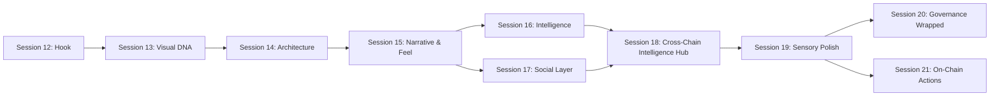

# Product "Wow" Plan v2 — DRepScore

> From comprehensive governance tool to the app that makes the entire crypto space say "wow." Sessions 12-21 transform the product through emotional design, visual identity, architecture, narrative, intelligence, social mechanics, cross-chain positioning, developer distribution, community flywheel, on-chain actions, and sensory polish.

**Created:** March 2, 2026
**Predecessors:** `product-wow-plan.md` (Sessions 1-7), `product-wow-plan-v1.5.md` (Sessions 8-11)
**Context:** Deep product/UX critique after completing all v1 and v1.5 work, including sync pipeline hardening. See agent transcript for the raw analysis.

---

## Table of Contents

1. [The Gap](#the-gap-impressive-tool-vs-transcendent-product)
2. [Design Philosophy for v2](#design-philosophy-for-v2)
3. [North Star: The 100/100 Wow Score](#north-star-the-100100-wow-score)
4. [Current State Summary](#current-state-summary)
5. [Session 12 — The 10-Second Hook](#session-12--the-10-second-hook)
6. [Session 13 — DRep Identity System & Visual Signature](#session-13--drep-identity-system--visual-signature)
7. [Session 14 — Experience Architecture Overhaul](#session-14--experience-architecture-overhaul)
8. [Session 15 — The Narrative & Feel Layer](#session-15--the-narrative--feel-layer)
9. [Session 16 — Governance Intelligence Engine](#session-16--governance-intelligence-engine)
10. [Session 17 — The Live Social Layer](#session-17--the-live-social-layer)
11. [Session 18 — Cross-Chain Governance Intelligence Hub](#session-18--cross-chain-governance-intelligence-hub)
12. [Session 19 — Sensory Polish & Performance](#session-19--sensory-polish--performance)
13. [Session 20 — Governance Wrapped & Community Flywheel](#session-20--governance-wrapped--community-flywheel)
14. [Session 21 — On-Chain Actions & Real-Time](#session-21--on-chain-actions--real-time)
15. [Execution Order](#execution-order-and-dependencies)
16. [Anti-Patterns](#anti-patterns)
17. [Deferred Items](#deferred-items)

---

## The Gap: Impressive Tool vs. Transcendent Product

Sessions 1-11 built an extraordinary feature set: 60+ API routes, 80+ components, 4-pillar scoring model, treasury intelligence with counterfactual analysis, representation matching from real votes, governance DNA quiz, multi-channel notifications (push, email, Discord, Telegram), gamification for both DReps and delegators, and Observable analytics dashboards. The engineering is world-class.

But the product still presents as an **analyst's tool wearing a nice coat of paint**. Three fundamental gaps prevent the "wow":

### 1. No Emotional Hook

The first 10 seconds are informational, not personal. The homepage shows "17.2B ADA is being governed right now" — factually impressive but emotionally empty. There's no personal connection. No one sees this and thinks "I need to act." The authenticated homepage shows skeleton loaders while client-fetching data. Compare to Credit Karma's breakthrough: "See your score." One screen, one number, immediate personal relevance.

### 2. No Visual Signature

Screenshots are indistinguishable from thousands of shadcn-based Next.js apps. The ScoreRing is a standard donut chart. The pillar bars are basic progress bars. The ActivityHeatmap is a GitHub clone. There is no single visual element that, when screenshotted, is instantly and unmistakably "DRepScore." The v1 plan called for a "signature governance constellation" — it was never built. The Governance Identity Radar (6-dimension alignment visualization) was identified in Session 11 as "Build now, lowest complexity, highest visual impact" — also never built.

### 3. Data Without Narrative

Every page shows numbers but no page tells a story. The DRep profile is 8 sections stacked vertically. The dashboard is 15+. The governance page is a wall of cards. Each piece is well-built in isolation; together they create cognitive overload. No page answers its core question in the first viewport. No page creates an emotional reaction.

---

## Design Philosophy for v2

These principles supersede all prior design guidance:

- **One-viewport answers.** Every page must answer its core question in the first viewport. Everything else is progressive depth.
- **Emotion before information.** The user should *feel* something before they *read* something. Pride, urgency, curiosity, surprise — design for the feeling first.
- **Dark mode is the hero.** Crypto users overwhelmingly prefer dark mode. Design dark-first, validate light mode second.
- **Speed is a feature.** Every interaction must feel instant. If data takes time, the UI must feel alive while waiting — not empty.
- **Every surface is shareable.** If it can't be screenshotted and look beautiful in a tweet, it's not done.
- **Progressive complexity, not progressive disclosure.** Don't hide complexity — reveal it through narrative. "Your DRep scored 72 — here's what that means" is better than hiding the breakdown behind a toggle.

---

## North Star: The 100/100 Wow Score

Our north star is getting DRepScore as close to 100/100 on a "wow" factor scale as possible. Every session plan should be evaluated against this metric. Agents working on independent sessions must assess how their changes move the needle.

### Scoring Dimensions

| Dimension | Weight | Description |
|-----------|--------|-------------|
| Visual Identity | 20% | Signature visuals, animation quality, screenshot shareability |
| Emotional Impact | 20% | First-viewport hook, narrative, personality, delight moments |
| IA & UX | 20% | Information architecture, navigation clarity, mobile experience |
| Technical Excellence | 15% | Performance, SSR, loading states, error handling |
| Content & Intelligence | 15% | Data narratives, AI summaries, cross-proposal insights |
| Community & Social | 10% | Social proof, sharing, activity feeds, engagement loops |

### Target Scores by Session

> **Revised March 2026 (post-S16 honest assessment).** Original projections assumed all planned items shipped per session. Actual delivery differed — page-level route transitions, social proof indicators, and several other S15 items were not built. Baseline corrected from ~83-86 to ~69-72.

| Session | Cumulative Score | Delta | Key Contributions |
|---------|-----------------|-------|-------------------|
| S12 + S13 (baseline) | ~48 | — | Visual identity, constellation, identity system |
| S14 | ~62 | +14 | Architecture overhaul, nav, mobile-native, proposals feed |
| S15 | ~69-72 | +7-10 | Narrative layer, GHI number, basic insights, empty states (note: page transitions, social proof not built) |
| S16 | ~78-82 | +9-10 | Intelligence engine, GHI trend/sparkline, AI narratives, State of Governance report, expanded insights |
| S17 | ~87 | +5 | Social layer, page transitions (S15 gap), activity feeds, sharing culture |
| S18 | ~92-93 | +5-6 | Cross-chain intelligence hub, developer platform, embeddable widgets, delegator identity, feature flags |
| S19 | ~96 | +3-4 | Sensory polish, sound design, scroll storytelling, Cmd+K, PWA, performance, community showcase |
| S20 | ~97 | +1 | Governance Wrapped, community flywheel, editorial content |
| S21 | ~98+ | +1 | On-chain actions, real-time WebSocket, offline-first |

All agents working on sessions should internalize this scoring framework and proactively identify opportunities to push the score higher within their session's scope.

---

## Current State Summary

This section provides the baseline for any agent picking up a session. All of this was built in Sessions 1-11.

### Routes

| Route | Purpose |
|-------|---------|
| `/` | Dual-mode homepage: `ConstellationHero` (R3F WebGL constellation + text overlay + `ActivityTicker`) + `PersonalGovernanceCard` (segment-aware: delegated/undelegated/drep, below hero) + `HowItWorksV2` (SVG micro-vignettes) + `DRepDiscoveryPreview` (with identity color accents). Auth via httpOnly cookie — no skeleton flash. Old components (`GovernancePulseHero`, `HomepageAuth`, `HomepageUnauth`, `DashboardPreview`) are no longer in the render path. |
| `/discover` | DRep discovery — card/table toggle, Governance DNA Quiz, smart search, infinite scroll |
| `/drep/[drepId]` | DRep profile — ScoreCard, milestones, score history, treasury stance, philosophy, heatmap, about, voting history (8 sections, linear stack) |
| `/proposals` | Proposal list with status tabs, type/sort filters |
| `/proposals/[txHash]/[index]` | Proposal detail — voters, timeline, sentiment poll, financial impact, accountability |
| `/pulse` | Governance Pulse — stats, leaderboard, movers, Hall of Fame, treasury health widget |
| `/treasury` | Treasury dashboard — health score, charts, What-If simulator, accountability polls |
| `/governance` | My Governance — delegation health, representation, calendar, citizen section (auth-gated) |
| `/compare` | Side-by-side DRep comparison — radar (pillars), trends, vote overlap |
| `/dashboard` | DRep Command Center — score, inbox, recommendations, competitive context, simulator, delegator analytics, milestones, philosophy, report card (15+ sections) |
| `/claim/[drepId]` | Claim DRep profile — FOMO-driven with governance pulse stats |
| `/profile` | User profile — prefs, watchlist, notifications |

### Navigation (Header)

Desktop: Proposals | Discover | Pulse | Treasury | My Governance (auth) | Dashboard (DRep) — 4-6 items.
Mobile: Hamburger sheet with same items + wallet connect.

### Data Architecture

- **Source:** Koios API (Cardano chain data) → Inngest cron functions → Supabase (Postgres)
- **Sync cadence:** Proposals every 30 min, DReps/votes/secondary every 6h, slow daily, treasury daily
- **Self-healing:** `sync-freshness-guard` retriggers stale syncs every 30 min
- **Scoring:** 4-pillar model — Rationale (35%), Effective Participation (30%), Reliability (20%), Profile (15%)
- **Alignment:** 6 dimensions stored on every DRep: `alignment_treasury_conservative`, `alignment_treasury_growth`, `alignment_decentralization`, `alignment_security`, `alignment_innovation`, `alignment_transparency` (0-100 each)
- **AI:** Anthropic Claude (sonnet) for proposal summaries, rationale summaries, rationale draft generation
- **Notifications:** Unified engine with push, email (Resend), Discord, Telegram channels
- **Analytics:** PostHog (client + server), Observable Framework dashboards

### Visual System

- **Stack:** Tailwind v4, shadcn/ui, Recharts, Lucide icons
- **Fonts:** Geist Sans + Geist Mono
- **Theme:** oklch color system — light (Cypherpunk: deep tech blue, electric purple, neon cyan) / dark (soft emerald, soft purple). Dark mode is the default for all visitors (set in Session 12).
- **Homepage hero:** React Three Fiber WebGL constellation with `@react-three/postprocessing` Bloom (mipmapBlur). Instanced nodes, batched lineSegments, ambient starfield, adaptive quality via GPU tier detection. `next/dynamic` with `ssr: false` — zero LCP impact (~200KB lazy-loaded).
- **Activity ticker:** Bloomberg-style scrolling horizontal feed of recent governance actions (`ActivityTicker` component, `/api/governance/activity` API route).
- **DRep identity colors:** `lib/drepIdentity.ts` maps 6 alignment dimensions to identity colors (Treasury Conservative = Deep Red, Treasury Growth = Emerald, Decentralization = Purple, Security = Amber, Innovation = Cyan, Transparency = Blue). Used by the constellation, and shared foundation for Session 13.
- **Animations:** CSS (`animate-fade-in-up`, `animate-gradient-shift`, card hover lift, button press scale, `animate-cta-pulse`, `ticker-scroll`) + R3F `useFrame` for continuous 3D animation.
- **Score visualization:** `ScoreRing` (standard donut chart)
- **Charts:** Recharts with default styling, some custom tooltips

### Key Gaps From Sessions 1-11 (NOT Built)

| Item | Status | Session Origin |
|------|--------|---------------|
| Governance Identity Radar (6-dim alignment radar chart) | **Not built** | Session 11 |
| Cross-Proposal Intelligence (macro governance patterns) | **Not built** | Session 11 |
| DelegationChangeCard (epoch-level delegator gain/loss) | **Not built** | Session 11 |
| Signature visual element / governance constellation | **Built (Session 12)** — R3F WebGL constellation with bloom, Cardano starburst layout | Session 6 |
| Page transitions (View Transitions API) | **Deferred** | Session 6 |
| Custom iconography | **Deferred** | Session 6 |

---

## Session 12 — The 10-Second Hook

### Thesis

The homepage is the highest-leverage surface in the product. The rewrite makes the first 10 seconds personal, urgent, and impossible to ignore — anchored by a full-bleed WebGL governance constellation.

### What Was Built

**1. Full-bleed ConstellationHero with R3F governance constellation.** React Three Fiber (Three.js) with real WebGL bloom. The constellation visualizes 200-800 DRep nodes (adaptive by GPU tier) in a Cardano-logo-inspired 6-arm radial starburst layout. Each arm represents one alignment dimension, with DReps colored by their dominant identity color. Ambient starfield for depth. Bloom post-processing (`mipmapBlur`) for cinematic glow. `CameraControls` for smooth fly-to animations on wallet connect.

**2. ActivityTicker — Bloomberg-style scrolling governance feed.** Horizontal continuously scrolling ticker showing recent votes, delegations, rationale publications, and proposals. Data from `/api/governance/activity`. Ticker speed is dynamic based on event count (~2s per event). Connects to constellation — ticker events pulse the corresponding DRep node.

**3. Segment-aware PersonalGovernanceCard.** Three variants:
- **Delegated**: DRep name, score, trend, representation match, open proposals, epoch countdown
- **Undelegated**: FOMO-driven "Your ADA is unrepresented" with governance stats
- **DRep**: Score, rank, delegator count, pending proposals
Rendered below the hero in normal document flow to prevent ticker overlap.

**4. SSR auth via httpOnly cookie.** Dual-write session management: `localStorage` + `httpOnly secure sameSite:lax` cookie. Server component reads cookie via `cookies()` API for pre-rendered authenticated content — no skeleton flash for returning users.

**5. HowItWorksV2 with SVG micro-vignettes.** Three-step visual explanation replacing the text-heavy v1.

**6. `lib/drepIdentity.ts` — 6-dimension identity color system.** Maps `AlignmentDimension` types to `IdentityColor` (hex, RGB, label). Utilities: `getDominantDimension()`, `getIdentityColor()`, `extractAlignments()`, `alignmentsToArray()`. Shared foundation for Session 13.

**7. `lib/constellation/layout.ts` — Cardano-logo starburst layout.** 6-arm radial layout with angular fanning (45-degree arc per arm). Force-directed positioning: specialists drift outward, generalists cluster near center. Z-axis depth variation for parallax. Outputs 3D `[x, y, z]` coordinates ready for `InstancedMesh`.

**8. Dark mode as default theme.** Set in `app/layout.tsx` via `defaultTheme="dark"`.

### What Changed in Cleanup (Session 12.5)

- Constellation upgraded to React Three Fiber (real WebGL bloom, GPU instancing, cinematic camera)
- Push notification modal deferred on homepage (no longer blocks constellation animation)
- Wallet disconnect properly resets hero state and camera position
- PersonalGovernanceCard moved below hero into normal flow (no more ticker overlap)
- Ticker speed doubled (from `4s/event` to `2s/event`)
- Legacy rendering files deleted (`renderer.ts`, `engine.ts`)

### Current State (for agent context)

- `components/GovernanceConstellation.tsx` — R3F `<Canvas>` with `Instances` (nodes), `lineSegments` (edges), `AmbientStarfield`, `EffectComposer` + `Bloom`, `CameraControls`
- `components/ConstellationHero.tsx` — Orchestrates constellation, headline overlay, ticker, and card data callback
- `components/HomepageDualMode.tsx` — Entry point: `ConstellationHero` + `PersonalGovernanceCard` (below hero) + `HowItWorksV2` + `DRepDiscoveryPreview`
- `components/ActivityTicker.tsx` — Horizontal scrolling governance feed
- `components/PersonalGovernanceCard.tsx` — Three-variant governance summary card
- `lib/constellation/layout.ts` — 3D starburst layout
- `lib/constellation/types.ts` — R3F-oriented interfaces (`ConstellationNode3D`, `ConstellationEdge3D`, `FindMeTarget`, etc.)
- `lib/drepIdentity.ts` — Identity color system (6 dimensions)
- `app/page.tsx` — Server component with `force-dynamic`, reads auth cookie, fetches pulse data + top DReps + holder data
- `app/api/governance/constellation/route.ts` — Returns node data for constellation
- `app/api/governance/activity/route.ts` — Returns recent governance events for ticker

### Success Criteria

- Time from landing to "I understand what this is and why I should care" < 5 seconds
- Time from wallet connect to personal governance data visible < 3 seconds (SSR, no client fetch)
- Activity feed creates the sensation of a live platform, not a static report
- Constellation creates visual awe — unmistakably "DRepScore"

### Risks

- Three.js bundle size (~200KB gzipped) — fully lazy-loaded via `next/dynamic` with `ssr: false`, zero LCP impact
- WebGL compatibility on older mobile devices — adaptive quality via GPU tier detection (bloom disabled on weak hardware)
- Constellation API response time with 800+ nodes — monitor and optimize if needed

---

## Session 13 — DRep Identity System & Visual Signature

### Thesis

Session 12 gave the homepage a visual identity with the R3F constellation. Session 13 extends that premium quality to every DRep — giving each one a unique, generative visual "face" derived from their governance data. The Governance Identity Radar and Hex Score become the two signature visuals of the platform: instantly recognizable, inherently shareable, and impossible to reproduce with off-the-shelf chart libraries.

**Design north star:** Every DRep profile should feel like entering that DRep's "world." Identity color permeates the page. The radar reveals their governance personality through animated geometry. The hex score pulses as their living signature. This is not a dashboard — it's a portrait.

### What Changes

**1. Governance Identity Radar — custom SVG with animated geometry (NOT Recharts).** A bespoke radar visualization — no chart library. 6 axis lines radiate from center, one per alignment dimension. Data points connected by a filled polygon with:
- **SVG filter glow**: `feGaussianBlur` + `feComposite` for a soft bloom matching the identity color, achieving the same premium feel as the constellation's WebGL bloom but in SVG
- **Gradient fill**: Radial gradient from identity color center (30% opacity) to edge (5% opacity), creating depth
- **Animated reveal**: On mount, each axis extends outward from center with Framer Motion spring physics (`stiffness: 200, damping: 20`). The polygon "unfolds" as dimensions animate to their values.
- **Adaptive sizes**: Full (200px profile hero with axis labels + dimension names), medium (80px for discovery cards with axes only), mini (32px for inline badges — silhouette only, no labels). All three sizes are a single `<GovernanceRadar>` component with a `size` prop.
- **Compare mode**: Two overlaid radar polygons with distinct identity-color fills and reduced opacity. Used on compare page.
- **Interactive tooltips**: Hover a dimension axis to see score value + percentile rank among all DReps.
- **Placement**: DRep profile hero (primary), discovery cards, quick view modal, compare page, report cards, OG images, badge embeds.

**2. Hex Score — procedural generative visualization.** Replace `ScoreRing` donut with a hexagonal score display where the 6 sides map to 6 alignment dimensions. Each vertex radius is proportional to the dimension score, creating an asymmetric shape unique to each DRep:
- **Generative edge particles**: Tiny dots drift along the hexagon edges using `requestAnimationFrame`, emitting from vertices at a rate proportional to the dimension's score. Creates a "living" feel.
- **Breathing glow**: Subtle pulsing box-shadow/SVG filter in the identity color, 3s cycle, amplitude ±15%. Makes the score feel alive, not static.
- **Noise-textured fill**: SVG `feTurbulence` filter for a subtle organic texture inside the hex, avoiding the flat-color look of standard charts.
- **Score number**: Large centered text with Framer Motion `useSpring` counting animation (0 → score on mount, spring physics for overshooting feel).
- **Morph animation**: When navigating between DRep profiles, the hex shape morphs smoothly using Framer Motion `animate` with path interpolation.
- **Sizes**: Hero (120px, full effects), card (48px, simplified — glow + number only, no particles), badge (24px, solid shape only).

**3. DRep profile hero — immersive identity experience.** The profile page hero becomes a full-bleed section (similar in ambition to the homepage constellation) that immerses the visitor in the DRep's identity:
- **Identity-colored ambient gradient**: Full-width background gradient using the DRep's dominant identity color at low opacity (5-10%), fading to the dark base. Creates a subtle but unmistakable "this DRep has a color" feeling.
- **Radar as centerpiece**: The full 200px radar animates on scroll-into-view, flanked by the DRep's name, score hex, and key stats.
- **Delegation CTA with identity accent**: Primary CTA button uses the identity color as its accent, creating visual consistency between "who they are" and "what you can do."
- **Parallax depth**: Slight parallax between the gradient background and the foreground content for a layered feel.

**4. Framer Motion animation system.** Physics-based animations as the default for all user-facing transitions:
- **Spring presets** in `lib/animations.ts`: `snappy` (stiffness: 400, damping: 30 — for interactions), `smooth` (stiffness: 200, damping: 25 — for reveals), `bouncy` (stiffness: 300, damping: 15 — for celebrations/milestones).
- **Staggered section reveals**: Profile sections animate in with 50ms stagger, sliding up with `smooth` spring.
- **Score counting**: `useSpring` for score numbers across the app (ScoreRing replacement, hex score, stat cards).
- **Card hover**: `whileHover={{ scale: 1.02, y: -2 }}` with `snappy` spring on all discovery/comparison cards.
- **Layout animations**: `AnimatePresence` + `layout` prop for smooth tab transitions on profile and dashboard pages.
- Dependency: `framer-motion` (~30KB gzipped, mitigated via `next/dynamic` for heavy animation components).

**5. DRep identity color system extension.** Extend `lib/drepIdentity.ts` with:
- `getIdentityGradient(dimension)`: Returns a CSS gradient string (e.g., `linear-gradient(135deg, #a855f7 0%, #0a0b14 100%)`) for use in profile heroes and card accents.
- `getRadarConfig(dimension)`: Returns SVG filter IDs and gradient stops for the radar's identity-colored bloom.
- `getHexVertices(alignments, size)`: Computes the 6 vertex positions for the asymmetric hex score shape.
- Identity color as: accent ring on score, gradient on profile header, radar fill, OG tint, card border glow, CTA button accent.

**6. Custom chart aesthetic — branded Recharts.** All remaining Recharts instances (score history, vote heatmap, treasury charts) get a cohesive branded skin:
- Dark background, dotted grid lines (#1a1b2e), identity-colored area fills with gradient
- Custom dark tooltips with brand accent border
- Consistent axis styling: muted labels, no chart chrome
- New shared config: `lib/chartTheme.ts`

**7. Dark-first design audit.** Systematic pass across all components:
- Card borders: replace solid borders with subtle `box-shadow: 0 0 0 1px rgba(identity-color, 0.1)` glow
- Stat numbers: use `text-white` with slight text-shadow in identity color for emphasis
- Empty states: replace generic illustrations with identity-themed subtle gradients
- Verify all chart labels, tooltips, and badges have sufficient contrast in dark mode
- Note: dark mode is already the default (Session 12).

**8. OG images with radar + identity color.** Distinctive, shareable social images:
- New route `/api/og/governance-identity/[drepId]`: Full-card image with DRep name, hex score, mini radar, identity-colored gradient background, DRepScore branding. This is what DReps share when they want to show their "governance personality."
- Update existing `/api/og/drep/[drepId]`: Add mini radar, identity color gradient, modernized layout.
- Update `/api/og/compare`: Both DReps' radars overlaid, dual identity-color gradients.
- All OG images use `next/og` `ImageResponse` with custom SVG rendering (not screenshots).

### Current State (for agent context)

- `EnrichedDRep` interface has all 6 `alignment*` fields (nullable numbers, 0-100)
- `lib/alignment.ts` — `computeAllCategoryScores()` computes all 6, `getDRepTraitTags()` generates text labels
- `lib/drepIdentity.ts` — **Already exists** (created in Session 12) with 6 identity colors, `getDominantDimension()`, `getIdentityColor()`, `extractAlignments()`, `alignmentsToArray()`, `getDimensionLabel()`, `getDimensionOrder()`, `getAllIdentityColors()`. Session 13 extends this with gradient, radar, and hex vertex utilities.
- `components/ScoreRing.tsx` — Standard SVG donut chart, color by score tier (to be replaced by HexScore)
- `components/CompareView.tsx` — Has a Recharts RadarChart for *pillars* (not alignment); alignment shown as horizontal bars (radar to be replaced with GovernanceRadar)
- `components/GovernanceConstellation.tsx` — R3F constellation on homepage sets the visual quality bar. Session 13 visuals must match this level of polish.
- Current animations: CSS (`animate-fade-in-up`, `animate-gradient-shift`, `animate-grow`, card hover via Tailwind transitions) + R3F `useFrame` on homepage constellation
- Decentralization score is discrete (5 possible values based on size tier) — may need normalization for radar visual balance
- Dark mode is already the default (Session 12)

### Success Criteria

- A screenshot of any DRep's profile is instantly recognizable as DRepScore — the radar and hex score are visual signatures no other app has
- DReps share their Governance Identity Radar on X/Twitter as their "governance personality" — the OG image is beautiful enough to share without context
- The profile hero creates an emotional response: "this DRep has a *presence*"
- Animations feel fast, purposeful, and premium (200-300ms spring, never floaty or delayed)
- Dark mode looks intentional and premium across every surface — not auto-generated

### Risks

- Alignment score clustering: if most DReps have similar radar shapes, the visual loses its power. **Mitigation**: Before building, query the alignment distribution. If >70% of DReps have all dimensions within ±10 of each other, apply min-max normalization per dimension to spread the visual range.
- Framer Motion bundle size (~30KB gzipped). Mitigate with `next/dynamic` for animation-heavy components that aren't above the fold.
- Hex score procedural effects (particles, noise texture) must perform well on mobile. **Mitigation**: Disable particles and noise filter on `prefers-reduced-motion` or mobile; show static hex with glow only.
- SVG filter glow on the radar has browser rendering differences. **Mitigation**: Test on Chrome, Firefox, Safari; fall back to CSS box-shadow if SVG filters are inconsistent.
- Custom SVG radar is more implementation effort than Recharts. **Tradeoff accepted**: The "Ambitious by Default" principle (see `workflow.md`) explicitly prioritizes visual distinctiveness over implementation speed for user-facing surfaces.

---

## Session 14 — Experience Architecture Overhaul

### Thesis

Every major page stacks sections vertically in a linear scroll. The DRep profile is 8 sections. The dashboard is 15+. The governance page is 10+ cards. This creates cognitive overload and makes every page feel the same. This session establishes the "one-viewport answer" principle: every page answers its core question in the first viewport, with everything else organized as tabs or progressive depth.

### What Was Built

**1. DRep profile page redesign with match score context.** 8 sections collapsed into 4 tabs (Score Analysis, Voting Record, Treasury & Philosophy, About) using a new `AnimatedTabs` component with directional Framer Motion transitions and URL hash deep-linking. Match score from DNA quiz is carried through to the profile hero via `?match=X` query param.

**2. Dashboard density reduction.** 15+ sections replaced with an executive summary hero strip (score + trend + rank + delegators + pending count), a `DashboardUrgentBar` for expiring proposals, and 3 tabs (Inbox & Actions, Performance, Sharing & Profile). 2-column layout removed.

**3. Navigation simplification.** Desktop: Discover | Proposals | My Delegation (auth) | Dashboard (DRep) — 2-4 items. "My Governance" renamed to "My Delegation". Pulse and Treasury removed from top-level nav, accessible via `GovernanceSubNav` on governance pages. Mobile: `MobileBottomNav` fixed bottom bar with auth-aware items, hamburger becomes secondary account/settings sheet.

**4. Proposals feed enhancement.** Status tabs replaced with toggle filter chips. Prominence-ranked sort (default) based on expiry proximity + financial impact + vote count. Urgent proposals get red left border + "Urgent" badge.

**5. Pulse page SSR conversion.** Converted from client component to server component with Suspense boundaries. Leaderboard interactive filter extracted to `PulseLeaderboardClient`. `GovernanceSubNav` added.

**6. Mobile-first polish.** 44px minimum touch targets on all tabs and nav items. Snap scrolling on tab bars. Safe area inset padding on bottom nav. Main content `pb-16` offset on mobile for bottom nav.

### Decisions Made

- **No URL restructuring.** Routes kept at `/proposals`, `/pulse`, `/treasury`. `GovernanceSubNav` provides lateral navigation instead.
- **Dashboard stays client-rendered.** SSR complexity for an auth-gated page was not worth the marginal gain. Pulse page was SSR'd instead (higher impact for public visitors).
- **No sidebar on dashboard.** Compact executive summary strip above tabs replaces the old 2-column layout.
- **Proposals stays top-level in nav.** Highest-traffic governance page — burying it in a dropdown adds friction.
- **"My Governance" renamed to "My Delegation."** More specific, avoids confusion with public governance pages. URL unchanged.
- **Match score carried to DRep profile.** `DRepCardGrid` appends `?match=X` to profile links when match data exists. `DRepProfileHero` displays it in identity color.

### Current State (for agent context)

- `app/drep/[drepId]/page.tsx` — Server component, 8 sections rendered linearly, all data fetched server-side
- `app/dashboard/page.tsx` — Score hero + inbox + onboarding + 2-column layout (left: DRepDashboard, ScoreSimulator, ScoreHistory; right: CompetitiveContext, RepScorecard, DelegatorTrend, Heatmap, Milestones, ProfileHealth) + bottom (Philosophy, WrappedShareCard, BadgeEmbed)
- `components/Header.tsx` — Nav items: Proposals, Discover, Pulse, Treasury + conditional My Governance, Dashboard
- `components/MobileNav.tsx` — Right-side Sheet, same items
- `app/proposals/page.tsx` — SSR proposals list, `ProposalsPageClient` handles tabs/filters
- `app/governance/page.tsx` — GovernanceDashboard + GovernanceCalendar + GovernanceCitizenSection
- shadcn `Tabs` component available; already used in Treasury (Overview/Simulator/Accountability)

### Success Criteria

- DRep profile answers "should I delegate to this person?" in the first viewport
- Dashboard answers "what do I need to do right now?" in the first viewport
- Navigation has 3-4 items max
- Mobile experience feels app-native (bottom nav, touch targets, single-column)
- Auth homepage renders server-side (no skeleton flash)

### Risks

- Tab deep-linking with SSR: Hash fragments aren't available server-side. `AnimatedTabs` defaults to first tab on SSR, reads hash client-side on mount.
- Bottom nav z-index stacking: Must layer below modals (z-40) but above content. Tested with existing sheets and modals.
- Proposals feed prominence sorting: Simple computation — expiry proximity + financial impact + vote count.
- Strategy doc consistency: Session renumbering (S15→S16, S16→S17) required careful cross-reference updates.

---

## Session 15 — The Narrative & Feel Layer

### Thesis

Session 14 restructured the architecture. Session 15 makes every page tell a story and feel alive. This session pulls forward the highest-impact emotional items that don't require the full intelligence engine (Session 16) or social infrastructure (Session 17).

### What Changes

**1. Template-based narrative summaries.** `NarrativeSummary` component with smart interpolation from existing data:
- DRep profile (below hero): "A transparency-focused DRep who votes on 87% of proposals and always provides reasoning..."
- Proposals page (hero): "14 proposals are open. 3 expire this epoch, requesting 42M ADA..."
- Dashboard (hero): "You have 3 proposals awaiting your vote. Score up 5 points..."
- Pulse page (hero): "Governance is heating up: 847 votes this week, up 34%..."

**2. Page-level Framer Motion route transitions.** `AnimatePresence` at the layout level. Content slides directionally on navigation. The single strongest signal that separates "app" from "website."

**3. Proposals command-center hero.** Compact hero above the feed: "X Open | Y Expiring Soon | Z ADA at Stake" with animated counters and urgency indicators.

**4. Governance Health Index (GHI) — just the number.** Computed from existing data: Participation Rate (25%), Rationale Rate (20%), Delegation Concentration/Gini (15%), Proposal Throughput (15%), Representation Alignment (15%), DRep Diversity (10%). Displayed as large number + gauge on Pulse hero, homepage stat strip, treasury page. No State of Governance report or AI narration — that comes in Session 16.

**5. Lightweight cross-proposal insights.** 2-3 static computations from existing `drep_votes`, `vote_rationales`, `proposals` tables. E.g., "DReps who provide rationale are X times more likely to vote No." Displayed as insight cards on Pulse page.

**6. Social proof indicators.** Surface existing data: "X people viewed this DRep this week" (from `views` table), "X delegators polled on this" (from `poll_responses`).

**7. Activity feed on Pulse page.** Reuse `ActivityTicker` component from homepage. Makes the governance section feel alive.

**8. Content-aware loading skeletons.** Skeletons that match the shape of real content (tab skeletons, card skeletons, hero skeletons) instead of generic gray rectangles.

**9. Enhanced empty states.** Identity-color gradient backgrounds, warm copy. Empty states should be charming, not clinical.

**10. "What is Cardano Governance?" explainer for anonymous users.** Lightweight section accessible from homepage. Not a tutorial — 30 seconds of context for crypto-savvy non-Cardano users. Bridges the gap from "curious outsider" to "I understand what this is."

**11. Mini GovernanceRadar badges on proposal voter lists.** In `ProposalVotersClient`, add `GovernanceRadar size="mini"` (32px) next to each voter's name. Connects the Session 13 identity system to the proposal experience.

### Success Criteria

- Every page tells a story in its first viewport — not just displays data
- Page transitions make navigation feel like an app, not a website
- GHI becomes a recognizable number in the Cardano community
- Empty states make users smile, not bounce
- Anonymous visitors understand what Cardano governance is within 30 seconds

### Risks

- GHI component weights are opinionated — publish methodology transparently
- Route transitions can feel slow if animation duration is too high — keep under 300ms
- Narrative summaries must handle edge cases (zero votes, new DReps, etc.) gracefully
- "What is Cardano Governance?" must not feel like a tutorial — keep it under 30 seconds of reading

---

## Session 16 — Governance Intelligence Engine

### Thesis

DRepScore has all the data to generate insights nobody else in crypto can create. Currently that data is presented as individual metrics on individual pages. This session transforms raw data into narrative intelligence — macro patterns, ecosystem health scoring, AI-powered explanations, and a canonical "State of Governance" report that becomes the source crypto media and researchers cite.

### What Changes

**1. Cross-Proposal Intelligence.** Macro-level governance pattern analysis: "DReps who provide rationale are X times more likely to vote No," "Treasury proposals pass at Y% but have only Z% community support," "The top 10 DReps by score agree on Z% of votes." New library `lib/proposalIntelligence.ts` querying existing tables. New component `CrossProposalInsights.tsx` with trend indicators and per-insight share buttons.

**2. Governance Health Index (GHI).** A single 0-100 number for ecosystem health — the crypto equivalent of the Fear & Greed Index. Components: Participation Rate (25%), Rationale Rate (20%), Delegation Concentration / Gini (15%), Proposal Throughput (15%), Representation Alignment (15%), DRep Diversity (10%). Displayed as a large number with gauge, color-coded (Critical/Fair/Good/Strong), with trend sparkline. Placement: Pulse hero, homepage stat strip, treasury page, shareable card. OG image: `/api/og/governance-health`.

**3. AI proposal explainer.** Upgrade from 160-char summaries to full 3-paragraph explanations via on-demand Claude call: what it does (plain English), why it matters (financial/governance impact), key considerations (for/against). Cached in `proposals.meta_json`. New route: `/api/proposals/explain`.

**4. "State of Governance" weekly report.** Auto-generated epoch-level report: GHI score + trend, key metrics, top 3 cross-proposal insights, proposal outcomes, DRep leaderboard movers, community vs DRep sentiment, treasury update. Published to `/pulse/report/[epoch]` (public, SEO-indexed). Delivered via governance brief email + in-app card. This becomes the artifact that Cardano forums, X/Twitter, and media link to.

**5. Cross-chain governance benchmarking.** ~~Section comparing Cardano governance to Ethereum (Tally), Polkadot (OpenGov), Cosmos (Mintscan).~~ **DEFERRED TO SESSION 18.** Manual data maintenance overhead does not justify the "wow" impact at this stage. When built, it should use automated public APIs (Tally for Ethereum, SubSquare for Polkadot).

**6. Enhanced AI governance brief.** Upgrade `lib/governanceBrief.ts` from template-based to Claude-narrated: same data context, AI generates a warm 200-word narrative including cross-proposal insights and GHI change. Budget control via cached shared insights.

**7. Post-vote rationale prompt for DReps.** Detect when a DRep has cast a new on-chain vote (from sync pipeline) and surface a contextual "Explain your vote on [Proposal X]" nudge in the dashboard urgent actions bar or inbox. Links directly to the VoteExplanationEditor with the proposal pre-selected.

**10. Shared AI utility (`lib/ai.ts`).** Centralizes Anthropic client instantiation, model constants, `generateText()` and `generateJSON()` helpers with graceful null-return fallback. All AI features use this instead of importing `@anthropic-ai/sdk` directly.

**11. GHI OG image.** New route `/api/og/governance-health` — gauge + score + trend + component bars. Designed for Twitter sharing.

**12. State of Governance OG image.** New route `/api/og/governance-report/[epoch]` — GHI score + key stats + epoch label. Dark background, branded.

**13. Contextual intelligence placement.** Relevant insights appear on proposal detail pages (type-matched) and the homepage (GHI compact widget). Intelligence is surfaced where it's contextually useful, not just on Pulse.

### What Was Built (S16 Delivery)

- `lib/ai.ts` — shared AI utility with `generateText()`, `generateJSON()`, model constants
- `lib/proposalIntelligence.ts` — expanded from 3 to 9 insight types with trend, methodology, shareText fields
- `lib/stateOfGovernance.ts` — report assembly + AI narrative generation
- `lib/governanceBrief.ts` — `generateAIDRepBrief()` and `generateAIHolderBrief()` with template fallback
- `lib/narratives.ts` — `generateAIDRepNarrative()` with template fallback
- `inngest/functions/snapshot-ghi.ts` — daily GHI epoch snapshots
- `inngest/functions/generate-state-of-governance.ts` — weekly report generation
- `app/api/governance/health-index/history/route.ts` — GHI trend data API
- `app/api/proposals/explain/route.ts` — on-demand AI proposal explainer with caching
- `app/api/og/governance-health/route.tsx` — GHI OG image
- `app/api/og/governance-report/[epoch]/route.tsx` — report OG image
- `app/pulse/report/[epoch]/page.tsx` — public State of Governance report page (scroll-driven narrative)
- `components/GovernanceHealthIndex.tsx` — enhanced with sparkline + trend badge
- `components/CrossProposalInsights.tsx` — enhanced with Insight of the Week, per-insight share, methodology, trend indicators
- `components/ProposalExplainer.tsx` — on-demand AI explanation component
- `components/ProposalContextInsight.tsx` — contextual insight on proposal detail pages
- `components/DashboardUrgentBar.tsx` — post-vote rationale prompt
- `components/HomepageDualMode.tsx` — GHI compact on homepage
- Database: `ghi_snapshots` table, `state_of_governance_reports` table

### Current State (for agent context)

- AI integration: `@anthropic-ai/sdk`, `claude-sonnet-4-5` for summaries, `claude-sonnet-4-20250514` for drafts
- `lib/governanceBrief.ts` — Template-based brief assembly + generation, stores in `governance_briefs` table
- `inngest/functions/generate-governance-brief.ts` — Weekly cron (Monday 10:00 UTC), batched per-user
- Existing data for cross-proposal analysis: `proposals`, `drep_votes`, `poll_responses`, `vote_rationales`, `drep_score_history` tables
- `app/pulse/page.tsx` — Client-side fetches, shows stats, leaderboard, movers, Hall of Fame
- No cross-chain data exists currently (Koios is Cardano-only)
- v1 API route `/api/v1/governance/health` returns aggregate stats already

**8. GHI historical trend + epoch-over-epoch comparison.** Not just "the number" but "the number over time." A sparkline showing GHI across epochs makes it a trackable metric that people check back on. Store epoch-level GHI snapshots in a new `ghi_snapshots` table.

**9. AI-narrated DRep profiles.** Upgrade from the template-based narrative system (built in Session 15) to AI-generated richer, more nuanced DRep summaries. Cached, not real-time — regenerate weekly per DRep. Uses the template narrative as a fallback when AI cache is stale.

### Success Criteria

- GHI gets shared on X/Twitter as "the number" for Cardano governance health
- GHI trend sparkline becomes the most-checked element on Pulse page
- "State of Governance" report becomes the most-linked DRepScore URL within 2 months
- Cross-proposal insights generate social media discussion
- At least one media outlet or researcher cites DRepScore data within 3 months
- Cross-chain benchmarking makes non-Cardano users aware of DRepScore

### Risks

- AI API costs: briefs generate per-user content. Template + AI polish controls cost. Monitor token usage.
- Cross-chain data freshness: manual maintenance is labor-intensive. Start static, automate later.
- GHI component weights are opinionated — be transparent about methodology, publish it.
- "State of Governance" quality must be high enough for media citation — AI hallucination guardrails critical.

---

## Session 17 — The Live Social Layer

### Thesis

DRepScore is a read-only analytical tool where all communication is one-directional. Governance is inherently social — debate, deliberation, persuasion, collective decision-making. This session adds the social dimension that transforms DRepScore from a tool you check into a platform you participate in. It also addresses the page-level route transitions that were planned for S15 but not built — the single strongest "app not website" signal.

### What Was Built (S17 Delivery)

**0. Directional page transitions (S15 gap).** `NavDirectionProvider` context tracks navigation direction (forward/backward/neutral) based on path depth. `app/template.tsx` upgraded from simple fade to directional slide-in using Framer Motion with spring physics. Deeper navigation slides left, shallower slides right, lateral crossfades. `lib/animations.ts` extended with `pageTransitionVariants`, `getPageTransition()`, `getPageInitial()`.

**1. Unified governance activity feed (platform-wide).** `ActivitySideWidget` component (compact 5-event feed) placed on DRep profile pages. `ActivityFeed` added to governance page. Activity API extended with DRep filtering (`?drepId=`), `score_change` events (>=5pt moves), and `proposal_outcome` events (ratified/enacted/dropped/expired). Both `ActivityFeed` and `ActivitySideWidget` handle new event types. Smart 60s polling with visibility-aware pause.

**2. Social proof indicators.** `SocialProofBadge` component with three variants: `views` (DRep weekly views), `poll` (community members polled on proposal), `participants` (active governance participants this week). Backed by `/api/social-proof` route with 15-minute cache TTL. Minimum display thresholds prevent embarrassing low numbers. Placed on DRep profiles and proposal detail pages.

**3. Enhanced DelegationCeremony.** Upgraded from generic confetti + `AnimatedScore` to identity-aware celebration: `HexScore` (hero size) + `GovernanceRadar` (medium), identity-colored confetti (DRep's dominant alignment color), personality label reveal, Framer Motion staggered entrance animations, identity-tinted CTA button. `InlineDelegationCTA` now fetches and passes alignments to the ceremony.

**4. Milestone celebration toasts.** `MilestoneCelebration` component — toast-style overlay (bottom-right, not full-screen) with confetti burst, badge + milestone name, share CTA via existing OG route. `MilestoneCelebrationManager` compares milestone `achievedAt` timestamps against last visit to trigger celebrations for new achievements. Wired into DRep dashboard. Supporting API routes: `/api/dreps/[drepId]/milestones`, `/api/users/last-visit`.

**5. In-context share prompts.** `GovernanceDNAReveal` enhanced with prominent callout-style share prompt (icon + descriptive text + `ShareActions`) instead of bare share buttons. Emphasizes governance personality and top match.

**6. Epoch summary OG image.** New route `/api/og/epoch-summary` — displays epoch number, DRep votes, rationales, proposals, and optional rep score in branded card format. `EpochSummaryCard` now passes stats to OG route for shareable images.

**7. DRep-delegator Q&A channel.** Database: `drep_questions` + `drep_responses` tables with RLS (public read, authenticated write). API: `POST /api/governance/questions` (submit, rate-limited 3/day/wallet/DRep), `GET /api/governance/questions?drepId=` (list with responses), `POST /api/governance/questions/[questionId]/respond` (DRep-only, verified via claimed profile). UI: `DRepCommunicationFeed` extended with "Statements" / "Q&A" tab bar. `QuestionForm` component with character counter and wallet auth. `DRepQuestionsInbox` component on dashboard inbox tab for DReps to reply.

### What Was Removed From S17 Scope

- **`/developers` page**: Moved exclusively to S18 where it makes strategic sense alongside cross-chain intelligence (developer-as-distribution-channel narrative).
- **Governance achievement NFTs**: Deferred indefinitely — poor wow-per-effort ratio, CIP-25 metadata complexity, wallet UX friction for a feature ~5% of users would engage with.
- **Full "Governance Wrapped" experience**: Replaced with lightweight epoch summary cards + OG route. Full multi-slide shareable story experience deferred to S20 (annual timing makes more sense).

### Current State (for agent context)

- `components/DRepCommunicationFeed.tsx` — Shows one-way feed (explanations, positions, philosophy) from `/api/governance/drep-feed`
- `components/ActivityTicker.tsx` — Built in Session 12, horizontal scrolling governance feed on homepage. Session 17 extends platform-wide.
- Profile views tracked in `views` table, `components/ProfileViewStats.tsx` exists
- v1 API: 7 routes (`/api/v1/dreps`, `/api/v1/dreps/[drepId]`, `/api/v1/dreps/[drepId]/votes`, `/api/v1/dreps/[drepId]/history`, `/api/v1/proposals`, `/api/v1/embed/[drepId]`, `/api/v1/governance/health`)
- Share infrastructure: 13 OG image routes, `ShareActions` component, `WrappedShareCard`, `DelegatorShareCard`, `DRepReportCard`, `BadgeEmbed`
- MeshSDK already integrated for delegation transactions
- Milestone system: `lib/milestones.ts` (9 milestones), `drep_milestones` table, `MilestoneBadges` component

### Success Criteria

- Activity feed makes the platform feel alive ("active" not "static")
- At least 10 delegator-DRep question exchanges within first month
- `/developers` page drives at least 3 external integrations within 3 months
- Governance DNA cards become a social media trend within Cardano community

### Risks

- DRep-delegator Q&A requires moderation strategy — public communication can attract spam/abuse
- NFT minting adds on-chain transaction complexity and potential wallet UX issues
- API rate limiting needs middleware — consider existing solutions (Upstash Redis)
- Social proof numbers may be low initially — consider minimum thresholds before displaying

---

## Session 18 — Cross-Chain Governance Intelligence Hub

### Thesis

With S16's intelligence engine and S17's social layer in place, Session 18 positions DRepScore beyond Cardano. The original scope was three items (cross-chain benchmarking, developer page, API docs). The expanded session transforms DRepScore into a governance intelligence hub with five pillars: cross-chain observatory, developer platform, embeddable widget ecosystem, delegator governance identity, and feature flag infrastructure for safe rollout. This is the "not just Cardano" moment.

### What Was Built (S18 Delivery)

**1. Cross-Chain Governance Observatory.** Automated data collection from Tally (Ethereum) and SubSquare (Polkadot) via weekly Inngest cron. New `governance_benchmarks` table stores participation rates, delegate counts, proposal throughput, computed governance scores (0-100), and letter grades per chain. `lib/crossChain.ts` centralizes adapters, scoring, and grade computation. `CrossChainReportCard` components display each chain with sparkline trends, identity colors, and Framer Motion animations. `GovernanceObservatory` orchestrates the three-chain display on both the Pulse page (full) and Homepage (compact stat strip). OG image route at `/api/og/cross-chain` for social sharing.

**2. Developer Experience Platform (`/developers`).** Stripe-quality developer page with: guided quick-start flow (get key → install → query), interactive `ApiExplorer` component with endpoint browser, parameter docs, and live "Try It" with real responses. Multi-language `CodeExample` component (cURL, JavaScript, Python) with copy-to-clipboard. Rate limit tiers documented: Anonymous (30/min), Free (100/min), Pro (1000/min), Enterprise (unlimited). Fixed critical rate limit bug where authenticated API keys were incorrectly using anonymous limits. Added `/developers` link to main navigation header.

**3. Embeddable Widget Ecosystem.** Four embed types: DRep Card (`/embed/drep/[drepId]`), GHI Gauge (`/embed/ghi`), Cross-Chain Comparison (`/embed/cross-chain`), and Governance Radar (existing). Dedicated `app/embed/layout.tsx` strips global chrome for clean iframe rendering. Self-contained embed components (`EmbedDRepCard`, `EmbedGHI`, `EmbedCrossChain`) with theme support (dark/light). `public/embed.js` script loader for zero-code integration via data attributes. Widget builder section on the developer page with copy-paste iframe/script snippets.

**4. Delegator Governance Identity Card.** `DelegatorGovernanceCard` component on the Governance page shows a user's governance age, delegated DRep (with score), quiz alignment match, and delegation streak. OG image route at `/api/og/governance-identity` generates personalized shareable cards. Share prompt encourages delegators to broadcast their governance participation.

**5. Feature Flag Infrastructure.** Supabase-backed `feature_flags` table with admin UI at `/admin/flags` for instant toggles without redeployment. `lib/featureFlags.ts` provides server-side `getFeatureFlag()` and client-side `<FeatureGate>` wrapper with 60s in-memory cache, env var overrides (`FF_<KEY>=true|false`), and upgrade path to per-user targeting. Cross-chain features gated by three flags: `cross_chain_observatory`, `cross_chain_embed`, `cross_chain_sync`. Critical capability for pre-market feature management.

### Current State (for agent context)

- `lib/crossChain.ts` — Chain types, adapters (Tally GraphQL, SubSquare REST), scoring, grading, identities
- `inngest/functions/sync-governance-benchmarks.ts` — Weekly cron with feature flag check
- `app/api/governance/benchmarks/route.ts` — Benchmarks API (flag-gated)
- `components/CrossChainReportCard.tsx` — Single chain report card with sparkline
- `components/GovernanceObservatory.tsx` — Three-chain orchestrator (full + compact variants)
- `app/developers/page.tsx` + `components/DeveloperPage.tsx` — Developer platform shell + content
- `components/ApiExplorer.tsx` — Interactive endpoint browser with try-it
- `components/CodeExample.tsx` — Multi-language code snippets
- `app/embed/layout.tsx` — Minimal embed layout
- `app/embed/drep/[drepId]/page.tsx`, `app/embed/ghi/page.tsx`, `app/embed/cross-chain/page.tsx` — Embed pages
- `components/EmbedDRepCard.tsx`, `components/EmbedGHI.tsx`, `components/EmbedCrossChain.tsx` — Embed components
- `public/embed.js` — Script loader for zero-code embedding
- `components/DelegatorGovernanceCard.tsx` — Delegator identity card
- `lib/featureFlags.ts` — Feature flag system
- `components/FeatureGate.tsx` — Client-side feature gate wrapper
- `app/admin/flags/page.tsx` + `components/admin/FeatureFlagAdmin.tsx` — Admin toggle UI
- Database: `governance_benchmarks` table, `feature_flags` table
- Feature flags: `cross_chain_observatory`, `cross_chain_embed`, `cross_chain_sync` (all default ON)

### Success Criteria

- Cross-chain benchmarking brings non-Cardano users to DRepScore
- At least 3 external integrations from developer platform within 3 months
- Embeddable widgets appear on at least 5 external sites within 6 months
- Delegator identity cards generate social sharing within Cardano community
- Feature flags enable safe rollout of controversial features without code changes

### Risks

- **Cross-chain API reliability**: Tally and SubSquare APIs may change without notice. Built with 7-day cache, graceful degradation, and feature flags for instant kill switch.
- **Cross-chain governance score methodology**: Different chains have fundamentally different structures. The "grade" is inherently opinionated. Methodology should be published transparently and community feedback solicited before removing feature flag.
- **Developer platform adoption**: Interactive explorer could balloon in scope. Shipped functional v1; iterate based on actual developer feedback.
- **Embed security**: iframes are sandboxed but script loader requires trust. CSP headers and origin validation planned for v2.

---

## Session 19 — Sensory Polish & Performance

### Thesis

After Sessions 15-18 deliver narrative, intelligence, social, cross-chain, and developer features, Session 19 is a dedicated polish pass to push from ~92-93 to ~96. Pure quality — no new features, just refinement of everything already built, plus pro-tool power-user touches.

### What Changes

**1. Sound design (optional, off by default).** Subtle audio cues for delegation, milestone achievement, score reveal. Think Stripe's checkout chime — so subtle you almost miss it, but it registers emotionally. Global toggle in user preferences. Uses Web Audio API for minimal bundle impact.

**2. Scroll-driven storytelling on DRep profiles.** Apple-style progressive reveals — as you scroll through profile tabs, each section has a mini narrative transition. Not just fade-in but contextual (e.g., voting record section opens with a timeline animation). Uses Framer Motion `useScroll` + `useTransform`.

**3. Performance audit.** Sub-100ms interactions, optimistic UI for all mutations, Core Web Vitals green across all pages. The fastest governance app in crypto. Specific targets: LCP < 2.5s, FID < 100ms, CLS < 0.1, TTI < 3.5s.

**4. Haptic feedback on mobile.** `navigator.vibrate()` for key actions (delegation, vote submission, milestone achievement) on supported devices. Subtle 10-20ms pulses, never distracting.

**5. Community showcase.** Curated "DRep of the Epoch" spotlight, community-submitted governance stories. This is the content flywheel that makes the platform self-sustaining. New section on Pulse page with editorial curation.

**6. Advanced OG image system.** Dynamic OG images that update in real-time (e.g., DRep OG image shows current score, not cached score). Makes shared links always current. Upgrade existing OG routes to use ISR with shorter revalidation.

**7. Cmd+K command palette.** Keyboard-first search and navigation using `cmdk` library (~5KB). Search DReps, jump to proposals, toggle dark mode, navigate to any page. Power user delight. Think Linear/Raycast — fast, beautiful, and addictive.

**8. PWA installability.** `manifest.json`, service worker for offline shell, install prompt. For users who check governance daily — the app should live on their homescreen/dock.

**9. Keyboard shortcuts.** `?` for help overlay, `d` for discover, `p` for proposals, `g` for governance. Pro-tool feel that rewards frequent users.

**10. Micro-interaction Easter eggs.** Subtle surprises: hover a perfect 100 score for a confetti burst, delegation anniversary celebration, secret konami code for constellation fireworks. Delight moments that reward exploration.

### Success Criteria

- Core Web Vitals green on all pages
- "DRep of the Epoch" generates community engagement and repeat visits
- Sound design, when enabled, creates memorable "moments" without being annoying
- Scroll-driven storytelling makes DRep profiles feel like premium product pages
- Cmd+K becomes the primary navigation method for power users
- At least 100 PWA installs within first month

### Risks

- Sound design requires careful taste — bad audio is worse than no audio. Start with 1-2 sounds, test extensively.
- Performance optimization may require architectural changes (RSC boundaries, streaming).
- Community showcase requires editorial process — plan for content moderation.
- Cmd+K requires careful index of all navigable content to be useful.

---

## Session 20 — Governance Wrapped & Community Flywheel

### Thesis

Session 19 polishes the product to near-perfection. Session 20 adds the community and content flywheel that makes DRepScore self-sustaining — users create content that attracts more users. The centerpiece is a full "Governance Wrapped" annual experience that becomes the most shared Cardano governance artifact of the year.

### What Changes

**1. Governance Wrapped — annual shareable experience.** Full multi-slide interactive story (deferred from S17) showing a user's governance year: votes influenced, proposals they cared about, DRep loyalty, governance personality evolution, community impact. Each slide is a shareable OG image. Think Spotify Wrapped for governance. This is the single highest-virality feature in the roadmap.

**2. Community showcase expansion.** "DRep of the Epoch" editorial system with community nomination and voting. Spotlight page with DRep's governance story, identity radar, and key votes. Drives repeat visits and DRep engagement.

**3. Community-submitted governance stories.** Moderated submission flow for delegators and DReps to share governance experiences, case studies, and perspectives. Curated on the Pulse page. Creates owned content that compounds over time.

**4. Governance leaderboards with seasonal resets.** Epoch-based leaderboard seasons with historical archives. Seasonal badges for top performers. Gamification that resets ensures ongoing engagement rather than permanent dominance by early adopters.

**5. User-generated insights and commentary.** Moderated proposal commentary system — lightweight annotations on proposals from community members. Not full discussion threads (deferred), but curated perspectives that add context.

### Success Criteria

- Governance Wrapped generates >1000 shares in first week
- Community showcase drives 20%+ increase in DRep profile claims
- Seasonal leaderboards increase weekly active users by 15%+
- Community stories become a cited resource in Cardano forums

### Risks

- Governance Wrapped requires careful data pipeline to aggregate a full year of user activity. Plan data collection early.
- Editorial content requires moderation infrastructure and human review — not fully automatable.
- Seasonal leaderboards must balance competitiveness with inclusivity — avoid rewarding only whale DReps.

---

## Session 21 — On-Chain Actions & Real-Time

### Thesis

DRepScore has been a read-only intelligence layer. Session 21 closes the loop by enabling direct on-chain governance actions from within the app and upgrading the entire experience to real-time. This is the final "wow" — DRepScore becomes the command center where governance actually happens, not just where it's observed.

### What Changes

**1. Direct vote casting from DRepScore.** If GovTool adoption patterns confirm demand (monitor through S18-S20), build native vote submission. DReps can cast votes, submit rationale, and delegate — all without leaving DRepScore. Uses MeshSDK (already integrated for delegation).

**2. Real-time WebSocket governance feed.** Replace all polling (activity ticker, feeds, social proof, GHI) with Supabase Realtime subscriptions. Governance events appear instantly. The entire platform feels alive — not periodically refreshed.

**3. Full offline-first PWA.** Service worker caching of governance data, proposals, and DRep profiles. Users can browse cached data offline and sync when reconnected. Critical for users in regions with unreliable connectivity.

**4. Actionable push notifications.** Deep-link notifications that take users directly to the relevant action: "Proposal X expires in 2 hours — vote now" links directly to the proposal with vote UI ready. Reduces friction from awareness to action.

**5. Floating compare tray.** While browsing DReps on Discover, pin candidates to a floating comparison tray at the bottom. Click to expand into full comparison view. Deferred since S14 — now the interaction design is mature enough to build it well.

### Success Criteria

- >50% of DRep votes cast through DRepScore within 3 months of launch
- Real-time feed creates a "live dashboard" sensation — users keep the tab open
- Offline-first enables governance participation in connectivity-constrained environments
- Actionable notifications achieve >30% click-through rate

### Risks

- On-chain transaction signing requires extensive wallet compatibility testing (Eternl, Lace, Nami, Flint, etc.)
- Real-time subscriptions at scale require Supabase Realtime capacity planning
- Offline-first PWA with real-time creates complex sync conflict scenarios
- Vote casting carries legal/liability considerations — ensure clear disclaimers

---

## Execution Order and Dependencies

- **Sessions 12-17** are shipped and deployed.
- **Session 18** expands DRepScore beyond Cardano — cross-chain observatory, developer platform, embeddable widgets, delegator identity, feature flags. **Shipped.**
- **Session 19** is pure polish: sound, scroll storytelling, Cmd+K, PWA, performance, community showcase — pushing from ~93 to ~96.
- **Session 20** adds the community flywheel: Governance Wrapped, editorial content, seasonal leaderboards — pushing to ~97.
- **Session 21** closes the loop with on-chain actions, real-time WebSocket, and offline-first PWA — pushing to ~98+.
- **S20 and S21** are independent of each other and could be parallelized or reordered based on demand signals (on-chain actions require monitoring GovTool adoption; community flywheel requires editorial capacity).

### Target Score Projections (Revised March 2026)

> Updated post-S18 to reflect expanded session scope, feature flag infrastructure, and new future sessions.

| Session | Estimated Score | Delta | Key Contributions |
|---------|----------------|-------|-------------------|
| Post S12-14 | ~62/100 | — | Visual identity, architecture |
| Post S15 | ~69-72/100 | +7-10 | Narrative layer, GHI number, basic insights |
| Post S16 | ~78-82/100 | +9-10 | Intelligence engine, AI narratives, State of Governance, GHI trend |
| Post S17 | ~87/100 | +5-9 | Page transitions, social layer, sharing culture |
| Post S18 | ~92-93/100 | +5-6 | Cross-chain intelligence, developer platform, widget distribution, delegator identity, feature flags |
| Post S19 | ~96/100 | +3-4 | Sound design, scroll storytelling, Cmd+K, PWA, performance, community showcase |
| Post S20 | ~97/100 | +1 | Governance Wrapped, community flywheel, editorial content |
| Post S21 | ~98+/100 | +1 | On-chain actions, real-time WebSocket, offline-first |

Each session gets its own worktree (`drepscore-<session-name>`) and detailed implementation plan (`.cursor/plans/<session>.plan.md`) before building begins.

---

## Anti-Patterns

In addition to all anti-patterns from v1 and v1.5:

1. **Don't add more sections to already-long pages.** The goal is to REDUCE information density, not add to it. New features go into existing tab structures, not as new vertical sections.
2. **Don't animate for animation's sake.** Every Framer Motion animation must serve a purpose: guide attention, confirm action, or create delight. If removing the animation wouldn't lose meaning, remove it.
3. **Don't optimize for power users first.** The homepage, DRep profiles, and proposals page must work for someone who has never heard of Cardano governance. Power-user features go in tabs, not heroes.
4. **Don't ship without dark mode testing.** Every component must look intentional in dark mode. No washed-out gradients, no invisible borders, no illegible chart labels.
5. **Don't break URLs.** If navigation restructuring moves pages, add redirects. External links to DRep profiles and proposals must never 404.
6. **Don't let AI hallucinate governance data.** Cross-proposal insights and State of Governance reports must validate facts against source data. Never let AI generate statistics — compute them, then let AI narrate them.

---

## Deferred Items

| Item | Rationale |
|------|-----------|
| On-chain rationale/voting submission | Planned for Session 21 — contingent on GovTool adoption patterns confirming demand. |
| AI score coach chatbot | Score Simulator + AI brief cover the "how do I improve" use case. Revisit when demand signal emerges. |
| Proposal discussion threads | Q&A channel in Session 17 is the lightweight version. Full threading has high moderation overhead. |
| Multi-DRep team dashboard | Very few organizations run team DReps. Revisit when demand signals emerge. |
| View Transitions API | Browser support still experimental in 2026. Framer Motion (Session 13) covers animation needs. |
| Custom iconography | Lucide is high quality and consistent. Custom icons require a designer. |
| Route-level URL restructuring for governance pages | Sub-nav achieves the same UX benefit without SEO/redirect risk. |
| Floating compare tray while browsing DReps | Planned for Session 21 — interaction design matured enough to build well. |
| Sound design | Planned for Session 19 — Sensory Polish & Performance. |
| Cross-chain governance benchmarking | Built in Session 18 (feature-flagged). **Shipped.** |
| Full Governance Wrapped experience | Planned for Session 20 — annual timing makes more sense. |
| Real-time WebSocket governance feed | Planned for Session 21 — replaces polling architecture. |
| Internationalization | Important but separate workstream — doesn't affect the "wow" factor for English-speaking crypto audience. |
