# Civica: The Definitive Product Vision (V2)

> **Status:** Active north star -- all build decisions, monetization timing, and architecture choices should align with this document.
> **Created:** March 2026
> **Version:** 2.1
> **Last updated:** 2026-03-07 (V2.1: build sequence rewritten from scratch -- compressed foundation Steps 0-3, persona-driven Steps 4-11 grounded in codebase audit of 269+ components, 145 API routes, 75+ tables, 24 Inngest functions)
> **Supersedes:** V1 of this document. Persona deep dives live in `docs/strategy/personas/`.
> **Living document:** Agents should update status markers, progress annotations, and minor refinements as work proceeds. Log changes in `docs/strategy/vision-changelog.md`. Increment minor version (2.1, 2.2...) for progress updates; reserve major version (3.0) for strategic pivots.

---

## The Vision in One Sentence

**Civica is the civic hub for the Cardano nation -- the one place where every ADA holder goes to understand what their stake is doing in governance, and where every governance participant goes to do their work.**

---

## The Thesis

Civica is not a dashboard and not just an intelligence layer. It is the **civic hub** for Cardano -- the place where citizenship in a digital nation becomes real. Underneath, a governance intelligence engine ingests every governance action on-chain, layers opinionated analysis on top, and delivers personalized, actionable insight to every participant in the ecosystem. But the engine is not the product. The product is the experience of being a Cardano citizen: informed, represented, engaged, and empowered.

The product moat is not code -- it is the compounding historical dataset that grows every epoch and becomes impossible to replicate. And increasingly, it is the community engagement data -- citizen sentiment, priority signals, endorsements, impact reports -- that no competitor collects because no competitor has built the civic hub where citizens participate.

The architectural insight that makes this possible: **every data point feeds every other data point.** A DRep's vote updates their alignment, their score, the GHI, the inter-body alignment, the treasury track record, and the epoch recap -- simultaneously. A citizen's sentiment vote on a proposal improves accountability signals, DRep evaluation, and community intelligence. A delegator's quiz answer improves their match, their footprint, and the system's understanding of citizen preferences. Nothing exists in isolation. The product feels like magic because the dots are genuinely connected underneath.

### The Identity Shift

The fundamental transformation Civica drives: ADA holders go from thinking **"I own tokens"** to feeling **"I'm a citizen of a digital nation."**

Cardano has a ratified constitution, a treasury worth billions of ADA, elected representatives (DReps), three branches of governance, and a 5-day legislative cycle. It is structurally more democratic than most countries. Every ADA holder has governance rights whether they exercise them or not. Civica makes that citizenship tangible, valuable, and effortless.

---

## Personas

Civica serves six distinct personas. Each sees a product tailored to their needs, all powered by the same interconnected data and intelligence engine. The Citizen is the anchor -- every other persona either serves citizens or is accountable to them.

> **Detailed persona documents** live in `docs/strategy/personas/`. Each document covers: who they are, what they want, their complete product experience, free vs. paid boundaries, connections to other personas, and success metrics. The summaries below provide the essential frame; the persona docs are the authoritative reference for product decisions.

| Persona                  | Role in Ecosystem                                                  | Civica Experience                                                                                                                                                       | Monetization                                                      | Persona Doc                                               |
| ------------------------ | ------------------------------------------------------------------ | ----------------------------------------------------------------------------------------------------------------------------------------------------------------------- | ----------------------------------------------------------------- | --------------------------------------------------------- |
| **Citizen** (ADA Holder) | The foundation. 80%+ of users.                                     | Civic hub: epoch briefing, treasury transparency, civic identity, community engagement, smart alerts. Summary intelligence, not analytics.                              | Free core. Premium Delegator (Step 6).                            | [citizen.md](personas/citizen.md)                         |
| **DRep**                 | Elected governance representatives (~700). Supply side.            | Governance workspace: vote casting, rationale submission, proposal analysis, reputation management, delegator communication. Citizens first, professional layer on top. | Free governance operations. DRep Pro for analytics + growth.      | [drep.md](personas/drep.md)                               |
| **SPO**                  | Infrastructure operators (~3,000). Staking-governance bridge.      | Identity platform: governance reputation, rich pool profile, delegator communication, governance-based discovery. The competitive dimension nobody else measures.       | Free governance + basic identity. SPO Pro for growth + analytics. | [spo.md](personas/spo.md)                                 |
| **CC Member**            | Constitutional guardians (~7-10). Highest authority.               | 80% public accountability surface, 20% optional tooling. Transparency Index, voting record, inter-body dynamics. Not a user product -- an ecosystem trust layer.        | Free (no Pro tier).                                               | [cc-member.md](personas/cc-member.md)                     |
| **Treasury Team**        | Builders who seek governance funding. Accountability subjects.     | Mutual benefit: proposer reputation, pre-proposal validation, milestone tracking, citizen impact reports. Accountability as competitive advantage.                      | Verified Project badge ($10-25/project).                          | [treasury-team.md](personas/treasury-team.md)             |
| **Researcher**           | Governance scholars, analysts, data journalists.                   | API-first data platform: historical datasets, methodology docs, bulk exports, versioned data. Credibility flows back to all personas.                                   | Research API subscriptions ($50-200/mo).                          | [researcher.md](personas/researcher.md)                   |
| **Integration Partner**  | Wallets, exchanges, pool tools, DeFi, explorers. B2B distribution. | Governance intelligence engine via API + embeddable widgets. Every integration extends Civica's reach without acquisition cost.                                         | API tiers ($50-200/mo). Widgets + deep integrations custom.       | [integration-partner.md](personas/integration-partner.md) |

### Citizen-Centric Architecture

The Citizen is not one persona among seven -- they are the anchor that gives every other persona meaning:

- **DReps** exist to represent citizens. Their scores, profiles, and accountability are measured by how well they serve citizen interests.
- **SPOs** operate infrastructure citizens stake with. Their governance reputation helps citizens make informed staking decisions.
- **CC Members** guard the constitution on citizens' behalf. The transparency surface exists so citizens can trust them.
- **Treasury Teams** spend citizens' collective ADA. Accountability mechanisms ensure citizens see where the money goes.
- **Researchers** validate the intelligence that citizens consume. Academic rigor builds citizen trust.
- **Integration Partners** distribute governance intelligence to citizens through the products they already use.

Every feature decision should pass the citizen test: **"Does this ultimately make a Cardano citizen's life better?"**

### Segment Fluidity

Most governance participants span multiple personas simultaneously. A DRep is also a citizen. An SPO may also be a DRep. A CC member has personal delegation and may operate a pool. A treasury team member is also an ADA holder tracking their own governance health.

Civica treats segments as **additive facets of one identity**, not separate user types. The product adapts to the union of all segments detected across a user's linked wallets. A DRep sees the citizen experience PLUS the governance workspace. An SPO sees the citizen experience PLUS pool identity management. Nobody loses the citizen layer; personas add professional capabilities on top.

See [Multi-Wallet Identity & Unified Experience](#multi-wallet-identity--unified-experience) and [ADR 007](../adr/007-multi-wallet-identity.md) for the technical model.

---

## The Civic Hub: Three Product Pillars

The civic hub rests on three pillars that together make Civica a destination citizens return to every epoch. Each pillar is described in detail in the [Citizen persona doc](personas/citizen.md). The summaries below establish the concepts that all persona experiences build on.

### Pillar 1: The Briefing (Summary Intelligence)

A personalized, plain-English digest updated every epoch (~5 days). The core return driver.

- **Personal status:** Delegation health (green/yellow/red), staking rewards, alerts. Usually: "Everything's fine."
- **What happened:** 2-4 headline cards summarizing governance activity. Written like news, not data.
- **Treasury update:** What was spent, on what, treasury balance. "Your proportional share: X ADA."
- **Your DRep this epoch:** How your representative performed. One-line verdict.
- **What's coming:** Active proposals, upcoming deadlines.

**Design rule:** If a citizen reads their briefing in 30 seconds and closes the app feeling informed, the product succeeded.

**What it is NOT:** A dashboard with charts. An analytics view with filters. A firehose of governance actions.

### Pillar 2: Civic Identity

A persistent, growing profile that represents the citizen's relationship with the Cardano network:

- Citizen since (epoch + date). Delegation streak. Representation summary.
- Governance alignment profile (from Quick Match). Governance footprint.
- Milestones that accumulate passively: "100 epochs delegated," "Your DRep voted on 200 proposals on your behalf."

Identity creates attachment (citizens who see their history don't casually abandon the product), enables Wrapped (shareable civic moments), and compounds the data flywheel (every citizen's profile enriches matching and intelligence).

### Pillar 3: Community Engagement (Structured Civic Participation)

The layer that gives every citizen a voice without creating a forum. Seven mechanisms, all structured, all analyzable, all feeding the intelligence engine:

1. **Proposal Sentiment:** "Do you support this? Yes / No / Not sure." Aggregate shown publicly. Divergence with DRep votes highlighted.
2. **Priority Signals:** "What should governance focus on?" Aggregate becomes the Citizen Mandate.
3. **Concern Flags:** Structured risk flags on proposals (too expensive, unclear deliverables, conflicts of interest). Threshold-based surfacing.
4. **Impact Tags:** On funded projects: "I use this" / "essential" / "disappointing." Crowdsourced accountability.
5. **Citizen Endorsements:** Endorse DReps, SPOs, or projects. Optional domain-specific trust signals. Social proof alongside algorithmic scores.
6. **Citizen Questions:** Structured questions to DReps about specific votes. Aggregated and merged. DReps respond once, publicly.
7. **Citizen Assemblies:** Periodic invitations to random citizen samples for deeper deliberation on major proposals. Digital sortition.

**Anti-forum principle:** None of these create threads, conversations, or debate spaces. They create _signals_ -- structured, aggregatable data that feeds the intelligence engine while giving citizens meaningful agency. No moderation required because there is nothing to moderate.

**New flywheel input:** Citizen engagement data is a new data source that no competitor collects. It enriches every surface: DRep profiles show citizen trust alongside scores, proposals show community sentiment alongside votes, treasury tracking shows citizen impact alongside spending data.

---

## Treasury Accountability

Treasury transparency is elevated to a first-class product pillar, not just a data layer. The Cardano treasury holds billions of ADA -- citizens' collective wealth -- and the governance process allocates it. Civica makes every aspect of that process visible, understandable, and accountable.

**For citizens:**

- Treasury balance and trend. Spending by category. "Your proportional share."
- What got funded: plain-English descriptions with delivery status.
- Project accountability: citizen impact tags, milestone tracking, delivery scores.
- Who voted for what: connect spending decisions to specific DReps (accountability trail).

**For DReps and SPOs:**

- Treasury impact analysis in the proposal workspace: amount, % of treasury, category, historical comparison.
- Proposer track record: did this team deliver on past funded proposals?
- Similar past proposals: what worked, what didn't.

**For Treasury Teams:**

- Proposer reputation that compounds: delivery scores, citizen impact, milestone completion across all projects.
- Pre-proposal validation: test concepts with citizen interest and DRep support signals before investing in a full proposal.
- Impact amplification: when funded projects ship, Civica surfaces them to citizens.
- The trust ladder: anonymous -> registered -> active -> verified -> established. Each step voluntary, each step advantageous.

See [Treasury Team persona doc](personas/treasury-team.md) for the full mutual benefit model.

---

## The Governance Workspace

Civica is not just where governance is observed -- it is **where governance happens.** DReps, SPOs, and CC members can perform their core governance operations directly within Civica, eliminating the fragmented multi-tool workflow that characterizes governance today.

### Vote Casting

DReps, SPOs, and CC members cast votes directly from Civica via MeshJS (CIP-95). The vote is cast from the same page where they reviewed the proposal analysis -- AI summary, treasury impact, citizen sentiment, inter-body context, constitutional alignment. No context switch. The analysis feeds directly into the action.

### Rationale Submission (The Killer Feature)

The single most impactful capability Civica can offer. Today, CIP-100 rationale submission requires manual JSON creation, self-hosting, and anchor hash submission. Most governance participants skip it because the friction is too high.

Civica's flow:

1. Rich-text editor for writing the rationale (or AI-assisted first draft from proposal + voting history + governance philosophy)
2. Auto-format to CIP-100 compliant JSON behind the scenes
3. Host the document (Supabase Storage or IPFS)
4. Bundle the metadata anchor with the vote transaction -- one submission: vote + rationale together

Effects cascade across every persona:

- More rationales on-chain (better for Cardano governance)
- DReps/SPOs who use Civica score higher (rationale quality is a scoring factor)
- Citizens see WHY their representative voted a certain way (better citizen experience)
- AI gets more training data (better governance intelligence)
- Governance transparency improves measurably (better for Cardano's reputation)

### Proposal Workspace

The analysis environment for governance participants, covering everything needed to make an informed vote:

- AI-generated plain-English proposal summary
- Treasury impact: amount, % of treasury, spending category
- Similar past proposals and their outcomes (delivered, partial, failed)
- Citizen sentiment from the community engagement layer
- Citizen questions: aggregated asks from the community
- Inter-body context: how the other governance bodies are leaning
- Constitutional alignment: AI analysis against the ratified constitution
- Proposal author track record: delivery history on past funded proposals

### Delegator Communication

Structured governance communication for DReps and SPOs -- not a blog, not a forum:

- Vote explanations automatically visible in citizen briefings
- Position statements attached to governance profiles
- Epoch updates (optional, AI-assisted)
- Citizen question responses (one response per aggregated question cluster, publicly visible)
- Governance philosophy (persistent profile section -- the "campaign page")
- SPO pool updates: maintenance announcements, community news, governance priorities

See [DRep persona doc](personas/drep.md) and [SPO persona doc](personas/spo.md) for full workspace specifications.

---

## Multi-Wallet Identity & Unified Experience

Cardano governance participants routinely operate multiple wallets: cold storage for ADA holdings, an operational wallet for daily use, a governance key for DRep registration, a pool operator wallet. Under a single-wallet identity model, each wallet is a separate user -- fragmenting watchlists, engagement history, governance profiles, Wrapped summaries, and AI advisor context. This directly undermines the intelligence layer.

### The Design

- **One human = one profile**, anchored by a stable UUID, with many wallets linked via `user_wallets`
- Each wallet contributes **segments** (DRep, SPO, Citizen) -- the user's effective segments are the union across all linked wallets
- Wallet linking is **opt-in** with clear privacy controls: link anytime, unlink anytime, no on-chain footprint

### Unified Experience Principles

The product does not require mode-switching. All governance roles surface in one view, and the UI adapts to whatever segments the user's linked wallets reveal:

- **Home screen adapts:** A DRep+SPO sees both scores, both inboxes, unified action items. A pure citizen sees the briefing and delegation health. The same page, different facets.
- **Matching adapts:** If you are already a DRep, the product surfaces "find an SPO aligned with your governance values" rather than "find your DRep." If you are both, matching focuses on delegation health.
- **Wrapped spans all roles:** "As a DRep you voted on 47 proposals; as an SPO your pool participated in 40; as a citizen your delegation health stayed green." One shareable identity, not three separate cards.
- **AI Advisor sees everything:** Cross-role insights that no single-wallet system can generate.
- **Navigation surfaces role-specific deep dives** from a unified top level. The citizen layer is always present; DRep and SPO workspaces are additive deep dives.

### Cross-Segment Intelligence

Multi-wallet identity unlocks intelligence impossible when each wallet is an island:

- **Personal inter-body alignment:** "As a DRep, you voted Yes on Proposal X. As an SPO, your pool voted No. Here is why that is interesting."
- **Aggregated governance footprint:** Total ADA governed across all wallets, total proposals touched across all roles.
- **Conflict detection:** "Your DRep delegation and your SPO operation have diverging alignment on treasury proposals."
- **Unified governance profile:** The PCA-based profile incorporates signal from all roles.

### Privacy

Wallet linking creates a server-side association between addresses. Privacy-sensitive users can choose to operate with a single wallet and lose nothing. Linking is purely additive. Unlinking removes the association completely. There is no on-chain record of linked wallets.

---

## The Data Flywheel

This is the core engine. Every user action -- on-chain and off-chain -- generates data that improves every surface in the product:

```mermaid
flowchart TB
  subgraph onChain [On-Chain Actions]
    DRepVote["DRep votes"]
    SPOVote["SPO votes"]
    CCVote["CC votes"]
    DRepDelegation["DRep delegation"]
    StakeDelegation["Stake delegation"]
    Proposals["New proposals"]
    Treasury["Treasury withdrawals"]
  end

  subgraph civic [Civic Engagement - NEW]
    Sentiment["Proposal Sentiment"]
    PrioritySignals["Priority Signals"]
    ConcernFlags["Concern Flags"]
    ImpactTags["Impact Tags"]
    Endorsements["Endorsements"]
    CitizenQuestions["Citizen Questions"]
  end

  subgraph engine [Intelligence Engine]
    Alignment["6D Alignment + PCA"]
    DRepScore["4-Pillar DRep Score"]
    SPOScore["SPO Governance Score"]
    GHI["GHI + EDI Decentralization"]
    InterBody["Tri-Body Alignment"]
    TreasuryIntel["Treasury Intelligence"]
    ProposalAI["Proposal Classification + Similarity"]
    Trends["Proposal Trends"]
    CitizenIntel["Citizen Intelligence - NEW"]
  end

  subgraph personal [Personal Layer]
    WalletUnion["Multi-Wallet Aggregation"]
    DRepMatch["DRep Matching"]
    SPOMatch["SPO Matching"]
    Footprint["Wallet Governance Footprint"]
    Alerts["Smart Notifications"]
    Wrapped["Governance Wrapped"]
    CivicIdentity["Civic Identity - NEW"]
  end

  subgraph surfaces [User Surfaces]
    Briefing["Epoch Briefing - NEW"]
    TreasuryPage["Treasury Transparency - NEW"]
    Constellation["Constellation"]
    DRepDiscover["DRep Discovery"]
    SPODiscover["SPO Discovery"]
    DRepProfiles["DRep Profiles"]
    SPOProfiles["SPO Profiles"]
    CCPage["Committee Page"]
    Calendar["Governance Calendar"]
    Observatory["Cross-Chain Observatory"]
    Pulse["Governance Pulse"]
    GovWorkspace["Governance Workspace - NEW"]
  end

  DRepVote --> Alignment & DRepScore & InterBody & TreasuryIntel
  SPOVote --> Alignment & SPOScore & InterBody & GHI
  CCVote --> InterBody
  DRepDelegation --> DRepScore & Footprint
  StakeDelegation --> SPOScore & Footprint
  Proposals --> ProposalAI & TreasuryIntel & Calendar & GHI
  Treasury --> TreasuryIntel & GHI

  Sentiment --> CitizenIntel & ProposalAI
  PrioritySignals --> CitizenIntel & Trends
  ConcernFlags --> CitizenIntel & ProposalAI
  ImpactTags --> TreasuryIntel & CitizenIntel
  Endorsements --> DRepScore & SPOScore & CitizenIntel
  CitizenQuestions --> CitizenIntel

  Alignment --> DRepMatch & SPOMatch & Constellation & DRepProfiles & SPOProfiles & DRepDiscover & SPODiscover
  DRepScore --> DRepProfiles & DRepDiscover & Alerts & Wrapped
  SPOScore --> SPOProfiles & SPODiscover & Alerts & Wrapped
  GHI --> Pulse & Observatory & Calendar
  InterBody --> DRepProfiles & SPOProfiles & CCPage & Pulse & Calendar
  TreasuryIntel --> DRepProfiles & SPOProfiles & Pulse & Wrapped & TreasuryPage & Briefing
  ProposalAI --> DRepMatch & SPOMatch & DRepDiscover & Calendar & Trends & GovWorkspace
  Trends --> Calendar & Pulse & Briefing
  CitizenIntel --> DRepProfiles & SPOProfiles & GovWorkspace & Briefing & TreasuryPage

  WalletUnion --> Footprint & DRepMatch & SPOMatch & Wrapped & Alerts
  DRepMatch --> Footprint & DRepDiscover
  SPOMatch --> Footprint & SPODiscover
  Footprint --> Wrapped & Alerts & CivicIdentity
  CivicIdentity --> Wrapped & Briefing
```

**Every new data source multiplies the value of every existing surface.** The V2 flywheel adds civic engagement as a new input category: citizen sentiment enriches proposal intelligence, priority signals shape trend analysis, impact tags strengthen treasury accountability, endorsements complement algorithmic scores. This is data no competitor collects because no competitor has the civic hub where citizens engage.

---

## Distribution Strategy

Growth comes from three channels, operating in parallel:

### 1. Direct Acquisition (Citizens Come to Civica)

- Simplified anonymous experience: two paths in (Stake / Govern), education woven in, gentle wallet connect prompts
- Quick Match as primary conversion funnel: 3 questions, 60 seconds, delegation
- Epoch briefing as retention driver: fresh content every ~5 days
- Civic identity as attachment mechanism: growing footprint creates switching cost

### 2. Viral Distribution (Personas Share Civica)

- DReps share scores, profiles, and Wrapped to attract delegation
- SPOs share governance reputation to differentiate their pools
- Citizens share civic identity, Wrapped, and governance footprint
- Every share is a billboard. DReps and SPOs are the unpaid sales force (Principle #5).
- Wrapped (Step 4) is the dedicated viral engine

### 3. B2B Distribution (Partners Embed Civica)

- Wallet providers embed Quick Match, DRep scores, delegation health
- Pool comparison tools add SPO governance scores as a new column
- Exchanges display governance data for custodied ADA
- Block explorers add intelligence layer to raw governance data
- "Powered by Civica" brand touchpoints across every integration
- See [Integration Partner persona doc](personas/integration-partner.md) for full strategy

**B2B distribution should begin before Step 7.** Early API access and widget prototypes for high-value partners (Eternl, PoolTool) can start as soon as the data is trustworthy (after Steps 0-2.5). The formal API product (Step 7) is the scalable version, but partnerships should not wait.

---

## Build Sequence (V2)

> **Rewritten March 2026** to reflect the V2 persona-centric vision and the current state of the codebase. Steps 0-3 summarize the completed foundation. Steps 4-11 define the forward path with specific references to existing infrastructure that can be reused or extended.

Each step assumes the previous steps are complete. For each forward step, we specify: what gets built, what already exists (reuse/modify), what is net-new, and which personas are served.

### Foundation: Steps 0-3 (COMPLETE)

The backend intelligence engine and core frontend are production-grade. This foundation includes:

- **Step 0: Governance Intelligence Engine** -- DRep Score V3 (4-pillar: Engagement Quality 35%, Effective Participation 25%, Reliability 25%, Governance Identity 15%), percentile normalization, momentum tracking. 6D PCA alignment system with AI proposal classification. GHI with 6 calibrated components + 7 EDI metrics. All scores snapshot daily. `lib/scoring/`, `lib/alignment/`, `lib/ghi/`.
- **Step 1: Matching & Personalization** -- PCA-based Quick Match (`/match`), user governance profiles with progressive confidence, dimension-level agreement, persona-agnostic matching engine (`match_type` parameter). `lib/matching/`.
- **Step 2: Cross-Body Intelligence** -- Treasury intelligence (spending effectiveness, DRep track records, similar proposals). SPO + CC vote fetching, storage, sync. Inter-body alignment. Governance calendar with AI epoch recaps. Proposal semantic classification. Wallet governance footprint.
- **Step 2.5: SPO Governance Layer** -- SPO 4-pillar scoring (`lib/scoring/spoScore.ts`), SPO 6D alignment, SPO matching, CC Transparency Index. SPO score and alignment snapshots from day one.
- **Step 3: Core Frontend** -- 33 page routes, 269+ components, 145 API endpoints, 24 Inngest sync functions, 75+ database tables. Persona-aware homes (HomeCitizen, HomeDRep, HomeSPO), Discover (DRep/SPO/proposal browse), DRep/SPO/CC profiles with two-viewport structure, Pulse observatory, My Gov command centers, admin dashboard, embed routes, Quick Match flow, delegation ceremony, wallet connection.

**Existing infrastructure the forward steps build on:**

| Domain            | Key Components & APIs                                                                                                                                                                                                                                                                                    |
| ----------------- | -------------------------------------------------------------------------------------------------------------------------------------------------------------------------------------------------------------------------------------------------------------------------------------------------------- |
| DRep Profiles     | DRepProfileHero, DRepProfileTabsV2, GovernanceRadar, ScoreHistoryChart, AlignmentTrajectory, SimilarDReps, VoteDetailSheet                                                                                                                                                                               |
| SPO Profiles      | SpoProfileHero, SpoProfileTabsV1, SPOCommandCenter, SPOClaimHero, CivicaSPOCard                                                                                                                                                                                                                          |
| Proposals         | ProposalHeroV1, ProposalLifecycleTimeline, ProposalVotersClient, ProposalTopRationales, ProposalDimensionTags, AlignmentCohortBreakdown, ProposalsBrowse                                                                                                                                                 |
| My Gov            | DRepCommandCenter (24KB), CitizenCommandCenter (25KB), SPOCommandCenter (13.5KB), CivicaProfile, CivicaInbox (16KB)                                                                                                                                                                                      |
| Pulse             | CivicaPulseOverview (23KB), CivicaObservatory (19.9KB), StateOfGovernance, CivicaEpochReport, CivicaGovernanceCalendar, CivicaTreasury                                                                                                                                                                   |
| Charts            | GovernanceRadar, DelegationGraph, VotingHistoryChart, TreasuryCharts, ScoreDistribution, VotingPowerTreemap, GovernanceHealthGauge, ProposalStatusFunnel                                                                                                                                                 |
| Matching          | QuickMatchFlow (23.5KB), MatchCard, GovernanceIdentityCard, ConfidenceBar, RadarOverlay                                                                                                                                                                                                                  |
| Delegation        | DelegateButton, DelegationCeremony, DelegationIntelligence, DelegatorAnalytics                                                                                                                                                                                                                           |
| Communication     | StatementComposer, SPOStatementComposer, VoteExplanationEditor, RationaleAssistant, DRepCommunicationFeed, DRepQuestionsInbox                                                                                                                                                                            |
| Engagement        | SentimentPoll (12.8KB), PollFeedback, TreasuryAccountabilityPoll                                                                                                                                                                                                                                         |
| Sharing           | WrappedShareCard, ShareActions, ShareModal, OG image generation                                                                                                                                                                                                                                          |
| Admin             | AdminAuthGate, AdminSidebar, FeatureFlagAdmin, IntegrityDashboard                                                                                                                                                                                                                                        |
| Infrastructure    | BrandedLoader, LoadingSkeleton, EmptyState, ErrorBanner, FeatureGate, CommandPalette, WalletConnectModal, Providers                                                                                                                                                                                      |
| Backend APIs      | 8 treasury routes, 39 governance routes, 8 DRep routes, 11 v1 public routes, epoch-recap, briefs, alignment-drift detection, polls                                                                                                                                                                       |
| Inngest Functions | 24 durable functions: sync (DReps, votes, proposals, scores, alignment, SPO scores, secondary, slow), intelligence (GHI, treasury, benchmarks, drift detection, data moat), notifications (epoch summary, weekly digest, wrapped, state of governance), maintenance (health, integrity, freshness guard) |

---

### Step 4: Citizen Experience & Acquisition Funnel (MEDIUM complexity)

> **Status: NOT STARTED**
> **Primary persona:** Citizen (ADA Holder)
> **Secondary impact:** All personas (improved onboarding benefits everyone)

The on-ramp. Without a clear, unintimidating path from "I hold ADA" to "I'm a Cardano citizen," the product's intelligence goes to waste. The backend data for everything in this step already exists -- this is purely a UX/presentation layer that makes existing intelligence accessible to citizens. Highest impact-to-effort ratio in the entire forward roadmap.

**What gets built:**

1. **Simplified anonymous experience:** Reduced nav surface for unconnected visitors (Explore, Match, Learn, Connect). Two-path entry: Stake (SPO discovery) and Govern (Quick Match). Education woven into every surface, not a separate destination. Messaging: "Your ADA gives you a voice. 60 seconds. Funds stay safe."

2. **Epoch Briefing:** Personalized, plain-English governance digest (every ~5 days at epoch boundary). Sections: personal status, what happened, treasury update, DRep performance, upcoming activity. AI-generated via Claude, citizen-appropriate language. The citizen's primary surface -- replaces the dashboard paradigm.

3. **Treasury Transparency ("Where Your Money Goes"):** Citizen-facing treasury surface. "Your proportional share" framing. Spending by category, project accountability cards, citizen impact highlights, spending trends over time. Every treasury ADA traceable from proposal to vote to delivery.

4. **Civic Identity:** Citizen-since dating, delegation streaks, representation summaries, governance footprint, milestones (first vote influence, first epoch delegation, 10-epoch streak). Progressive profile that grows with participation.

5. **Smart Alerts:** Low-frequency, high-signal. Default quiet. Every alert connects to an action. Triggers: DRep score drop, alignment drift, new proposal matching interests, delegation anniversary, treasury milestone.

6. **PostHog conversion funnel:** landing → path_selected → quick_match_started → completed → wallet_prompted → connected → delegated. Measure before optimizing.

**What exists (reuse/modify):**

| Asset                                               | Action                                                             |
| --------------------------------------------------- | ------------------------------------------------------------------ |
| `HomeCitizen.tsx` (16.6KB)                          | **Modify** -- restructure around Epoch Briefing as primary surface |
| `HomeAnonymous.tsx`                                 | **Modify** -- simplify to two-path entry                           |
| `CitizenCommandCenter.tsx` (25KB)                   | **Modify** -- integrate briefing, civic identity, alerts           |
| `CivicaTreasury.tsx`                                | **Modify** -- add citizen "your share" framing                     |
| `TreasuryCharts.tsx` (14.5KB)                       | **Reuse** -- spending visualizations                               |
| `/api/treasury/*` (8 routes)                        | **Reuse** -- accountability, effectiveness, history                |
| `/api/governance/epoch-recap`                       | **Reuse** -- epoch summary data                                    |
| `/api/briefs/generate`                              | **Reuse** -- AI brief generation                                   |
| `GovernanceFootprintCard.tsx`                       | **Modify** -- integrate into civic identity                        |
| `DelegationAnniversaryCard.tsx`                     | **Reuse** -- milestone celebrations                                |
| `PersonalizedStatsStrip.tsx`                        | **Modify** -- citizen-tuned stats                                  |
| `SinceLastVisit.tsx`                                | **Reuse** -- returning user context                                |
| Notification system (`check-notifications` Inngest) | **Modify** -- add citizen alert triggers                           |
| `detect-alignment-drift` Inngest function           | **Reuse** -- drift detection for alerts                            |

**Net-new:**

| What                                       | Purpose                                                         |
| ------------------------------------------ | --------------------------------------------------------------- |
| `EpochBriefing.tsx`                        | Core citizen briefing component (AI-generated, epoch-cycle)     |
| `CivicIdentityCard.tsx`                    | Citizen identity: since-date, streaks, milestones, footprint    |
| `TreasuryCitizenView.tsx`                  | "Where your money goes" with proportional share calculation     |
| `SmartAlertManager.tsx`                    | Alert routing: detect triggers → filter by preference → deliver |
| `citizen_milestones` table                 | Track milestone achievements per user                           |
| `citizen_briefings` table                  | Cache generated briefings per user per epoch                    |
| `simplified_onboarding` feature flag       | A/B test simplified vs current anonymous UX                     |
| `generate-epoch-briefing` Inngest function | Batch-generate citizen briefings at epoch boundary              |

**Persona-appropriate surfaces:** After wallet connection, the citizen sees the briefing (not a dashboard). DReps see their governance inbox. SPOs see their pool identity. Each persona's "home" is designed for them.

---

### Step 5: Governance Workspace (MEDIUM-HIGH complexity)

> **Status: NOT STARTED**
> **Primary persona:** DRep, SPO
> **Secondary impact:** Citizen (more rationales = better transparency), Researcher (richer data)

The capability that makes Civica indispensable: governance operations happen here, not somewhere else. Citizens are now using the platform (Step 4). DReps and SPOs need a reason to make it their daily tool.

**What gets built:**

1. **Vote casting:** MeshJS/CIP-95 governance transaction construction, wallet signing, on-chain submission. Vote from the same page where you analyzed the proposal. Support for DRep votes (VotingProcedure) and SPO votes. Transaction building, fee estimation, confirmation UX, submission tracking, on-chain verification.

2. **Rationale authoring + CIP-100 submission:** Rich-text editor with AI assist (Claude drafts from: proposal summary + voting history + governance philosophy + alignment dimensions). CIP-100 JSON-LD schema generation. Document hosting on Supabase Storage (with IPFS option). Metadata anchor bundling with vote transaction. Two-minute flow: analyze → draft → review → submit (vote + rationale in one transaction).

3. **Governance statement setup:** Guided flow for DReps and SPOs to publish governance philosophy. CIP-100 compliant. AI-assisted drafting from voting record analysis. Published on-chain as metadata anchor. Displayed on profiles.

4. **Proposal workspace enhancements:** Constitutional alignment analysis surfaced alongside proposal, citizen sentiment integration (from Step 6), citizen question surfacing, information request system for proposal authors.

5. **Delegator communication tools:** Vote explanations (post-vote, AI-assisted), position statements, epoch updates (AI-drafted from actual voting record), citizen question response interface, SPO pool update channel.

**What exists (reuse/modify):**

| Asset                                     | Action                                                            |
| ----------------------------------------- | ----------------------------------------------------------------- |
| `VoteExplanationEditor.tsx`               | **Modify** -- integrate into post-vote rationale flow             |
| `RationaleAssistant.tsx`                  | **Modify** -- enhanced AI drafting with CIP-100 output            |
| `DRepCommandCenter.tsx` (24.6KB)          | **Modify** -- add "Pending Votes" action queue with inline voting |
| `ProposalHeroV1.tsx`                      | **Modify** -- add "Cast Vote" action panel                        |
| `StatementComposer.tsx`                   | **Modify** -- CIP-100 compliance, governance statement flow       |
| `SPOStatementComposer.tsx`                | **Modify** -- CIP-100 compliance                                  |
| `DRepCommunicationFeed.tsx` (12.8KB)      | **Modify** -- structured update templates                         |
| `DRepQuestionsInbox.tsx` (11KB)           | **Modify** -- response workflow integration                       |
| `/api/rationale` + `/api/rationale/draft` | **Reuse** -- rationale storage and AI drafting                    |
| `/api/drep/[drepId]/positions`            | **Reuse** -- position statement storage                           |
| `/api/drep/[drepId]/philosophy`           | **Reuse** -- governance philosophy                                |
| `getOpenProposalsForDRep()` in data.ts    | **Reuse** -- pending vote detection                               |
| `vote_rationales` table                   | **Reuse** -- rationale storage                                    |

**Net-new:**

| What                                | Purpose                                                                                |
| ----------------------------------- | -------------------------------------------------------------------------------------- |
| `VoteCaster.tsx`                    | MeshJS/CIP-95 vote transaction builder + wallet signer + confirmation UX               |
| `RationaleFlow.tsx`                 | Full CIP-100 rationale creation pipeline (editor → AI draft → JSON-LD → host → anchor) |
| `GovernanceStatementWizard.tsx`     | Step-by-step philosophy/statement setup with AI assist                                 |
| `lib/cip100.ts`                     | CIP-100 JSON-LD document construction and validation                                   |
| `lib/metadataAnchor.ts`             | Document hosting (Supabase Storage) + URI generation                                   |
| MeshJS + `@meshsdk/core` dependency | Wallet interaction for governance transactions                                         |
| `governance_actions` table          | Track votes cast through Civica (analytics + verification)                             |
| `rationale_documents` table         | Hosted CIP-100 documents with URIs and on-chain anchors                                |

**Key metric:** If Civica 2x's the ecosystem rationale rate for its users, the value proposition is proven.

---

### Step 6: Community Engagement Layer (MEDIUM complexity)

> **Status: NOT STARTED**
> **Primary persona:** Citizen
> **Secondary impact:** DRep (citizen signal), Treasury Team (validation + impact), Researcher (analyzable data)

The structured signal layer. Civic engagement generates analyzable data, not noise. No forums, no threads, no moderation burden. Each mechanism took inspiration from successful structured civic engagement patterns.

**What gets built:**

Seven engagement mechanisms, each producing structured data that feeds the intelligence engine:

1. **Proposal Sentiment:** Simple directional signal on active proposals (Support / Oppose / Unsure). Anonymous until wallet connected. Aggregated on proposal pages. DReps see citizen sentiment as input to voting decisions.

2. **Priority Signals:** "What should governance focus on?" Citizens vote on priority areas (infrastructure, education, marketing, DeFi, etc.). Aggregated into community priority dashboard. Treasury teams use to validate concepts before proposing.

3. **Concern Flags:** Structured flags on proposals: "too expensive," "team unproven," "duplicates existing project," "constitutional concern." Aggregated counts surface systemic concerns without moderation.

4. **Impact Tags:** Post-delivery citizen feedback on funded projects: "I use this" / "I tried it" / "I didn't know about it." Usage rating: essential / useful / okay / disappointing. Feeds treasury accountability.

5. **Citizen Endorsements:** Citizens endorse DReps beyond delegation. "I trust this DRep on treasury matters" or "This DRep's rationales help me understand governance." Lightweight, structured, analyzable.

6. **Citizen Questions:** Directed questions to DReps about specific proposals or positions. Structured format, delivered to DRep inbox, answered asynchronously. Not a chat -- a query/response system.

7. **Citizen Assemblies (lightweight):** Time-bounded structured consultations. "Should governance prioritize X or Y this quarter?" Multiple-choice, 1-week duration, results published. 1-2 per epoch, curated by Civica.

**What exists (reuse/modify):**

| Asset                                    | Action                                                   |
| ---------------------------------------- | -------------------------------------------------------- |
| `SentimentPoll.tsx` (12.8KB)             | **Modify** -- adapt for proposal sentiment               |
| `PollFeedback.tsx`                       | **Modify** -- adapt for priority signals                 |
| `TreasuryAccountabilityPoll.tsx`         | **Modify** -- adapt for impact tags                      |
| `/api/polls/vote` + `/api/polls/results` | **Modify** -- generalize for all 7 mechanisms            |
| `/api/governance/questions` + `/respond` | **Reuse** -- citizen question delivery                   |
| `DRepQuestionsInbox.tsx`                 | **Reuse** -- question response interface                 |
| `CivicaInbox.tsx` (16KB)                 | **Modify** -- surface citizen questions prominently      |
| `poll_responses` table                   | **Modify** -- extend schema for sentiment/priority/flags |

**Net-new:**

| What                                             | Purpose                                              |
| ------------------------------------------------ | ---------------------------------------------------- |
| `ProposalSentiment.tsx`                          | Inline sentiment voting on proposal pages            |
| `PrioritySignals.tsx`                            | Priority area voting dashboard                       |
| `ConcernFlags.tsx`                               | Structured concern flagging on proposals             |
| `ImpactTags.tsx`                                 | Post-delivery citizen feedback on funded projects    |
| `CitizenEndorsements.tsx`                        | DRep endorsement beyond delegation                   |
| `CitizenAssembly.tsx`                            | Time-bounded consultation component                  |
| `citizen_sentiment` table                        | Proposal sentiment votes                             |
| `citizen_priority_signals` table                 | Priority area votes                                  |
| `citizen_concern_flags` table                    | Proposal concern flags                               |
| `citizen_impact_tags` table                      | Project impact feedback                              |
| `citizen_endorsements` table                     | DRep endorsements                                    |
| `citizen_assembly_responses` table               | Assembly consultation votes                          |
| `precompute-engagement-signals` Inngest function | Aggregate engagement data for all consuming surfaces |

**Why this order:** Citizens are using the platform (Step 4), DReps are doing governance work (Step 5). Now citizens need channels to express preferences that feed back into the intelligence layer. This creates the data flywheel's newest input stream -- community engagement signals that no competitor collects because no competitor has built the civic hub where citizens participate.

---

### Step 7: Viral Growth & Shareable Moments (LOW-MEDIUM complexity)

> **Status: PARTIALLY COMPLETE** -- Wrapped generation and OG images live for all entity types.
> **Primary persona:** All personas (distribution channel)

Every data layer now exists. The workspace generates rich participation records. Community engagement creates citizen-specific content. Wrapped transforms it all into acquisition.

**What gets built:**

1. **Governance Wrapped:** Epoch and annual summaries for citizens (governance impact, delegation, engagement), DReps (voting record, score trajectory, delegator growth), SPOs (governance reputation, pool governance comparison).

2. **Shareable OG image generation:** Match results, score milestones, governance footprint, civic identity achievements, delegation anniversaries, community engagement stats.

3. **Civic identity shareable moments:** "I've been a Cardano citizen for 100 epochs," "My DRep scored in the top 10%," "I've influenced 3 proposals through my delegation."

4. **Multi-role Wrapped:** For users who are both DReps and SPOs, or citizens with multiple wallets.

5. **Citizen Governance Impact Score:** Personal gamified score for delegators: delegation duration × DRep activity × quiz participation × engagement depth. Shareable return driver.

**What exists (reuse/modify):**

| Asset                                 | Action                                                     |
| ------------------------------------- | ---------------------------------------------------------- |
| `WrappedShareCard.tsx`                | **Modify** -- add civic identity moments, engagement stats |
| `ShareActions.tsx` + `ShareModal.tsx` | **Reuse** -- sharing infrastructure                        |
| `/api/my-gov/wrapped/[period]`        | **Reuse** -- wrapped data API                              |
| `generate-governance-wrapped` Inngest | **Modify** -- enrich with workspace + engagement data      |
| OG image generation                   | **Reuse** -- existing infrastructure                       |
| `DelegationCeremony.tsx`              | **Reuse** -- celebration UX                                |
| `MilestoneCelebration.tsx`            | **Reuse** -- milestone celebrations                        |
| `CelebrationOverlay.tsx`              | **Reuse** -- animation framework                           |

**Net-new:**

| What                              | Purpose                                       |
| --------------------------------- | --------------------------------------------- |
| `GovernanceImpactScore.tsx`       | Citizen impact score calculation + display    |
| `CivicMilestoneShare.tsx`         | Shareable civic identity moment cards         |
| Animated share preview generation | Motion-based OG previews for social platforms |
| `citizen_impact_scores` table     | Stored citizen impact calculations            |

---

### Step 8: Monetization (MEDIUM complexity)

> **Status: NOT STARTED**
> **Primary persona:** DRep, SPO, Citizen (premium), Treasury Team

DReps and SPOs are now using the free workspace daily. Community is engaged. Pro tiers are a natural upsell for competitive advantage on top of indispensable free tools.

**What gets built:**

1. **Subscription infrastructure:** ADA-native payments (or Stripe fallback), subscription table, entitlement checks, billing management.

2. **DRep Pro ($15-25/mo):** Delegation analytics (who delegated, who left, why), AI rationale drafting (enhanced), score simulator (what-if voting), competitive intelligence (vs similar DReps), advanced inbox prioritization, campaign tools, custom alerts, performance coaching.

3. **SPO Pro ($15-25/mo):** Delegation analytics, competitive intelligence, growth coaching, AI governance statement drafting, rich pool profile with custom branding, advanced communication tools, campaign tools.

4. **Premium Delegator ($5-10/mo):** AI Governance Advisor (enhanced briefings beyond the free Epoch Briefing), advanced alerts (score drops, alignment shifts, unusual patterns), portfolio delegation management, governance participation tracking + exportable records, enhanced Wrapped.

5. **Verified Project ($10-25/project):** Identity verification, enhanced project page, milestone management suite, spending transparency tools, proposal drafting intelligence, pre-proposal validation, priority visibility, verified badge.

**What exists (reuse/modify):**

| Asset                    | Action                                      |
| ------------------------ | ------------------------------------------- |
| `ScoreSimulator.tsx`     | **Gate** -- move behind DRep Pro            |
| `DelegatorAnalytics.tsx` | **Gate** -- enhanced version behind Pro     |
| `CompetitiveContext.tsx` | **Gate** -- detailed competitive behind Pro |
| Feature flag system      | **Reuse** -- entitlement-based gating       |
| `RationaleAssistant.tsx` | **Gate** -- AI enhanced drafting behind Pro |

**Net-new:**

| What                                       | Purpose                                                       |
| ------------------------------------------ | ------------------------------------------------------------- |
| Subscription system (Stripe or ADA-native) | Payment processing, plan management, entitlements             |
| `ProGate.tsx`                              | Paywall component with upgrade CTA                            |
| `SubscriptionManager.tsx`                  | Billing and plan management UI                                |
| `AIGovernanceAdvisor.tsx`                  | Premium citizen AI briefing (upsell from free Epoch Briefing) |
| `ProposalDraftingIntelligence.tsx`         | AI-powered proposal guidance for treasury teams               |
| `subscriptions` table                      | User subscription state                                       |
| `subscription_events` table                | Payment history and audit trail                               |

**Free/Pro boundary:** Free = everything needed to govern effectively (voting, rationale, proposal workspace, basic stats, basic identity). Pro = competitive advantage, growth analytics, AI-powered efficiency. Never gate essential governance operations.

**Monetization target:** $4,000-10,000/mo combined from all tiers.

---

### Step 9: API Platform & B2B Distribution (MEDIUM complexity)

> **Status: V1 API EXISTS** (11 public routes at `/api/v1/`)
> **Primary persona:** Integration Partner, Researcher

> **Note:** Informal partner relationships and early API access should begin much earlier (post-Step 3). This step formalizes and scales the integration infrastructure.

**What gets built:**

1. **API v2 expansion:** Full entity, governance system, proposal, treasury, matching, alignment, and bulk export endpoints (see [researcher.md](personas/researcher.md) for complete API surface specification).

2. **Rate limiting tiers:** Free (100/day), Basic ($50/mo, 10K/day), Pro ($200/mo, 100K/day), Enterprise (custom).

3. **Research tier:** Academic pricing ($50-100/mo), bulk exports (CSV/JSON), versioned datasets, methodology documentation.

4. **Embeddable widgets:** Quick Match, DRep Score card, SPO Governance badge, Governance Health gauge, Delegation Health indicator. Themeable, "Powered by Civica" attribution.

5. **Developer experience:** OpenAPI spec, SDK generation (TypeScript, Python), interactive API explorer, sandbox environment, webhook system for real-time partner notifications.

**What exists (reuse/modify):**

| Asset                               | Action                                         |
| ----------------------------------- | ---------------------------------------------- |
| `/api/v1/*` (11 routes)             | **Keep** -- maintain backward compatibility    |
| `DeveloperPage.tsx` (14.5KB)        | **Modify** -- v2 docs and explorer             |
| `ApiExplorer.tsx` (12KB)            | **Modify** -- v2 endpoints                     |
| Embed routes (`/embed/*`)           | **Expand** -- add widget endpoints             |
| `EmbedDRepCard.tsx`, `EmbedGHI.tsx` | **Modify** -- themeable, attribution framework |
| Upstash Redis rate limiting         | **Reuse** -- scale for API tiers               |

**Integration priority:** Eternl → Lace → PoolTool → Vespr → CardanoScan → ADApools → Exchanges.

**Monetization target:** $1,500-4,000/mo from API subscriptions + widget licensing.

See [Integration Partner persona doc](personas/integration-partner.md) for full integration model.

---

### Step 10: Advanced Intelligence (HIGH complexity)

> **Status: NOT STARTED**
> **Primary persona:** All (consumer wow), Integration Partner + Researcher (B2B analytics)

Two major features that require the full data picture:

**10a: Delegation Network Graph + Influence Mapping**

- Delegation flow visualization: power concentration, "kingmaker" wallets, governance factions
- DRep influence scoring: how much does a vote swing outcomes (weighted by voting power + proposal margins)
- Delegation cluster detection: groups of wallets delegating to similar DReps (governance factions)
- Historical delegation migration: where do delegators go when they re-delegate?
- R3F/WebGL visualization using existing Constellation architecture
- "Power map" -- system-wide governance power distribution
- SPO-delegator relationships alongside DRep delegation flows

**10b: Governance Simulation Engine**

- "What if" analysis: simulate governance outcomes under different delegation distributions
  - "What if the top 10 DReps had 20% less power?"
  - "What if DRep X voted No on this treasury proposal?"
  - "What if you re-delegated to DRep Y?"
- Monte Carlo simulation of proposal outcomes based on current voting patterns + alignment distributions
- Impact modeling for delegation changes: "if you delegate here, the decentralization index improves by X"
- DRep/SPO score projection: "if you provide rationales for the next 5 proposals, your score will reach X"
- Staking governance simulation: "what if you moved your stake to SPO Y -- how does their governance alignment compare?"

**What exists (reuse/modify):**

| Asset                                 | Action                                    |
| ------------------------------------- | ----------------------------------------- |
| `DelegationGraph.tsx` (12.5KB)        | **Extend** -- full network visualization  |
| `GlobeConstellation.tsx` (24.4KB)     | **Reuse** -- 3D rendering infrastructure  |
| `GovernanceConstellation.tsx` (24KB)  | **Reuse** -- node visualization framework |
| `TreasurySimulator.tsx` (15.8KB)      | **Extend** -- governance simulation       |
| `ScoreSimulator.tsx`                  | **Extend** -- score projection            |
| `delegation_snapshots` infrastructure | **Extend** -- per-epoch tracking          |

**Data modeling milestone:** `delegation_snapshots(wallet_address, drep_id, epoch, voting_power)` per epoch. Net-new data collection enabling delegation migration analysis.

**Monetization angle:** Both a consumer "wow" feature and a B2B analytics product. Institutional delegators and governance researchers will pay for this data.

---

### Step 11: New Product Lines (HIGH complexity, speculative)

> **Status: NOT STARTED**
> **Primary persona:** New audiences beyond core Cardano governance

**11a: Catalyst Score**

- Accountability framework applied to Project Catalyst:
  - Proposal reviewer scoring (accountability for reviewers)
  - Funded project completion tracking (did they deliver?)
  - Fund allocation analytics and ROI tracking
  - Proposer reputation scores
- Shared infrastructure: same scoring/alignment engine, same UI components
- Cross-pollination: DReps who vote on treasury proposals that fund Catalyst can be evaluated on those outcomes
- Proposer reputation from treasury project profiles (Step 8) carries forward

**Why here (not earlier):** Catalyst distributes tens of millions in ADA per fund. The accountability need is enormous. But it is a separate product surface with different data sources and different users. Only tackle it after the core governance product is world-class and generating revenue. The infrastructure transfers directly.

**Monetization target:** Separate Catalyst funding proposal + its own SaaS tier.

**11b: Cross-Ecosystem Governance Identity**

- Portable governance reputation: a "governance passport" that proves participation
  - Verifiable credentials for governance actions (votes, delegation, participation streaks)
  - Cross-chain reputation bridging: active Cardano governance participation travels
  - Integration with DID (Decentralized Identity) standards
- Privacy-preserving governance verification (Midnight partnership opportunity):
  - ZK proofs that a DRep voted without revealing how
  - Anonymous governance reputation
  - Confidential delegation analytics
- ENS/.ada integration for governance identity

**Why last:** Genuinely novel and depends on protocol-level support (Midnight, DID standards, cross-chain bridges). The value is enormous but the execution risk is highest. By this point, Civica's reputation and data moat make it the natural home for governance identity.

**Monetization angle:** The "Stripe for blockchain governance" play -- other chains and protocols pay to access governance reputation data.

---

## Monetization Roadmap (Aligned to Build Sequence)

| After Step | Revenue Stream                                                         | Persona Served         | Target                |
| ---------- | ---------------------------------------------------------------------- | ---------------------- | --------------------- |
| 0-4        | **Free forever** -- build userbase, prove value, secure Catalyst grant | All                    | $0/mo + $30-75K grant |
| 7          | **Wrapped virality** -- organic growth, ecosystem sponsor placements   | Citizens, DReps, SPOs  | $200-500/mo sponsors  |
| 8          | **DRep Pro** -- competitive analytics + growth tools                   | DReps                  | $1,000-2,500/mo       |
| 8          | **SPO Pro** -- delegation growth + competitive intelligence            | SPOs                   | $1,000-2,500/mo       |
| 8          | **Verified Projects** -- identity verification + accountability tools  | Treasury Teams         | $200-500/mo           |
| 8          | **Premium Delegator** -- AI governance advisor + advanced tracking     | Citizens (power users) | $750-2,000/mo         |
| 9          | **API/B2B** -- wallet integrations, exchanges, pool tools              | Integration Partners   | $1,500-4,000/mo       |
| 9          | **Research Subscriptions** -- academic + professional data access      | Researchers            | $200-1,000/mo         |
| 10         | **Enterprise** -- institutional delegation advisory, custom reporting  | Integration Partners   | $2,000-5,000/mo       |
| 11a        | **Catalyst Score** -- separate product line with own funding           | New persona            | $2,000+/mo            |
| 11b        | **Governance-as-a-Service** -- platform play                           | Cross-ecosystem        | TBD                   |

**Cumulative target at full maturity: $12,000-25,000+/mo** -- enough to replace full-time income and build a small team.

**Catalyst funding strategy:** Apply to Fund 16 with Steps 0-3 live. "We built the most sophisticated governance intelligence platform in crypto. Fund us to make it accessible to every ADA holder." Target $75-150K ADA.

---

## The "100/100 Wow" Framework

The wow score is an emergent property of how well these systems connect. Here is how each capability contributes:

**A citizen who gets it in 30 seconds:** A new visitor sees two paths: Stake or Govern. They choose Govern, answer 3 questions, see a radar chart form in real-time, match with a DRep who shares their values, and delegate. 90 seconds from stranger to citizen. The next epoch, they open Civica and see: "Your DRep voted Yes on a developer toolkit proposal. Everything's healthy." They close the app, informed and confident. That is the entire citizen product, and it is enough. (Foundation + Step 4)

**Scores that matter (not a vibe):** A DRep profile shows a score reflecting actual governance behavior -- rationale quality assessed by AI, voting patterns weighted by importance, reliability measured by responsiveness. The user trusts this score because it means something specific and defensible. (Foundation)

**A governance workspace that eliminates context switching:** A DRep reads the AI proposal summary, checks citizen sentiment ("72% support, 31 citizens flagged unclear deliverables"), reviews similar past proposals, writes a rationale (starting from an AI draft), and casts their vote. All on one page. Two minutes, start to finish. No other tool does this. (Steps 5+6)

**Treasury spending you can trace from ADA to impact:** A citizen checks the treasury page: "4M ADA funded Project X. Milestone 3 of 5 complete. 89 citizens use it, 71% say essential. DRep Y voted Yes." Every treasury dollar is traceable from proposal to vote to delivery to citizen impact. (Foundation + Steps 4+6+8)

**Proposal cards that connect everything:** A treasury proposal card shows: "4.2M ADA (0.12% of treasury) -- Your DRep voted Yes -- SPOs voted 60% No -- Citizens 73% support -- Similar to 3 past proposals (2 delivered, 1 partial) -- Expires in 2 epochs." Every fact from a different system, unified into one glanceable card. (Foundation + Steps 4+6)

**An epoch that tells a story:** "Epoch 523: 4 proposals ratified, 12M ADA withdrawn, governance decentralization improved by 3%. Your DRep voted on all 4 and provided rationales for 3." Personal, contextual, narrative. (Foundation + Steps 4+7)

**A DRep profile that reads like a person:** Hero: name, HexScore, Governance Radar, personality narrative, key facts, citizen endorsement count. Below: voting record, treasury track record, inter-body alignment, alignment trajectory. Citizen trust alongside algorithmic score. (Foundation + Steps 4+6)

**A system view that inspires confidence:** Pulse: GHI at 72 (up 3), 7 EDI metrics, proposal trends, inter-body alignment map, cross-chain comparison, AI State of Governance narrative. The entire ecosystem, one page. (Foundation)

**SPOs with a governance reputation:** A stake pool profile shows: SPO Score 88, governance radar, inter-body alignment, pool mission, team, delegator communication channel. Pool delegators choose based on governance values, not just ROI. No pool comparison tool shows this. (Foundation + Step 4)

**The full governance picture:** A proposal page shows three bodies side by side: "DReps: 72% Yes. SPOs: 45% Yes. CC: 100% Yes." Plus citizen sentiment: "73% support, 48 flagged 'too expensive'." The AI explains the tension. No other tool shows governance from all angles simultaneously. (Foundation + Step 6)

**One identity, every role:** You link your second wallet. Your SPO score appears alongside your DRep score. Your Wrapped now includes pool governance. The AI advisor spots your DRep and SPO votes diverge on treasury proposals. You set nothing up. The product understood and adapted. (Multi-Wallet + Steps 4-8)

**An identity you want to share:** Governance Wrapped: "You've been a Cardano citizen for 100 epochs. Your DRep voted on 47 proposals, approved 15M ADA in treasury spending -- 90% rated as delivered. Your SPO voted on 40 proposals." This is a badge of honor. Users share it unprompted. (Step 7)

**Citizens with a voice:** A citizen votes on proposal sentiment, flags a concern about unclear deliverables, endorses their DRep for treasury oversight, and reports that a funded project they use is essential. Each action took 5 seconds. Each generated data that improved the intelligence engine. The citizen feels heard without writing a single forum post. (Step 6)

---

## Data Compounding Schedule

This is the silent engine. Every day the product runs, the moat deepens.

| Snapshot                     | Frequency        | Created At | Compounds Into                                                |
| ---------------------------- | ---------------- | ---------- | ------------------------------------------------------------- |
| `drep_score_snapshots`       | Per score change | Foundation | Score history, momentum, Wrapped, alerts                      |
| `alignment_snapshots`        | Daily per epoch  | Foundation | Temporal trajectories, shift detection, Wrapped               |
| `ghi_snapshots`              | Daily            | Foundation | GHI trends, epoch recaps, State of Gov                        |
| `edi_snapshots`              | Daily            | Foundation | Decentralization dashboard, cross-chain comparison            |
| `treasury_snapshots`         | Daily            | Foundation | Treasury health, runway, epoch recaps                         |
| `pools`                      | Per sync         | Foundation | SPO profiles, SPO discovery, pool comparison                  |
| `inter_body_alignment`       | Per sync         | Foundation | Proposal pages, DRep/SPO profiles, governance dynamics        |
| `proposal_similarity_cache`  | Per sync         | Foundation | Related proposals, trend detection                            |
| `epoch_recaps`               | Per epoch        | Foundation | Calendar, Wrapped, AI advisor, **Briefing**                   |
| `governance_events`          | Per event        | Foundation | Footprint, timeline, Wrapped, notifications                   |
| `spo_score_snapshots`        | Per score change | Foundation | SPO score history, momentum, SPO Wrapped, alerts              |
| `spo_alignment_snapshots`    | Daily per epoch  | Foundation | SPO temporal trajectories, shift detection, SPO Wrapped       |
| `user_governance_profiles`   | Per vote/quiz    | Foundation | Matching (DRep + SPO), AI advisor, Premium features           |
| `user_wallets`               | Per link event   | Foundation | Segment detection, cross-role intelligence, unified footprint |
| `citizen_milestones`         | Per milestone    | Step 4     | Civic identity, shareable moments, Wrapped                    |
| `citizen_briefings`          | Per epoch        | Step 4     | Epoch Briefing, returning user context                        |
| `governance_actions`         | Per vote cast    | Step 5     | Workspace analytics, rationale tracking, Wrapped              |
| `rationale_documents`        | Per submission   | Step 5     | CIP-100 rationale hosting, methodology validation             |
| `citizen_sentiment`          | Per vote         | Step 6     | Proposal intelligence, DRep accountability, briefing          |
| `citizen_priority_signals`   | Per signal       | Step 6     | Citizen Mandate, trend analysis, proposal relevance           |
| `citizen_endorsements`       | Per endorsement  | Step 6     | DRep/SPO trust scores, discovery ranking, matching            |
| `citizen_impact_tags`        | Per tag          | Step 6     | Treasury accountability, project scoring, proposer reputation |
| `citizen_concern_flags`      | Per flag         | Step 6     | Proposal intelligence, systemic concern detection             |
| `citizen_assembly_responses` | Per assembly     | Step 6     | Community consensus, governance direction                     |
| `proposer_profiles`          | Per project      | Step 8     | Treasury team reputation, DRep voting context                 |
| `citizen_impact_scores`      | Per epoch        | Step 7     | Gamified engagement, shareable moments, retention             |
| `delegation_snapshots`       | Per epoch        | Step 10    | Network graph, migration analysis, influence                  |

**The compounding insight:** A DRep who has been scored for 50 epochs has a richer profile than one scored for 5. A treasury team with three delivered projects has a track record no newcomer can match. A citizen assembly with 20 verdicts creates a precedent library. Time is our advantage. Every day a competitor does NOT collect this data is a day they can never get back.

---

## New Integration Opportunities (Beyond Koios)

| Integration                            | What It Unlocks                                              | When                |
| -------------------------------------- | ------------------------------------------------------------ | ------------------- |
| **Koios `/vote_list` SPO+CC**          | Tri-body alignment, full governance picture                  | Foundation (done)   |
| **Koios `/pool_list`**                 | Full SPO registry, pool discovery                            | Foundation (done)   |
| **Koios `/pool_info`**                 | Pool metadata, pledge, margin, governance statements         | Foundation (done)   |
| **Koios `/pool_metadata`**             | Extended pool metadata, off-chain references                 | Foundation (done)   |
| **Koios `/pool_delegators`**           | SPO delegator count, staking governance footprint            | Foundation (done)   |
| **Koios `/pool_voting_power_history`** | SPO governance power over time                               | Foundation (done)   |
| **Koios `account_info` full**          | ADA balance, rewards, wallet footprint                       | Foundation (done)   |
| **MeshJS CIP-95**                      | Vote casting, governance transactions                        | Step 5              |
| **CIP-100 metadata**                   | Rationale retrieval, hash verification, rationale submission | Foundation + Step 5 |
| **Tally API (enhanced)**               | Ethereum delegate power for EDI comparison                   | Foundation (done)   |
| **SubSquare API (enhanced)**           | Polkadot validator power for EDI comparison                  | Foundation (done)   |
| **Catalyst/IdeaScale**                 | Funded project tracking, reviewer scoring                    | Step 11a            |
| **Midnight SDK**                       | ZK governance proofs, privacy features                       | Step 11b            |
| **Cardano DB Sync (optional)**         | Deep historical chain data, delegation history               | Step 10             |

---

## Competitive Position

No governance product in crypto does what Civica does -- and no competitor CAN, because no competitor has the civic hub where citizens engage and the compounding dataset that makes the intelligence possible.

The closest comparators:

- **Tally (Ethereum):** Proposal voting interface. No scoring, no matching, no intelligence, no community engagement, no cross-chain. Single governance body only.
- **SubSquare (Polkadot):** Referendum tracking. Basic analytics. No reputation system. No multi-body analysis. No civic engagement layer.
- **Snapshot:** Off-chain voting tool. No accountability, no intelligence layer. No on-chain governance data. No citizen experience.
- **DRep.tools:** Basic Cardano DRep listing. No scoring, no matching, no AI, no analytics. DReps only.
- **PoolTool / ADApools:** Stake pool metrics (uptime, rewards, fees). Zero governance data. The SPO governance layer is a completely untapped opportunity.
- **GovTool:** Cardano's official governance tool. Handles voting mechanics but has no intelligence layer, no scoring, no matching, no citizen experience, no community engagement. Complementary infrastructure, not a competitor.

Civica's advantage is not any single feature -- it is the system. The scoring engine feeds the matching engine feeds the intelligence engine feeds the community engagement engine feeds the notification engine feeds the growth engine. Six personas served by one interconnected data flywheel, powered by community engagement data no competitor collects. No one can replicate this by copying one feature.

**The civic hub moat:** Even if a competitor replicated every algorithm, they would still lack: (a) the compounding historical dataset, (b) the citizen engagement data, (c) the proposer reputation records, (d) the integration partner ecosystem, and (e) the governance workspace adoption. The moat is not code -- it is the system operating over time.

---

## Principles (Non-Negotiable)

1. **Citizens first.** Every feature, every surface, every data point ultimately serves the Cardano citizen. Other personas either serve citizens or are accountable to them. When in doubt, ask: "Does this make a citizen's life better?"

2. **Free core, paid power tools.** Never gate: discovery, basic scores, delegation, Quick Match, basic alerts, essential governance operations (voting, rationale submission). These are the growth engine and the mission. Monetize competitive advantage, growth analytics, and AI-powered efficiency -- not core governance.

3. **Data is the product.** Open methodology builds trust. Proprietary historical data builds revenue. Citizen engagement data builds the moat no competitor can cross. Never stop collecting.

4. **Persona-appropriate depth.** Citizens get summary intelligence. DReps get a workspace. SPOs get an identity platform. CC members get a transparency surface. Each persona's primary experience must be emotionally complete for their needs. Different personas need different products, not different depths of the same product.

5. **Intelligence demands action.** Every insight must connect to something the user can do. A score without a delegation button is just a number. A health warning without a "fix this" CTA is just anxiety. A proposal without a vote button is a missed opportunity. Civica is where governance HAPPENS, not just where it is observed.

6. **Accountability is advantage.** Transparency is not imposed -- it is rewarded. DReps who provide rationales score higher. SPOs who participate in governance get discovered. Treasury teams who deliver build reputation. The system creates natural incentives for good governance behavior.

7. **Structured signal over open discourse.** Civic engagement generates analyzable data, not noise. Every citizen interaction feeds the intelligence engine. No forums, no threads, no moderation burden. Structure prevents abuse while preserving meaningful agency.

8. **DReps, SPOs, and Integration Partners are the sales force.** Every DRep who shares their score, every SPO who shares their governance reputation, every wallet that embeds Quick Match is marketing. Make sharing effortless, embedding simple, and attribution clear.

9. **Ship fast, iterate faster.** AI-assisted development means we move at speeds that make traditional teams look glacial. Every step above is achievable, not aspirational.

10. **Vertical depth over horizontal breadth.** Be THE indispensable civic hub for Cardano governance. Depth wins. Do not expand to other chains until Cardano is completely served.

11. **Build in public.** Share the roadmap, the methodology, the decisions. Governance participants value transparency. A governance intelligence platform that is not itself transparent has no credibility.
