# Civica: The Definitive Product Vision

> **Status:** Active north star -- all build decisions, monetization timing, and architecture choices should align with this document.
> **Created:** March 2026
> **Last updated:** March 2026 (Multi-wallet identity, progress markers through Step 4)
> **Supersedes:** `product-wow-plan-v2.md` as the primary product direction document.

---

## The Thesis

Civica is not a dashboard. It is the **governance intelligence layer** for Cardano -- the single system that ingests every governance action on-chain, layers opinionated analysis on top, and delivers personalized, actionable insight to every participant in the ecosystem. The product moat is not code -- it is the compounding historical dataset that grows every epoch and becomes impossible to replicate.

The architectural insight that makes this possible: **every data point feeds every other data point.** A DRep's vote updates their alignment, their score, the GHI, the inter-body alignment, the treasury track record, and the epoch recap -- simultaneously. A delegator's quiz answer improves their match, their footprint, and the system's understanding of citizen preferences. Nothing exists in isolation. The product feels like magic because the dots are genuinely connected underneath.

---

## Personas

Civica serves seven distinct personas. Each sees a product tailored to their needs, all powered by the same interconnected data engine.

| Persona                                  | What DRepScore Does For Them                                                                                                                                                                  |
| ---------------------------------------- | --------------------------------------------------------------------------------------------------------------------------------------------------------------------------------------------- |
| **ADA Holders (Delegators)**             | Find a DRep aligned with their values in 60 seconds, track their delegation health, understand how their governance power is being used. The core free experience.                            |
| **DReps**                                | Build a governance reputation through transparent scoring, attract delegators, manage their governance inbox, track competitive standing. Monetized via DRep Pro.                             |
| **SPOs (Stake Pool Operators)**          | Demonstrate governance participation to staking delegators, build an SPO governance score, differentiate their pool through active governance. Monetized via SPO Pro. ~3,000 registered SPOs. |
| **Constitutional Committee Members**     | Transparent voting record and alignment analysis across all three governance bodies. High-visibility accountability for a small, high-status group (~7-10 members).                           |
| **Treasury Proposal Teams**              | Showcase delivery track record, manage accountability polls, build proposer reputation for future funding requests. Monetized via Verified Project badges.                                    |
| **Governance Researchers / Analysts**    | Academic-grade data exports, historical snapshots, EDI metrics, cross-chain comparison datasets. Citation-ready governance data. Monetized via Research API subscriptions.                    |
| **Crypto Enthusiasts (Outside Cardano)** | See how sophisticated governance can be when done right. Cross-chain observatory, EDI comparison, and the sheer depth of the platform serve as a showcase for Cardano governance.             |

### Segment Fluidity

Most governance participants span multiple personas simultaneously. A DRep is also a delegator (to themselves or others). An SPO may also be a DRep. A CC member has personal delegation and may operate a pool. A treasury proposal team member is also an ADA holder tracking their own governance health.

Civica treats segments as **additive facets of one identity**, not separate user types. The product adapts to the union of all segments detected across a user's linked wallets -- a user who links a DRep wallet and an SPO wallet sees a unified experience that surfaces both roles without mode-switching. See [Multi-Wallet Identity & Unified Experience](#multi-wallet-identity--unified-experience) below and [ADR 007](../adr/007-multi-wallet-identity.md) for the technical model.

---

## Multi-Wallet Identity & Unified Experience

Cardano governance participants routinely operate multiple wallets: cold storage for ADA holdings, an operational wallet for daily use, a governance key for DRep registration, a pool operator wallet. Under a single-wallet identity model, each wallet is a separate user -- fragmenting watchlists, engagement history, governance profiles, Wrapped summaries, and AI advisor context. This directly undermines the intelligence layer.

### The Design

- **One human = one profile**, anchored by a stable UUID, with many wallets linked via `user_wallets`
- Each wallet contributes **segments** (DRep, SPO, Citizen) -- the user's effective segments are the union across all linked wallets
- Wallet linking is **opt-in** with clear privacy controls: link anytime, unlink anytime, no on-chain footprint

### Unified Experience Principles

The product does not require mode-switching. All governance roles surface in one view, and the UI adapts to whatever segments the user's linked wallets reveal:

- **Home screen adapts:** A DRep+SPO sees both scores, both inboxes, unified action items. A pure citizen sees delegation health and footprint. The same page, different facets.
- **Matching adapts:** If you are already a DRep, the product surfaces "find an SPO aligned with your governance values" rather than "find your DRep." If you are both, matching focuses on delegation health.
- **Wrapped spans all roles:** "As a DRep you voted on 47 proposals; as an SPO your pool participated in 40; as a citizen your delegation health is green." One shareable identity, not three separate cards.
- **AI Advisor sees everything:** "Your DRep score dropped 3 points, but your SPO alignment with the DRep consensus improved. Your delegation to DRep X is still well-matched." Cross-role insights that no single-wallet system can generate.
- **Navigation surfaces role-specific deep dives** (DRep management, SPO management, delegation health) from a unified top level. Depth is progressive -- the top layer is unified, the drill-downs are role-specific.

### Cross-Segment Intelligence

Multi-wallet identity unlocks intelligence that is impossible when each wallet is an island:

- **Personal inter-body alignment:** "As a DRep, you voted Yes on Proposal X. As an SPO, your pool voted No. Here is why that is interesting."
- **Aggregated governance footprint:** Total ADA governed across all wallets, total proposals touched across all roles, combined engagement level.
- **Conflict detection:** "Your DRep delegation and your SPO operation have diverging alignment on treasury proposals -- here is where they split."
- **Unified governance profile:** The PCA-based governance profile incorporates signal from all roles, producing a richer and more accurate representation of the user's governance values.

### Privacy

Wallet linking creates a server-side association between addresses. Privacy-sensitive users can choose to operate with a single wallet and lose nothing -- the core product works identically. Linking is purely additive. Unlinking removes the association completely. There is no on-chain record of linked wallets.

---

## The Data Flywheel

This is the core engine. Every user action generates data that improves every surface in the product:

```mermaid
flowchart TB
  subgraph onChain [On-Chain Actions]
    DRepVote["DRep votes"]
    SPOVote["SPO votes"]
    CCVote["CC votes"]
    DRepDelegation["DRep delegation"]
    StakeDelegation["Stake delegation"]
    Proposals["New proposals"]
    Treasury["Treasury withdrawals"]
  end

  subgraph engine [Intelligence Engine]
    Alignment["6D Alignment + PCA"]
    DRepScore["4-Pillar DRep Score"]
    SPOScore["SPO Governance Score"]
    GHI["GHI + EDI Decentralization"]
    InterBody["Tri-Body Alignment"]
    TreasuryIntel["Treasury Intelligence"]
    ProposalAI["Proposal Classification + Similarity"]
    Trends["Proposal Trends"]
  end

  subgraph personal [Personal Layer]
    WalletUnion["Multi-Wallet Aggregation"]
    DRepMatch["DRep Matching"]
    SPOMatch["SPO Matching"]
    Footprint["Wallet Governance Footprint"]
    Alerts["Smart Notifications"]
    Wrapped["Governance Wrapped"]
  end

  subgraph surfaces [User Surfaces]
    Constellation["Constellation"]
    DRepDiscover["DRep Discovery"]
    SPODiscover["SPO Discovery"]
    DRepProfiles["DRep Profiles"]
    SPOProfiles["SPO Profiles"]
    CCPage["Committee Page"]
    Calendar["Governance Calendar"]
    Observatory["Cross-Chain Observatory"]
    Pulse["Governance Pulse"]
  end

  DRepVote --> Alignment & DRepScore & InterBody & TreasuryIntel
  SPOVote --> Alignment & SPOScore & InterBody & GHI
  CCVote --> InterBody
  DRepDelegation --> DRepScore & Footprint
  StakeDelegation --> SPOScore & Footprint
  Proposals --> ProposalAI & TreasuryIntel & Calendar & GHI
  Treasury --> TreasuryIntel & GHI

  Alignment --> DRepMatch & SPOMatch & Constellation & DRepProfiles & SPOProfiles & DRepDiscover & SPODiscover
  DRepScore --> DRepProfiles & DRepDiscover & Alerts & Wrapped
  SPOScore --> SPOProfiles & SPODiscover & Alerts & Wrapped
  GHI --> Pulse & Observatory & Calendar
  InterBody --> DRepProfiles & SPOProfiles & CCPage & Pulse & Calendar
  TreasuryIntel --> DRepProfiles & SPOProfiles & Pulse & Wrapped
  ProposalAI --> DRepMatch & SPOMatch & DRepDiscover & Calendar & Trends
  Trends --> Calendar & Pulse

  WalletUnion --> Footprint & DRepMatch & SPOMatch & Wrapped & Alerts
  DRepMatch --> Footprint & DRepDiscover
  SPOMatch --> Footprint & SPODiscover
  Footprint --> Wrapped & Alerts
```

**Every new data source we add multiplies the value of every existing surface.** This is why adding SPO+CC votes does not just add SPO data -- it enriches every DRep profile, every proposal page, the GHI, the observatory, and the epoch recaps.

---

## Build Sequence

Each step assumes the previous steps are complete. Complexity is rated Low / Medium / High. Detailed implementation plans for each step are linked where they exist.

### Step 0: Backend Metric Upgrades (HIGH complexity)

> **Status: COMPLETE** -- All scoring, alignment, GHI, and observatory systems are live in production.

The foundation. Everything downstream depends on the quality of these scores.

**What gets built:**

- PCA Alignment System -- AI proposal classification, 6 redesigned dimensions, PCA matching engine, temporal trajectories.
- DRep Score 10/10 -- 4-pillar redesign (Engagement Quality, Effective Participation, Reliability, Governance Identity), percentile normalization, momentum.
- GHI 10/10 -- EDI metrics engine, 6 redesigned components, calibration curves, decentralization dashboard.
- Cross-Chain Observatory 10/10 -- Strip scores/grades, chain-native metrics, EDI comparison, AI insight.

**Why first:** Every downstream feature (matching, footprint, calendar recaps, treasury framing, inter-body analysis) consumes these scores. Getting them right means everything built on top is trustworthy and differentiated. Ship garbage scores, and the whole product is garbage.

**Data modeling milestone:** After this step, begin snapshotting ALL new scores per epoch -- `alignment_snapshots`, `score_snapshots`, `ghi_snapshots`, `edi_snapshots` are populated daily. This historical data is the moat.

---

### Step 1: DNA Quiz + Matching UX (MEDIUM complexity)

> **Status: COMPLETE** -- Quick Match, PCA matching, user governance profiles, confidence scoring, dimension-level agreement all live.

**What gets built:**

- PCA-based matching in quiz and Quick Match
- Smart proposal selection (type diversity, alignment coverage)
- Dimension-level agreement ("you agree on decentralization, differ on treasury")
- User governance profiles (progressive, updates on every vote)
- Quick Match flow (`/match` -- 3 questions, 60 seconds to delegation)
- Rich reveal UX with confidence scores, radar overlays, improve-your-match suggestions
- **Persona-agnostic matching engine** -- design the PCA matching API to accept a `match_type` parameter from day one, enabling both "find my DRep" and "find my SPO" flows with the same infrastructure

**Why second:** Quick Match is the primary acquisition funnel. The homepage strips down to Constellation + "Find your DRep in 60 seconds." This must be world-class before anything else ships to users. It is the single most important UX flow in the product.

**Monetization unlock:** User governance profiles (created here) become the foundation for Premium Delegator features later. The same profiles power SPO matching in Step 2.5.

---

### Step 2: Phase 1 Metrics Expansion (MEDIUM complexity)

> **Status: COMPLETE** -- Treasury intelligence, SPO/CC votes, inter-body alignment, wallet footprint, governance calendar, proposal intelligence all live.

**What gets built:**

- Treasury Intelligence wiring -- API routes for `getDRepTreasuryTrackRecord()`, `getSpendingEffectiveness()`, `findSimilarProposals()`. Treasury % framing in proposal cards.
- SPO + CC vote fetching, storage, sync. Inter-body alignment library + API.
- **Full SPO metadata fetching** -- new `fetchPoolList()`, `fetchPoolInfo()`, `fetchPoolMetadata()` functions using Koios `/pool_list`, `/pool_info`, `/pool_metadata` endpoints. New `PoolInfo`, `PoolMetadata` types. New `pools` table storing pool_id, ticker, name, homepage, description, pledge, margin, governance_statement, metadata_hash.
- **CC member metadata** -- fetch and store CC member info alongside CC votes. Small table, lightweight sync.
- **SPO metadata sync** -- extend `sync-spo-cc-votes` Inngest function to also sync pool metadata on the same cadence.
- Wallet Governance Footprint -- ADA balance from Koios, footprint API, citizen report card.
- Governance Calendar enrichment -- epoch recaps with AI, historical epoch browsing.
- Proposal Semantic Intelligence -- classification-based similarity, trend detection, integration into recaps.

**Why third:** These are the "connect the dots" data layers. Once SPO/CC votes exist, every proposal page can show "DReps voted 70% Yes, SPOs voted 40% Yes, CC voted 100% Yes." Once treasury framing exists, every proposal shows "this = 0.3% of treasury." Once epoch recaps exist, every epoch has a story. These are individually simple but collectively transform the product from "DRep scores" to "governance intelligence." The SPO metadata fetched here is the foundation for the SPO Governance Layer in Step 2.5.

**Data modeling milestone:** Begin snapshotting `inter_body_alignment` per epoch. Begin storing `proposal_similarity_cache` during sync. Begin accumulating `governance_events` per user for footprint. `pools` table populated with metadata for all registered SPOs.

---

### Step 2.5: SPO Governance Layer (MEDIUM-HIGH complexity)

> **Status: COMPLETE** -- SPO scoring (4-pillar), SPO alignment, CC fidelity scoring (CIP-136), SPO matching all live.

The SPO persona mirror. Depends on Step 0 (scoring infrastructure) and Step 2 (SPO votes + metadata).

**What gets built:**

- **SPO Score engine** (`lib/scoring/spoScore.ts`) -- adapt DRep Score's 4-pillar model for pool operators:
  - **Participation (38%):** vote rate, weighted by proposal importance and type
  - **Consistency (24%):** voting alignment with consensus, type diversity (replaces "Engagement Quality")
  - **Reliability (23%):** voting responsiveness, epoch-over-epoch continuity
  - **Governance Identity (15%):** metadata quality, governance statement presence, pledge commitment, active pool status (replaces "Pool Identity")
  - Percentile normalization across all governance-active SPOs
  - _Note: canonical pillar names match `lib/scoring/spoScore.ts` `SPO_PILLAR_WEIGHTS`. Use these names in all UI, docs, and API responses._
- **SPO alignment computation** -- run the same 6D alignment engine on SPO votes, store in `pools` table columns mirroring the `dreps` alignment columns
- **SPO profiles data layer** -- `getSPOById()`, `getSPOVotes()`, `getSPOAlignment()`, `getSPOTreasuryTrackRecord()` in a new `lib/spoData.ts`
- **Inter-body alignment per SPO** -- how does this SPO vote relative to the DRep consensus? Relative to the CC?
- **SPO matching integration** -- extend PCA matching to project SPO votes into PCA space, enabling "find my SPO" alongside "find my DRep"
- **CC profiles data layer** -- `getCCMembers()`, `getCCVotes()`, `getCCAlignment()` for the Committee page
- **CC Transparency Index** -- simple scoring: vote participation, rationale provision, alignment with community sentiment
- **Sync pipeline:** `sync-spo-scores` Inngest function triggered after SPO votes sync, `sync-spo-alignment` for alignment computation
- **Snapshots from day one:** `spo_score_snapshots` and `spo_alignment_snapshots` tables, populated on the same cadence as DRep snapshots

**Why here (not later):** SPO profiles and scoring must exist before the frontend reimagining (Step 3) so that SPO Discovery, SPO profiles, and the navigation restructure can be designed for all three governance bodies simultaneously. Building the SPO backend after the frontend would mean redesigning surfaces twice.

**Persona unlocked:** ~3,000 SPOs who now have a governance reputation system. "Your pool operator scored 85/100 on governance participation" is a competitive differentiator that SPOs will share with their staking delegators.

---

### Step 3: Frontend Reimagining (MEDIUM complexity)

> **Status: SUBSTANTIALLY COMPLETE** -- All core surfaces live (homepage, discover, DRep/SPO/CC profiles, My Gov, Pulse, proposals, navigation). Delegation flow is wired into DRep profiles via `InlineDelegationCTA`. Remaining: treasury project pages (`/project/[txHash]`), `/learn` route, delegation CTA on Quick Match results, proposal browse card enrichment (treasury %, tri-body votes, expiration), Discover hero personalization, table view toggle, feature flag audit.

**What gets built:**

- Strip homepage to Constellation + Quick Match CTA + PersonalCard
- Discover overhaul -- hero with match results, card grid default, table toggle
- DRep profile two-viewport restructure -- hero/narrative/facts in VP1, record in VP2
- Proposals with "Your DRep voted" badges and cross-proposal insight hero
- My Delegation as governance health check (green/yellow/red)
- DRep Dashboard with single urgent action
- Pulse page as content destination (GHI, State of Gov, insights, observatory, leaderboard)
- `/learn` route for governance education content
- Feature flag audit -- ungating mature features, cleaning up experimental gates
- **SPO Discovery page** (`/pools`) -- card grid of governance-active SPOs, sortable by SPO Score, filterable by alignment dimension. Same progressive complexity model as DRep Discover.
- **SPO Profile page** (`/pool/[poolId]`) -- mirrors DRep profile architecture: hero with SPO Score + radar + narrative, voting record below, treasury track record, inter-body alignment with DReps.
- **SPO Quick Match** -- `/match` page gets a toggle: "Find my DRep" vs "Find my SPO." Same 3-question flow, different result set.
- **CC Members page** (`/committee`) -- listing of all current Constitutional Committee members with voting records, alignment, and transparency index.
- **Treasury Project pages** (`/project/[txHash]`) -- funded proposal detail with delivery status, accountability poll results, team track record, similar proposals.
- **Nav expansion** -- "Governance Bodies" section in navigation: DReps, SPOs, Committee. Unified information architecture for all three bodies.
- **Production delegation flow** -- `InlineDelegationCTA` on DRep profiles (done), `DelegateButton` on Quick Match result cards, wallet connect → preflight → confirm → ceremony. The complete "90 seconds to delegation" path.
- **Multi-wallet linking flow** in My Gov -- connect additional wallets, label them, view detected segments per wallet, manage linked wallets. See [Multi-Wallet Identity & Unified Experience](#multi-wallet-identity--unified-experience).
- **Unified multi-segment dashboard** -- the home screen adapts to the union of segments across all linked wallets. A DRep+SPO sees both scores and both inboxes. A pure citizen sees delegation health. No mode-switching.
- **Role-aware navigation** -- DRep management and SPO management surface as deep dives from the unified home, not as separate products.

**Why here (not earlier):** The backend upgrades, matching UX, and SPO scoring must be solid before we redesign the frontend. The reimagined homepage is JUST the Constellation + Quick Match -- if Quick Match is not world-class, the homepage is empty. If DRep and SPO scores are not trustworthy, the profile restructure means nothing. Build the engine first, then build the car around it.

**Critical design rule:** Every page's Layer 1 (viewport 1) must be emotionally complete on its own. A user who never scrolls must still think "wow." Depth is progressive, not mandatory.

**Dot connection opportunity:** The reimagined proposal cards now show: treasury % of balance, your DRep's vote, SPO/CC vote summary, AI-generated context, similar proposals, and expiration countdown. Each of these came from a different backend system. Together on one card, they create the "how does this app know all this?" moment.

---

### Step 4: Governance Wrapped + Shareable Moments (LOW-MEDIUM complexity)

> **Status: IN PROGRESS** -- Wrapped generation and OG images live for all entity types (DRep, SPO, Citizen). Remaining: viral distribution UX (one-click social sharing with pre-composed text), animated share previews, multi-role Wrapped, embed enhancements.

**What gets built:**

- "Governance Wrapped" per-user and per-DRep -- annual or per-epoch summary of governance participation
- Shareable OG image generation for: wrapped stats, match results, DRep score milestones, governance footprint highlights
- "Your DRep This Epoch" summary card for delegators
- DRep year-in-review shareable
- Embed enhancements: interactive DRep card with live score, GHI gauge with sparkline
- **SPO Wrapped** -- "Your pool operator voted on 47 proposals this year, scoring 85/100 on governance participation." SPOs share this to attract staking delegators.
- **"Your Staking Governance" card** -- for staking delegators: not just delegation, but how their pool operator governs. "Your SPO voted on all treasury proposals and aligned with the DRep consensus 70% of the time."
- **Multi-role Wrapped** -- for users who span segments, Wrapped tells the full story: "As a DRep you voted on 47 proposals. As an SPO your pool participated in 40. As a citizen your delegation health stayed green all year." One shareable identity card, not three separate summaries.

**Future extension: Citizen Governance Impact Score.** A personal score for delegators based on: delegation duration, DRep activity level, quiz participation, proposal engagement, and governance footprint depth. This gives citizens a gamified reason to return and a sharable metric that drives virality. Natural fit for Step 6 Premium Delegator features.

**Why here:** At this point every data layer exists for all three governance bodies. Wrapped is the viral growth engine -- users share their governance footprint, DReps share their score history, SPOs share their governance participation, and every share is a billboard for DRepScore. This step transforms all the data work into acquisition.

**Monetization unlock:** Premium Wrapped (more detail, custom branding for DReps and SPOs) is a natural Pro feature. Wrapped OG images drive organic traffic.

**Data modeling milestone:** No new snapshots needed -- this consumes all existing snapshot tables. The value of having been snapshotting since Step 0 pays off here: rich historical narratives like "your DRep's alignment shifted 15 points toward decentralization over 6 months."

---

### Step 5: DRep Pro + SPO Pro Tiers (MEDIUM complexity)

**What gets built:**

- Subscription infrastructure -- ADA-native payments (or Stripe fallback), subscription table, entitlement checks
- **DRep Pro** features:
  - Profile analytics (who viewed, delegation trends, audience demographics)
  - AI rationale drafting assistant (already exists at `/api/rationale/draft`, gate behind Pro)
  - Smart inbox prioritization (already exists in dashboard, enhance with AI ranking for Pro)
  - Delegator engagement tools (polls, position statements -- some exist, enhance)
  - "Verified DRep" badge
  - Custom alerts (alignment shift, score threshold, competitive context)
  - Enhanced score simulator
  - Campaign page / governance philosophy editor
- **SPO Pro** features (mirrors DRep Pro, adapted for pool operators):
  - Pool governance analytics (who is viewing, staking delegator governance sentiment)
  - "Verified SPO" badge with governance participation highlight
  - Competitive insights vs other SPOs in the same pledge/size tier
  - AI governance statement drafting
  - Custom alerts (score changes, governance ranking shifts, delegator movement)
- **"Verified Project" badge** for treasury proposal teams -- teams pay to verify their identity and get a trust badge on their project page, plus access to accountability management tools
- Pro-gated API: `/api/v1/dreps/:id/analytics` and `/api/v1/pools/:id/analytics` for own data

**Why here (not earlier):** DReps and SPOs need to experience the free product's value before they will pay. By this point: their scores are sophisticated (Steps 0 + 2.5), their profile pages are beautiful (Step 3), delegators are finding them via Quick Match (Step 1), and their governance record is rich with treasury tracking, inter-body alignment, and temporal trajectories (Step 2). The Pro tier enhances what is already obviously valuable.

**Open design question:** Pro tier pricing for multi-segment users (e.g., someone who is both a DRep and an SPO) -- bundle discount vs. unified "Gov Pro" tier. See [Multi-Wallet Identity & Unified Experience](#multi-wallet-identity--unified-experience).

**Monetization target:** $2,000-5,000/mo from DRep Pro (50-100 DReps) + SPO Pro (50-100 SPOs) + Verified Projects at $15-25/mo.

---

### Step 6: Premium Delegator + AI Governance Advisor (MEDIUM complexity)

**What gets built:**

- Premium delegator tier ($5-10/mo or stake-weighted free):
  - AI Governance Advisor: "Based on your values and delegation, here is what changed this epoch and what you should pay attention to" -- personalized AI briefings using the user's governance profile + all system data
  - Advanced alerts: score drops, alignment shifts, unusual voting patterns, delegation health warnings
  - Portfolio delegation management: split delegation across multiple DReps (when supported by protocol), track combined alignment
  - Governance participation tracking + exportable records
  - Enhanced Wrapped with full historical analysis
- Free-tier Governance Advisor: simplified version ("3 proposals are open, your DRep voted on 2")

**Why here:** The user governance profile (Step 1), wallet footprint (Step 2), and epoch recaps (Step 2) create a rich personalization layer. The AI advisor consumes ALL of it: your DRep delegation, your SPO staking, both actors' governance records, treasury impact, proposal trends, inter-body dynamics. This is the "Spotify Wrapped meets Bloomberg Terminal for governance" moment.

**Monetization target:** $750-2,000/mo from Premium Delegator (staking governance adds incremental value).

**Dot connection highlight:** The AI advisor prompt has access to: the user's alignment profile, their DRep's 4-pillar score breakdown, their SPO's governance score, the DRep's treasury track record, inter-body alignment on recent proposals (including "your DRep voted Yes but your SPO voted No"), governance calendar deadlines, proposal trends, and GHI trajectory. No competitor can generate this insight because no competitor has this data.

**Multi-wallet amplifier:** For users who span segments, the advisor sees the full picture across all linked wallets and all roles. Cross-role insights become possible: "Your DRep votes and your SPO votes diverged on treasury proposals this epoch -- your DRep approved 80% but your pool only voted on 60%." The advisor can also detect alignment drift between a user's own governance actions (as DRep/SPO) and their delegation choices (as citizen).

---

### Step 7: Governance Data API v2 (MEDIUM complexity)

**What gets built:**

- Public API expansion beyond existing v1 endpoints:
  - `/v2/dreps/:id/alignment` -- 6D alignment + PCA coordinates + temporal trajectory
  - `/v2/dreps/:id/treasury` -- spending profile, approved ADA, accountability ratings
  - `/v2/pools/:id` -- SPO governance profile, score, alignment, voting record
  - `/v2/pools/:id/votes` -- SPO voting history
  - `/v2/pools/:id/alignment` -- SPO 6D alignment + inter-body alignment
  - `/v2/committee` -- CC members list with voting records
  - `/v2/committee/:id/votes` -- CC member voting history
  - `/v2/proposals/:id/inter-body` -- DRep/SPO/CC vote breakdown + alignment score
  - `/v2/projects/:txHash` -- funded proposal data, accountability, delivery status
  - `/v2/governance/health` -- GHI with all 6 components + EDI breakdown
  - `/v2/governance/decentralization` -- 7 EDI metrics, historical
  - `/v2/governance/trends` -- proposal trends, participation trends
  - `/v2/matching/quick` -- embeddable Quick Match for wallets (DRep and SPO)
- Rate limiting tiers: Free (100 req/day), Basic ($50/mo, 10K/day), Pro ($200/mo, 100K/day), Enterprise (custom)
- **Research tier** -- academic pricing ($50-200/mo): bulk data exports (CSV/JSON), historical snapshots, custom date ranges, cross-sectional queries, versioned datasets with methodology documentation
- OpenAPI spec, SDK generation, developer docs enhancement
- Embeddable Quick Match widget for wallet providers

**Why here:** The data is rich, the scores are trustworthy, and wallet providers need governance UX. Lace showing "DRepScore: 82" in their delegation UI is the dream integration. SPO data adds a second compelling integration use case: stake pool comparison tools. The research tier opens the academic market.

**Monetization target:** $1,500-4,000/mo from 5-10 integration partners + research subscriptions.

**Integration targets (in order of likelihood):**

1. Eternl -- most governance-forward wallet
2. Lace -- IOG's wallet, strategic alignment
3. Vespr -- growing mobile wallet
4. DeFi platforms with governance exposure
5. Stake pool comparison tools (PoolTool, ADApools) -- SPO governance data

---

### Step 8: Delegation Network Graph + Influence Mapping (HIGH complexity)

**What gets built:**

- Delegation flow visualization: who delegates to whom, power concentration, "kingmaker" wallets
- DRep influence scoring: how much does a DRep's vote swing outcomes (weighted by voting power + proposal margins)
- Delegation cluster detection: groups of wallets delegating to similar DReps (governance factions)
- Historical delegation migration: where do delegators go when they re-delegate?
- R3F/WebGL visualization using Constellation architecture
- "Power map" -- system-wide view of governance power distribution

**Why here:** This requires all the foundational data (SPO votes, delegation data, voting power snapshots, inter-body alignment) to be robust. It is the "wow, I can see the entire governance ecosystem" moment. Also feeds into EDI metrics (GHI Power Distribution component) for real-time updates.

- **SPO-delegator relationships** included alongside DRep delegation flows -- the full governance power map shows both delegation and staking governance influence.

**Data modeling milestone:** Begin snapshotting delegation relationships per epoch: `delegation_snapshots(wallet_address, drep_id, epoch, voting_power)`. This is net-new data collection that enables delegation migration analysis.

**Monetization angle:** This is both a consumer "wow" feature and a B2B analytics product. Institutional delegators and governance researchers will pay for this data.

---

### Step 9: Governance Simulation Engine (HIGH complexity)

**What gets built:**

- "What if" analysis: simulate governance outcomes under different delegation distributions
  - "What if the top 10 DReps had 20% less power?"
  - "What if DRep X voted No on this treasury proposal?"
  - "What if you re-delegated to DRep Y?"
- Monte Carlo simulation of proposal outcomes based on current voting patterns + alignment distributions
- Impact modeling for delegation changes: "if you delegate here, the decentralization index improves by X"
- **Staking governance simulation:** "what if you moved your stake to SPO Y -- how does their governance alignment compare?"
- DRep score projection: "if you provide rationales for the next 5 proposals, your score will reach X"
- SPO score projection: same for pool operators

**Why here:** Simulation requires the full data picture: accurate scores, alignment, inter-body alignment, voting power, delegation network. It transforms DRepScore from an observatory into an advisory platform. The user is not just told what happened -- they can explore what COULD happen.

**Monetization angle:** Premium/Pro feature. Institutional delegators making $10M+ delegation decisions will absolutely pay for simulation tools.

---

### Step 10: Catalyst Score (HIGH complexity, new product line)

**What gets built:**

- Apply the DRepScore accountability framework to Project Catalyst:
  - Proposal reviewer scoring (accountability for reviewers)
  - Funded project completion tracking (did they deliver?)
  - Fund allocation analytics and ROI tracking
  - Proposer reputation scores
- Shared infrastructure: same alignment engine, same scoring patterns, same UI components
- Cross-pollination: DReps who vote on treasury proposals that fund Catalyst can be evaluated on those outcomes too
- **Proposer reputation** feeds directly from treasury project profiles (Step 3): teams already have a track record on DRepScore before Catalyst Score even launches

**Why here (not earlier):** Catalyst distributes tens of millions in ADA per fund. The accountability need is enormous. But it is a separate product surface with different data sources and different users. Only tackle it after the core governance product is world-class and generating revenue. The infrastructure (scoring engine, AI, UI patterns) transfers directly.

**Monetization target:** Separate Catalyst funding proposal + its own SaaS tier.

**Data modeling milestone:** New tables for Catalyst proposals, reviewers, milestones, completion tracking. Potentially new API integrations (Catalyst/IdeaScale data).

---

### Step 11: Cross-Ecosystem Governance Identity (HIGH complexity, speculative)

**What gets built:**

- Portable governance reputation: a "governance passport" that proves your participation
  - Verifiable credentials for governance actions (votes, delegation, participation streaks)
  - Cross-chain reputation bridging: if you are an active Cardano governance participant, that reputation travels
  - Integration with DID (Decentralized Identity) standards
- Privacy-preserving governance verification (Midnight partnership opportunity):
  - ZK proofs that a DRep voted without revealing how
  - Anonymous governance reputation
  - Confidential delegation analytics
- ENS/.ada integration for governance identity

**Why last:** This is genuinely novel and depends on protocol-level support (Midnight, DID standards, cross-chain bridges). The value is enormous but the execution risk is highest. By this point, Civica's reputation and data moat make it the natural home for governance identity.

**Monetization angle:** This is the "Stripe for blockchain governance" play -- other chains and protocols pay to access governance reputation data.

---

## Monetization Roadmap (Aligned to Build Sequence)

| After Step | Revenue Stream                                                                             | Target                |
| ---------- | ------------------------------------------------------------------------------------------ | --------------------- |
| 0-2.5      | **Free forever** -- build userbase across all personas, prove value, secure Catalyst grant | $0/mo + $30-75K grant |
| 4          | **Wrapped virality** -- organic growth, ecosystem sponsor placements                       | $200-500/mo sponsors  |
| 5          | **DRep Pro** -- 50-100 paying DReps at $15-25/mo                                           | $1,000-2,500/mo       |
| 5          | **SPO Pro** -- 50-100 paying SPOs at $15-25/mo                                             | $1,000-2,500/mo       |
| 5          | **Verified Projects** -- treasury proposal teams at $10-25/project                         | $200-500/mo           |
| 6          | **Premium Delegator** -- power users tracking governance + staking governance              | $750-2,000/mo         |
| 7          | **API/B2B** -- wallet integrations, exchanges, pool comparison tools                       | $1,500-4,000/mo       |
| 7          | **Research Subscriptions** -- academic institutions, professional analysts                 | $200-1,000/mo         |
| 8-9        | **Enterprise** -- institutional delegation advisory, custom reporting                      | $2,000-5,000/mo       |
| 10         | **Catalyst Score** -- separate product line with own funding                               | $2,000+/mo            |
| 11         | **Governance-as-a-Service** -- platform play                                               | TBD                   |

**Cumulative target at full maturity: $12,000-25,000+/mo** -- enough to replace full-time income and build a small team.

**Catalyst funding strategy:** Apply to Fund 16 after Steps 0-2 are live. The proposal writes itself: "We built the most sophisticated governance intelligence platform in crypto, here is the data to prove it, fund us to make it accessible to every ADA holder." Target $75-150K ADA.

---

## The "100/100 Wow" Framework

The wow score is not a number we assign -- it is an emergent property of how well these systems connect. Here is how each step contributes:

**Scores that matter (not a vibe):** A DRep profile shows a score that reflects their actual governance behavior -- rationale quality assessed by AI, voting patterns weighted by importance, reliability measured by responsiveness, profile completeness scored by quality. The user trusts this score because it _means something specific and defensible_. (Step 0)

**Matching that feels magic:** A user answers 3 questions about their governance values and sees a radar chart form in real-time, then 3 DReps appear with confidence scores and dimension-level explanations. Each match card has a "Delegate" button. They tap it, their wallet confirms, confetti flies, and they are a governance participant. 90 seconds from first question to confirmed delegation. (Step 1 + Step 3)

**Proposal cards that connect everything:** A treasury proposal card shows: "4.2M ADA (0.12% of treasury) -- Your DRep voted Yes -- SPOs voted 60% No -- Similar to 3 past proposals (2 delivered, 1 partial) -- Expires in 2 epochs." Every fact from a different system, unified into one glanceable card. (Steps 2+3)

**Proposal browse cards that preview the intelligence:** Even before clicking into a proposal, the browse card on Discover shows: type badge, treasury amount and % (for withdrawals), tri-body vote indicators (DRep/SPO/CC), your DRep's vote, expiration countdown, and status. The user scans 25 proposals and already understands the governance landscape. Clicking in reveals the full story. (Steps 2+3)

**An epoch that tells a story:** "Epoch 523: 4 proposals ratified, 12M ADA withdrawn, governance decentralization improved by 3%. Your DRep voted on all 4 and provided rationales for 3. Your governance alignment with DRep X grew 5% this epoch." Personal, contextual, narrative. (Steps 2+4)

**A DRep profile that reads like a person:** Hero viewport: name, HexScore, Governance Radar, personality narrative, 4 key facts. Below: full record with voting history, treasury track record ("approved 50M ADA, 80% rated as delivered"), inter-body alignment ("agrees with SPOs 70%, CC 40%"), alignment trajectory over 12 months. No other governance platform does this. (Steps 0+2+3)

**A system view that inspires confidence:** Pulse page: GHI at 72 (up 3 this epoch), 7 EDI decentralization metrics, proposal trend analysis, inter-body alignment map, cross-chain comparison, AI-generated State of Governance narrative. You understand the ENTIRE governance ecosystem from one page. (Steps 0+2+3)

**The full governance picture:** A proposal page shows three governance bodies side by side: "DReps: 72% Yes. SPOs: 45% Yes. CC: 100% Yes." The inter-body alignment score reveals tension. The AI explains why SPOs might be more cautious. No other tool shows governance from all three angles simultaneously. (Steps 2+2.5+3)

**SPOs with a governance reputation:** A stake pool profile shows: SPO Score 88, voted on 95% of proposals, alignment radar showing strong decentralization conviction, inter-body alignment with DReps at 70%. Pool delegators see this and choose their SPO based on governance values, not just ROI. An entirely new decision dimension for staking. (Steps 2.5+3)

**One identity, every role:** You connect your second wallet and suddenly your governance profile expands -- your SPO score appears alongside your DRep score, your Wrapped now includes pool governance, and the AI advisor spots that your DRep votes and SPO votes diverge on treasury proposals. You did not set anything up. You just linked a wallet. The product understood what you are and adapted. This is the "how does it know?" moment for power users -- and it is only possible because of the multi-wallet identity model underneath. (Multi-Wallet Identity + Steps 3-6)

**An identity you want to share:** Governance Wrapped card: "You delegated 45,000 ADA to DRep X for 8 epochs. Your DRep voted on 47 proposals, provided rationales for 42, and approved 15M ADA in treasury spending -- 90% was rated as delivered. Your SPO voted on 40 proposals and aligned with your DRep 75% of the time." This is a badge of honor. Users share it unprompted. (Step 4)

---

## Data Compounding Schedule

This is the silent engine. Every day the product runs, the moat deepens.

| Snapshot                    | Frequency        | Created At   | Compounds Into                                                |
| --------------------------- | ---------------- | ------------ | ------------------------------------------------------------- |
| `drep_score_snapshots`      | Per score change | Step 0       | Score history, momentum, Wrapped, alerts                      |
| `alignment_snapshots`       | Daily per epoch  | Step 0       | Temporal trajectories, shift detection, Wrapped               |
| `ghi_snapshots`             | Daily            | Step 0       | GHI trends, epoch recaps, State of Gov                        |
| `edi_snapshots`             | Daily            | Step 0       | Decentralization dashboard, cross-chain comparison            |
| `treasury_snapshots`        | Daily            | Existing     | Treasury health, runway, epoch recaps                         |
| `pools`                     | Per sync         | Step 2       | SPO profiles, SPO discovery, pool comparison                  |
| `inter_body_alignment`      | Per sync         | Step 2       | Proposal pages, DRep/SPO profiles, governance dynamics        |
| `proposal_similarity_cache` | Per sync         | Step 2       | Related proposals, trend detection                            |
| `epoch_recaps`              | Per epoch        | Step 2       | Calendar, Wrapped, AI advisor                                 |
| `governance_events`         | Per event        | Existing     | Footprint, timeline, Wrapped, notifications                   |
| `spo_score_snapshots`       | Per score change | Step 2.5     | SPO score history, momentum, SPO Wrapped, alerts              |
| `spo_alignment_snapshots`   | Daily per epoch  | Step 2.5     | SPO temporal trajectories, shift detection, SPO Wrapped       |
| `user_governance_profiles`  | Per vote/quiz    | Step 1       | Matching (DRep + SPO), AI advisor, Premium features           |
| `user_wallets`              | Per link event   | Multi-Wallet | Segment detection, cross-role intelligence, unified footprint |
| `delegation_snapshots`      | Per epoch        | Step 8       | Network graph, migration analysis, influence                  |

**The compounding insight:** A DRep who has been scored for 50 epochs has a richer profile than one scored for 5. An SPO who has been governance-tracked since day one has a story no latecomer can match. A delegator with 20 quiz answers has a better match than one with 3. An epoch recap for epoch 550 (built on 50 prior recaps) tells a richer story than epoch 500. Time is our advantage. Every day a competitor does NOT collect this data is a day they can never get back.

---

## New Integration Opportunities (Beyond Koios)

| Integration                            | What It Unlocks                                      | When                 |
| -------------------------------------- | ---------------------------------------------------- | -------------------- |
| **Koios `/vote_list` SPO+CC**          | Tri-body alignment, full governance picture          | Step 2               |
| **Koios `/pool_list`**                 | Full SPO registry, pool discovery                    | Step 2               |
| **Koios `/pool_info`**                 | Pool metadata, pledge, margin, governance statements | Step 2               |
| **Koios `/pool_metadata`**             | Extended pool metadata, off-chain references         | Step 2               |
| **Koios `/pool_delegators`**           | SPO delegator count, staking governance footprint    | Step 2.5             |
| **Koios `/pool_voting_power_history`** | SPO governance power over time                       | Step 2.5             |
| **Koios `account_info` full**          | ADA balance, rewards, wallet footprint               | Step 2               |
| **Tally API (enhanced)**               | Ethereum delegate power for EDI comparison           | Step 0 (Observatory) |
| **SubSquare API (enhanced)**           | Polkadot validator power for EDI comparison          | Step 0 (Observatory) |
| **CIP-100 metadata**                   | On-chain rationale retrieval, hash verification      | Step 0 (DRep Score)  |
| **Catalyst/IdeaScale**                 | Funded project tracking, reviewer scoring            | Step 10              |
| **Midnight SDK**                       | ZK governance proofs, privacy features               | Step 11              |
| **Cardano DB Sync (optional)**         | Deep historical chain data, delegation history       | Step 8               |

---

## Competitive Position

No governance product in crypto does what DRepScore will do after this vision is executed. No competitor serves all three governance bodies (DReps, SPOs, CC), scores them, matches users to them, tracks their treasury impact, and wraps it in AI-powered intelligence. The closest comparators:

- **Tally (Ethereum):** Proposal voting interface. No scoring, no matching, no intelligence, no cross-chain. Single governance body only.
- **SubSquare (Polkadot):** Referendum tracking. Basic analytics. No reputation system. No multi-body analysis.
- **Snapshot:** Off-chain voting tool. No accountability, no intelligence layer. No on-chain governance data.
- **DRep.tools:** Basic Cardano DRep listing. No scoring, no matching, no AI, no analytics. DReps only, no SPOs or CC.
- **PoolTool / ADApools:** Stake pool metrics (uptime, rewards, fees). Zero governance data. The SPO governance layer is a completely untapped opportunity that no pool comparison tool has touched.

Civica's advantage is not any single feature -- it is the system. The scoring engine feeds the matching engine feeds the intelligence engine feeds the notification engine feeds the growth engine. Seven personas served by one interconnected data flywheel. No competitor can replicate this by copying one feature.

---

## Principles (Non-Negotiable)

1. **Free core, paid power tools.** Never gate: discovery, basic scores, delegation, Quick Match, basic alerts. These are the growth engine and the mission.
2. **Data is the product.** Open methodology builds trust. Proprietary historical data builds revenue. Never stop collecting.
3. **Progressive complexity.** Layer 1 must be emotionally complete. No user should NEED to scroll to feel the product is valuable.
4. **Ship fast, iterate faster.** AI-assisted development means we can move at speeds that make traditional teams look glacial. Every step above is achievable, not aspirational.
5. **DReps and SPOs are the sales force.** Every DRep who shares their score and every SPO who shares their governance participation is marketing. Make sharing effortless and rewarding.
6. **Vertical depth over horizontal breadth.** Be THE indispensable governance layer for Cardano. Depth wins.
7. **Build in public.** Share the roadmap, the methodology, the decisions. Governance participants value transparency.
8. **Intelligence demands action.** Every insight the product surfaces must connect to something the user can do. A score without a delegation button is just a number. A health warning without a "fix this" CTA is just anxiety. The product's job is not to inform -- it is to empower.
