# Governada: The Definitive Product Vision (V3)

> **Status:** Active north star -- all build decisions, monetization timing, and architecture choices should align with this document.
> **Created:** March 2026
> **Version:** 3.1
> **Last updated:** 2026-03-12 (V3.1: Phase 2+3 strategic re-evaluation — merged Engagement + Viral/Identity into launch-ready phases, added representative activation and growth engine)
> **Supersedes:** V2.3. Persona deep dives live in `docs/strategy/personas/`.
> **Living document:** Agents should update status markers and progress annotations as work proceeds. Log changes in `docs/strategy/vision-changelog.md`. Increment minor version (3.1, 3.2...) for progress updates; reserve major version (4.0) for strategic pivots.

---

## The Vision in One Sentence

**Governada is the governance intelligence platform for Cardano -- the one place where every ADA holder goes to understand what their stake is doing in governance, and where every governance participant goes to do their work.**

---

## The Thesis

Governada is not a dashboard and not just an intelligence layer. It is the **governance intelligence platform** for Cardano -- the place where citizenship in a digital nation becomes real. Underneath, a governance intelligence engine ingests every governance action on-chain, layers opinionated analysis on top, and delivers personalized, actionable insight to every participant in the ecosystem. But the engine is not the product. The product is the experience of being a Cardano citizen: informed, represented, engaged, and empowered.

The product moat is not code -- it is the compounding historical dataset that grows every epoch and becomes impossible to replicate. And increasingly, it is the community engagement data -- citizen sentiment, priority signals, endorsements, impact reports -- that no competitor collects because no competitor has built the civic hub where citizens participate.

The architectural insight that makes this possible: **every data point feeds every other data point.** A DRep's vote updates their alignment, their score, the GHI, the inter-body alignment, the treasury track record, and the epoch recap -- simultaneously. A citizen's sentiment vote on a proposal improves accountability signals, DRep evaluation, and community intelligence. A delegator's quiz answer improves their match, their footprint, and the system's understanding of citizen preferences. Nothing exists in isolation. The product feels like magic because the dots are genuinely connected underneath.

### The Identity Shift

The fundamental transformation Governada drives: ADA holders go from thinking **"I own tokens"** to feeling **"I'm a citizen of a digital nation."**

Cardano has a ratified constitution, a treasury worth billions of ADA, elected representatives (DReps), three branches of governance, and a 5-day legislative cycle. It is structurally more democratic than most countries. Every ADA holder has governance rights whether they exercise them or not. Governada makes that citizenship tangible, valuable, and effortless.

---

## UX Philosophy

### Restraint as Craft

The most important UX decision in Governada's history: **showing less, not more.** The platform has deep intelligence -- 4-pillar DRep scores, 6D alignment, GHI with 7 EDI metrics, 7 engagement mechanisms, treasury analytics, inter-body dynamics. The temptation is to surface it all. The craft is in choosing what NOT to show.

**Core rules:**

- **One job per page.** Every page has a single JTBD in <8 words. Everything on the page serves that job.
- **Conclusions first, data behind interactions.** "Your DRep is doing well" is the surface. The score breakdown is one click deeper.
- **Information budget is zero-sum.** Adding content to a page requires removing or collapsing something else.
- **Match density to readiness.** First-time visitors see less than returning users. Anonymous users see less than authenticated users. Progressive disclosure, not artificial restriction.
- **Intelligence over data.** "72" is not intelligence. "Solid governance, but 3 missed votes" is. Every number must answer "so what?"

See `docs/strategy/context/ux-constraints.md` for per-page constraints.

### JTBD-Driven Navigation

Navigation is organized around what users DO, not what data types exist. There is no "browse entities" section. There is "understand governance" (Governance section), "do my governance job" (Workspace), and "check what needs my attention" (Hub). See `docs/strategy/context/navigation-architecture.md` for the definitive nav spec.

---

## Personas

Governada serves seven distinct personas. Each sees a product tailored to their needs, all powered by the same interconnected data and intelligence engine. The Citizen is the anchor -- every other persona either serves citizens or is accountable to them.

> **Detailed persona documents** live in `docs/strategy/personas/`. The summaries below provide the essential frame; the persona docs are the authoritative reference for product decisions.

| Persona                  | Role in Ecosystem                                             | Governada Experience                                                                                                                         | Monetization                                     |
| ------------------------ | ------------------------------------------------------------- | -------------------------------------------------------------------------------------------------------------------------------------------- | ------------------------------------------------ |
| **Citizen** (ADA Holder) | The foundation. 80%+ of users.                                | Hub: delegation health, governance coverage, epoch briefing, treasury transparency, engagement actions. Summary intelligence, not analytics. | Free core. Premium Delegator ($5-10/mo).         |
| **DRep**                 | Elected representatives (~700). Supply side.                  | Hub + Workspace: vote casting, rationale submission, proposal analysis, reputation management, delegator communication.                      | Free governance ops. DRep Pro ($15-25/mo).       |
| **SPO**                  | Infrastructure operators (~3,000). Staking-governance bridge. | Hub + Workspace: governance reputation, pool profile, delegator communication, governance-based discovery.                                   | Free governance + identity. SPO Pro ($15-25/mo). |
| **CC Member**            | Constitutional guardians (~7-10). Highest authority.          | 80% public accountability surface, 20% optional tooling. Transparency Index, voting record, inter-body dynamics.                             | Free (no Pro tier).                              |
| **Treasury Team**        | Builders seeking governance funding.                          | Proposer reputation, pre-proposal validation, milestone tracking, citizen impact reports. Accountability as competitive advantage.           | Verified Project ($10-25/project).               |
| **Researcher**           | Governance scholars, analysts, data journalists.              | API-first data platform: historical datasets, methodology docs, bulk exports, versioned data.                                                | Research API ($50-200/mo).                       |
| **Integration Partner**  | Wallets, exchanges, pool tools (B2B).                         | Governance intelligence via API + embeddable widgets. Every integration extends reach.                                                       | API tiers ($50-200/mo).                          |

### Citizen-Centric Architecture

The Citizen is not one persona among seven -- they are the anchor that gives every other persona meaning:

- **DReps** exist to represent citizens. Their scores and profiles are measured by how well they serve citizen interests.
- **SPOs** operate infrastructure citizens stake with. Their governance reputation helps citizens make informed staking decisions.
- **CC Members** guard the constitution on citizens' behalf. The transparency surface exists so citizens can trust them.
- **Treasury Teams** spend citizens' collective ADA. Accountability mechanisms ensure citizens see where the money goes.
- **Researchers** validate the intelligence that citizens consume. Academic rigor builds citizen trust.
- **Integration Partners** distribute governance intelligence to citizens through the products they already use.

Every feature decision should pass the citizen test: **"Does this ultimately make a Cardano citizen's life better?"**

### Segment Fluidity

Most governance participants span multiple personas simultaneously. Governada treats segments as **additive facets of one identity**, not separate user types. The product adapts to the union of all segments detected across a user's linked wallets. A DRep sees the citizen experience PLUS the governance workspace. Nobody loses the citizen layer; personas add professional capabilities on top.

**Navigation adaptation is aggressive.** Different personas see different bottom bar items, different sidebar sections, different Hub cards, and different Workspace tools. This is not one product with conditional elements -- it's different products sharing an engine.

See [Multi-Wallet Identity](#multi-wallet-identity--unified-experience) and the navigation architecture spec for details.

---

## Navigation Architecture

The product is organized into 7 sections, each serving a distinct JTBD:

| Section        | Route         | JTBD                        | Who Sees It                                   |
| -------------- | ------------- | --------------------------- | --------------------------------------------- |
| **Hub**        | `/`           | What needs my attention?    | Everyone (content adapts per persona + state) |
| **Workspace**  | `/workspace`  | Do my governance job        | DRep, SPO only                                |
| **Governance** | `/governance` | Understand what's happening | Everyone                                      |
| **Delegation** | `/delegation` | Monitor my governance team  | Authenticated with delegation                 |
| **Match**      | `/match`      | Find my representatives     | Primarily anonymous/undelegated               |
| **You**        | `/you`        | My identity and settings    | Authenticated                                 |
| **Help**       | `/help`       | FAQ, glossary, methodology  | Everyone                                      |

**Core principles:**

1. **Hub-first.** The Home page is every persona's control center. Most navigation starts from Hub cards that link deeper. The nav bar is a safety net, not the primary navigation surface.
2. **Aggressive persona adaptation.** Different personas see different nav items, Hub content, and defaults.
3. **Three navigation tiers.** Global nav (top/bottom bar), section nav (sidebar/pill bar), contextual nav (tabs within entity pages).
4. **Engagement is a layer, not a section.** Engagement surfaces through Hub cards and contextual prompts. There is no `/engage` destination.

See `docs/strategy/context/navigation-architecture.md` for the complete spec including route migration map, bottom bar configs, sidebar structure, and implementation notes.

---

## Five Flywheels

The product strategy is organized around five self-reinforcing flywheels. Each creates compounding value over time. The build sequence is designed to activate them in order of lowest activation energy to highest.

### Flywheel 1: Accountability

```
Governada scores governance behavior
  -> DReps/SPOs care about scores (public reputation)
    -> They vote more, write rationales, respond to citizens
      -> Governance quality improves
        -> Citizens see governance working -> more participation
          -> More data to score -> scores become more authoritative
```

**Moat:** Methodology credibility + historical depth. Anyone can scrape on-chain data, but a trusted, transparent, community-validated scoring methodology with 100+ epochs of history is extremely hard to replicate.

**Activation energy:** LOW. The scoring engine is complete. This flywheel is ACTIVE -- scores surfaced in new architecture (Phase 1 shipped). Phase 2 accelerates with representative activation and competitive leaderboards.

### Flywheel 2: Engagement

```
Citizen connects wallet
  -> Hub shows delegation health + governance coverage
    -> Coverage gap motivates finding DRep/SPO
      -> Citizen engages (sentiment, priorities, questions, endorsements)
        -> Engagement data feeds DRep/SPO intelligence
          -> Representatives respond (rationales, answers, updates)
            -> Citizen gets richer briefings -> returns next epoch
```

**Moat:** Citizen preference data (governance profiles, priority signals, sentiment) + structured civic opinion at scale. No competitor collects this because no competitor has built the civic hub where citizens participate.

**Activation energy:** MEDIUM. Engagement mechanisms exist (7 built). Phase 2 activates: recompose from dead `/engage` page into Hub feed and contextual prompts on entity pages.

### Flywheel 3: Content/Discourse

```
DReps publish rationales + epoch updates on Governada
  -> Citizens read them (only place with structured governance discourse)
    -> Citizens respond (questions, endorsements, sentiment)
      -> Governada becomes WHERE governance conversation happens
        -> More DReps publish there (audience is there)
          -> Richer content -> more citizen engagement
```

**Moat:** CIP-100 authoring infrastructure. If Governada is the best authoring experience for CIP-100 rationales, it captures governance discourse at creation.

**Activation energy:** LOW-MEDIUM. CIP-100 infrastructure exists. Workspace routing shipped (Phase 1). This flywheel is STARTING -- Phase 2 representative activation accelerates content creation.

### Flywheel 4: Viral/Identity

```
Citizen earns governance milestones
  -> Shareable civic identity (wrapped, share cards, OG images)
    -> Social media visibility
      -> Others discover Governada -> connect wallets
        -> They earn milestones -> they share
          -> Governance participation becomes visible social identity
```

**Moat:** Emotional attachment to governance identity. Citizens who see their 100-epoch history don't casually abandon the product.

**Activation energy:** MEDIUM. Wrapped and OG image infrastructure exist. Phase 2 activates: Impact Score, milestone sharing, share engine, representative profile sharing. Merged into Phase 2 for launch -- engagement + identity + sharing are interdependent.

### Flywheel 5: Integration/Distribution

```
Governada builds governance intelligence
  -> Wallets/tools want governance data for their users
    -> They integrate via API/embeds
      -> Their users discover Governada
        -> More data -> better intelligence -> more integration demand
```

**Moat:** Network effects of integration. Each wallet showing Governada scores validates the system and drives traffic.

**Activation energy:** HIGH. Needs stable product + API v2 + business development. Premature until flywheels 1-4 are running. Post-launch phase.

### How Flywheels Compound

- **Engagement** generates the data that makes **Accountability** scores credible
- **Accountability** pressure drives DReps to create **Content** on the platform
- **Content** gives citizens reasons to engage, feeding **Engagement**
- **Integration** distributes scores from **Accountability** to wider audiences
- **Viral/Identity** brings new users who feed all other flywheels

The single biggest risk: **cold start.** Every flywheel needs minimum critical mass. The MLE approach directly addresses this -- by making each persona's first experience brilliant, we maximize retention of early users.

---

## The Civic Hub: Three Product Pillars

The civic hub rests on three pillars that together make Governada a destination citizens return to every epoch. Each pillar is described in detail in the [Citizen persona doc](personas/citizen.md).

### Pillar 1: The Briefing (Summary Intelligence)

A personalized, plain-English digest updated every epoch (~5 days). The core return driver. Surfaces through Hub status cards, not a separate page.

- **Personal status:** Delegation health (green/yellow/red), governance coverage, alerts. Usually: "Everything's fine."
- **What happened:** 2-4 headline cards summarizing governance activity. Written like news, not data.
- **Treasury update:** What was spent, on what, treasury balance. "Your proportional share: X ADA."
- **Your DRep this epoch:** How your representative performed. One-line verdict.
- **What's coming:** Active proposals, upcoming deadlines.

**Design rule:** If a citizen reads their Hub in 30 seconds and closes the app feeling informed, the product succeeded.

### Pillar 2: Civic Identity

A persistent, growing profile that represents the citizen's relationship with the Cardano network. Lives at `/you/identity`.

- Citizen since (epoch + date). Delegation streak. Representation summary.
- Governance alignment profile (from Quick Match). Governance footprint.
- Milestones that accumulate passively: "100 epochs delegated," "Your DRep voted on 200 proposals on your behalf."
- Governance Coverage analysis (see below).

Identity creates attachment, enables Wrapped, and compounds the data flywheel.

### Pillar 3: Community Engagement (Structured Civic Participation)

The layer that gives every citizen a voice without creating a forum. Seven mechanisms, all structured, all analyzable, all feeding the intelligence engine. Surfaces through Hub engagement cards and contextual prompts on entity pages -- NOT a separate destination.

1. **Proposal Sentiment:** Support / Oppose / Not sure. Aggregate shown publicly. DRep divergence highlighted.
2. **Priority Signals:** "What should governance focus on?" Aggregate becomes the Citizen Mandate.
3. **Concern Flags:** Structured risk flags on proposals. Threshold-based surfacing.
4. **Impact Tags:** On funded projects: "I use this" / "essential" / "disappointing." Crowdsourced accountability.
5. **Citizen Endorsements:** Endorse DReps, SPOs, or projects. Social proof alongside algorithmic scores.
6. **Citizen Questions:** Structured questions to DReps about specific votes. Aggregated and merged.
7. **Citizen Assemblies:** Periodic invitations to random citizen samples for deeper deliberation.

**Anti-forum principle:** No threads, no conversations, no debate spaces. Structured signals that feed the intelligence engine while giving citizens meaningful agency.

**Anonymous engagement policy (Option C):** Anonymous users see engagement results (sentiment bars, endorsement counts, priority rankings) but cannot participate. Results are displayed as conversion motivation: "Citizens rated this proposal 73% positive -- connect to add your voice." This preserves data integrity while maximizing conversion.

---

## Governance Coverage (New Concept)

Citizens need BOTH a good DRep AND a governance-active pool to be fully represented. This is a key Governada differentiator -- no competitor measures this.

**How it works:**

- DReps vote on: treasury withdrawals, parameter changes, hard forks, constitution changes, committee elections, info actions
- SPOs vote on: hard fork initiation, certain parameter changes, no-confidence motions
- Together, they cover all governance action types
- **Governance Coverage %** = (action types where at least one representative voted) / (total action types with votes this epoch)

**Where it surfaces:**

- Hub status card: "Your governance coverage: 85%"
- Delegation page: detailed breakdown by action type with DRep card + Pool card
- Match flow: "Complete your governance team" when only DRep or only pool is delegated
- Alerts: "Your pool hasn't voted on any governance action this epoch -- your coverage dropped to 60%"
- Conflict detection: DRep and pool voted opposite ways
- Improvement suggestions: pools/DReps that would increase coverage

---

## Treasury Accountability

Treasury transparency is a first-class product pillar. The Cardano treasury holds billions of ADA -- citizens' collective wealth -- and the governance process allocates it.

**For citizens (via Hub + `/governance/treasury`):**

- Treasury balance and trend. Spending by category. "Your proportional share."
- What got funded: plain-English descriptions with delivery status.
- Project accountability: citizen impact tags, milestone tracking, delivery scores.
- Who voted for what: connect spending decisions to specific DReps.

**For DReps and SPOs (via Workspace + proposal pages):**

- Treasury impact analysis: amount, % of treasury, category, historical comparison.
- Proposer track record: did this team deliver on past funded proposals?
- Similar past proposals: what worked, what didn't.

**For Treasury Teams:**

- Proposer reputation that compounds. Pre-proposal validation. Impact amplification.
- The trust ladder: anonymous -> registered -> active -> verified -> established.

---

## The Governance Workspace

Governada is where governance HAPPENS, not just where it is observed. DReps, SPOs, and CC members perform core governance operations directly within the Workspace (`/workspace`).

### Vote Casting

DReps, SPOs, and CC members cast votes via MeshJS (CIP-95). The vote is cast from the same page where they reviewed proposal analysis -- AI summary, treasury impact, citizen sentiment, constitutional alignment. No context switch.

### Rationale Submission (The Killer Feature)

CIP-100 rationale submission reduces friction from "manual JSON creation + self-hosting" to "rich-text editor + one-click submit." AI-assisted first draft from proposal + voting history + governance philosophy. Effects cascade: more rationales on-chain, higher scores, better citizen experience, more training data, improved governance transparency.

### Workspace Structure

DRep Workspace:

- Action Queue (`/workspace`) -- proposals needing votes, sorted by deadline
- Voting Record (`/workspace/votes`) -- your votes with rationale status
- Rationales (`/workspace/rationales`) -- your published rationales
- Delegators (`/workspace/delegators`) -- who trusts you, communication
- Performance (`/workspace/performance`) -- score breakdown, competitive position

SPO Workspace:

- Gov Score (`/workspace`) -- governance score with improvement suggestions
- Pool Profile (`/workspace/pool-profile`) -- your pool's governance identity
- Delegators (`/workspace/delegators`) -- staker communication
- Position (`/workspace/position`) -- competitive landscape

DRep+SPO: Both sets of sub-pages appear in sidebar, grouped by role header.

### Delegator Communication

Structured governance communication -- not a blog, not a forum:

- Vote explanations visible in citizen briefings
- Governance philosophy on profiles
- Epoch updates (AI-assisted)
- Citizen question responses

---

## Multi-Wallet Identity & Unified Experience

**One human = one profile**, anchored by a stable UUID, with many wallets linked via `user_wallets`. Each wallet contributes segments -- the user's effective segments are the union across all linked wallets. Wallet linking is opt-in with clear privacy controls.

**Unified Experience:**

- Hub adapts: DRep+SPO sees both scores, both inboxes, unified action items
- Matching adapts: if you're already a DRep, matching focuses on "find an SPO aligned with your governance values"
- Wrapped spans all roles: one shareable identity, not three cards
- Navigation surfaces role-specific Workspace sections from a unified top level

**Cross-Segment Intelligence:**

- Personal inter-body alignment: "As a DRep, you voted Yes. As an SPO, your pool voted No."
- Aggregated governance footprint across all wallets and roles
- Conflict detection between your different governance roles

See [ADR 007](../adr/007-multi-wallet-identity.md) for the technical model.

---

## The Data Flywheel

Every user action -- on-chain and off-chain -- generates data that improves every surface in the product:

```mermaid
flowchart TB
  subgraph onChain [On-Chain Actions]
    DRepVote["DRep votes"]
    SPOVote["SPO votes"]
    CCVote["CC votes"]
    DRepDelegation["DRep delegation"]
    StakeDelegation["Stake delegation"]
    Proposals["New proposals"]
    Treasury["Treasury withdrawals"]
  end

  subgraph civic [Civic Engagement]
    Sentiment["Proposal Sentiment"]
    PrioritySignals["Priority Signals"]
    ConcernFlags["Concern Flags"]
    ImpactTags["Impact Tags"]
    Endorsements["Endorsements"]
    CitizenQuestions["Citizen Questions"]
  end

  subgraph engine [Intelligence Engine]
    Alignment["6D Alignment + PCA"]
    DRepScore["4-Pillar DRep Score"]
    SPOScore["SPO Governance Score"]
    GHI["GHI + EDI Decentralization"]
    InterBody["Tri-Body Alignment"]
    TreasuryIntel["Treasury Intelligence"]
    ProposalAI["Proposal Classification + Similarity"]
    Trends["Proposal Trends"]
    CitizenIntel["Citizen Intelligence"]
  end

  subgraph personal [Personal Layer]
    WalletUnion["Multi-Wallet Aggregation"]
    DRepMatch["DRep Matching"]
    SPOMatch["SPO Matching"]
    Footprint["Wallet Governance Footprint"]
    Alerts["Smart Notifications"]
    Wrapped["Governance Wrapped"]
    CivicIdentity["Civic Identity"]
    Coverage["Governance Coverage"]
  end

  subgraph surfaces [User Surfaces]
    Hub["Hub (persona-adaptive)"]
    Workspace["Governance Workspace"]
    GovSection["Governance Section"]
    DelegationPage["Delegation Page"]
    EntityProfiles["DRep/SPO/CC Profiles"]
    TreasuryPage["Treasury Transparency"]
  end

  DRepVote --> Alignment & DRepScore & InterBody & TreasuryIntel
  SPOVote --> Alignment & SPOScore & InterBody & GHI
  CCVote --> InterBody
  DRepDelegation --> DRepScore & Footprint
  StakeDelegation --> SPOScore & Footprint
  Proposals --> ProposalAI & TreasuryIntel & GHI
  Treasury --> TreasuryIntel & GHI

  Sentiment --> CitizenIntel & ProposalAI
  PrioritySignals --> CitizenIntel & Trends
  ConcernFlags --> CitizenIntel & ProposalAI
  ImpactTags --> TreasuryIntel & CitizenIntel
  Endorsements --> DRepScore & SPOScore & CitizenIntel
  CitizenQuestions --> CitizenIntel

  Alignment --> DRepMatch & SPOMatch & EntityProfiles & GovSection
  DRepScore --> EntityProfiles & GovSection & Alerts & Wrapped
  SPOScore --> EntityProfiles & GovSection & Alerts & Wrapped
  GHI --> GovSection & Hub
  InterBody --> EntityProfiles & GovSection
  TreasuryIntel --> EntityProfiles & TreasuryPage & Hub
  ProposalAI --> DRepMatch & SPOMatch & GovSection & Workspace
  Trends --> GovSection & Hub
  CitizenIntel --> EntityProfiles & Workspace & Hub & TreasuryPage

  WalletUnion --> Footprint & DRepMatch & SPOMatch & Wrapped & Alerts
  DRepMatch --> Footprint & GovSection
  SPOMatch --> Footprint & GovSection
  Footprint --> Wrapped & Alerts & CivicIdentity
  CivicIdentity --> Wrapped & Hub
  Coverage --> Hub & DelegationPage & Alerts
```



**Every new data source multiplies the value of every existing surface.** The five flywheels are the strategic lens; the data flywheel is the technical engine that powers all of them.

---

## Distribution Strategy

Growth comes from three channels plus flywheel-driven organic growth:

### 1. Direct Acquisition (Citizens Come to Governada)

- Two-path anonymous landing: "Build Your Governance Team" (Match) + "Explore Governance"
- Match as primary conversion funnel: quiz -> results -> "connect wallet to delegate" -> citizen. Framed as assembling a "governance team" (DRep + governance-active Pool).
- Hub as retention driver: fresh content every ~5 days at epoch boundary
- Epoch-boundary digest: opt-in email notification with personalized briefing summary. Email collection is opt-in only -- web3-first identity, email as notification channel.
- Civic identity as attachment mechanism: growing footprint creates switching cost
- Governance Coverage as differentiated hook: "Are you fully represented?"

### 2. Viral Distribution (Personas Share Governada)

- DReps share scores, profiles, and Wrapped to attract delegation. Share engine with pre-formatted text + OG images.
- SPOs share governance reputation to differentiate their pools
- Citizens share civic identity, milestones, governance stats, and coverage
- Every share is a billboard. DReps and SPOs are the unpaid sales force.
- Milestone share cards, governance stats, sentiment divergence insights, and Governance Wrapped are the dedicated viral engines
- "Governance team" framing: "My governance team covers 92% of Cardano governance" -- shareable stat

### 3. B2B Distribution (Partners Embed Governada)

- Wallet providers embed Quick Match, DRep scores, delegation health
- Pool comparison tools add SPO governance scores as a new column
- Exchanges display governance data for custodied ADA
- "Powered by Governada" brand touchpoints across every integration
- Integration priority: Eternl -> Lace -> PoolTool -> Vespr -> CardanoScan -> ADApools -> Exchanges

### 4. Flywheel-Driven Organic Growth

- Accountability flywheel: DReps optimize for Governada scores -> they share -> their delegators discover the platform
- Content flywheel: governance discourse centralizes on Governada -> becomes the canonical governance reference
- Engagement flywheel: citizen voice mechanisms create data no competitor has -> attracts researchers and partners
- Community intelligence: epoch reports, sentiment divergence, governance temperature create citation-worthy content every epoch

**Anonymous-to-citizen funnel:** Anonymous users see rich governance data and engagement results but cannot participate in engagement. Engagement results serve as conversion motivation. Wallet connect prompts appear at the moment of intent, not on arrival.

---

## Build Phases (V3)

> **Rewritten March 2026** to replace the linear Steps 0-11 build sequence with flywheel-oriented phases. The backend intelligence engine (old Steps 0-2.5) remains the foundation. The frontend is being reset to a new architecture. Forward phases are organized by which flywheel they activate.

### Foundation (COMPLETE)

The backend intelligence engine is production-grade and unchanged by the architecture reset:

- **Governance Intelligence Engine** -- DRep Score V3 (4-pillar), percentile normalization, momentum tracking. 6D PCA alignment with AI proposal classification. GHI with 6 components + 7 EDI metrics. Daily snapshots. `lib/scoring/`, `lib/alignment/`, `lib/ghi/`.
- **Matching & Personalization** -- PCA-based Quick Match, user governance profiles, dimension-level agreement, persona-agnostic matching engine. `lib/matching/`.
- **Cross-Body Intelligence** -- Treasury intelligence (8 API routes), SPO + CC vote sync, inter-body alignment, governance calendar with AI epoch recaps, proposal semantic classification, wallet governance footprint.
- **SPO Governance Layer** -- SPO 4-pillar scoring, SPO 6D alignment, SPO matching, CC Transparency Index.

**Additionally shipped (needs recomposition, not rebuilding):**

- Citizen experience components: EpochBriefing, CivicIdentityCard, TreasuryCitizenView, milestone detection, citizen briefing generation
- Governance workspace: vote casting (CIP-95/MeshJS), rationale submission (CIP-100), governance statements, constitutional alignment, DRep/SPO epoch updates
- Community engagement: 7 mechanisms (sentiment, priorities, concern flags, impact tags, questions, assemblies, endorsements), integrity system, precompute pipeline
- Viral infrastructure: Wrapped generation, OG image generation, civic identity OG images

### Phase 0: Architecture Reset [COMPLETE]

_Rebuild the frontend skeleton around the new navigation architecture and MLE approach._

**Delivers:**

- New route structure: Hub, Workspace, Governance, You, Delegation, Match, Help
- Shell with persona-adaptive sidebar (desktop), bottom bar (mobile), pill bars
- Hub card system: Action, Status, Engagement, Discovery cards sorted by urgency
- Citizen MLE: Hub with 3-4 cards, Delegation page with dual-representative view
- DRep MLE: Workspace action queue with deadline-sorted proposals
- SPO MLE: Workspace governance score with improvement suggestions
- Anonymous landing: value prop + two CTAs ("Find Your Representative" + "Explore Governance")
- Route redirects from old architecture (301s for `/discover`, `/pulse`, `/my-gov`, `/engage`, `/learn`)

**Definition of done:** Each persona can complete their #1 JTBD in under 60 seconds.

**Flywheel impact:** Sets the stage. No flywheel spins yet, but the architecture enables all of them.

### Phase 1: Recompose & Activate [~95% COMPLETE]

_Take existing components (300+) and place them correctly in the new architecture. Recomposition, not rebuilding._

**1a: Entity profiles in new architecture** -- DRep, SPO, CC, Proposal pages with proper breadcrumbs from Governance section. Entity page tabs work as real routes, not query params.

**1b: Governance section** -- Proposals, Representatives, Pools, Committee, Treasury, Health sub-pages populated with existing components. Persona-aware default landing per sub-page.

**1c: Workspace recomposition** -- DRep action queue with vote casting + CIP-100 flow. SPO gov score with pool profile. Delegator communication tools. All wired into Workspace routing.

**1d: Governance Coverage (NEW)** -- Coverage calculation, Hub status card, Delegation page breakdown, gap/conflict alerts.

**Flywheel activation:**

- **Accountability** starts -- scores surfaced prominently, profiles easy to find, competitive pressure loop begins
- **Content/Discourse** starts -- Workspace makes CIP-100 authoring frictionless, rationales visible on profiles

### Phase 2: The Living Platform [NOT STARTED — LAUNCH PHASE 1 of 2]

_Transform Governada from an intelligence platform you visit into a civic platform you inhabit. Engagement, identity, sharing, and representative activation ship together because they're interdependent -- engagement without a sharing engine is a tree falling in an empty forest._

_Flywheel targets: Engagement + Viral/Identity + Content/Discourse (merged — these are one interconnected system for launch)_

**2a: Engagement Activation (The Voice Layer)** -- Surface the 7 engagement mechanisms already built but buried on the dead `/engage` page:

- Hub feed engagement items -- active sentiment polls, priority signals, citizen assemblies surfaced in the Hub feed. Citizens see governance questions when they land, not buried on a dead page.
- Contextual prompts on entity pages -- "How do you feel about this proposal?" on proposal pages. "Endorse this DRep" on DRep profiles. Impact tags on funded projects in treasury. Concern flags inline on proposals.
- Anonymous glass window -- anonymous visitors see engagement results (sentiment bars, endorsement counts, priority rankings) but can't participate. Conversion motivation: "Citizens rated this proposal 73% positive -- connect to add your voice."
- Engagement -> intelligence feedback -- citizen sentiment visible in DRep Workspace ("Your delegators are 68% opposed to this proposal"). Endorsement counts on governance browse cards. Priority signals shape Hub briefing narrative.
- Community Consensus visualization -- aggregate citizen voice on key governance questions. Feature-flagged at launch (needs data volume threshold before surfacing).

**2b: Civic Identity & Milestones (The Investment Layer)** -- Create emotional investment that prevents churn:

- Governance Impact Score -- personal metric combining: delegation tenure, representative activity on your behalf, engagement depth, governance coverage. Progressive, always growing. Displayed on Hub and `/you`.
- Milestone achievement system -- detect and celebrate: first delegation, first sentiment vote, 10-epoch delegation streak, "Your DRep voted on 50 proposals on your behalf," coverage milestones. Each milestone is a retention moment AND a sharing trigger.
- Enhanced civic identity surface -- `/you` identity page becomes a living governance resume: "Citizen since Epoch 472. 34 proposals represented. Governance Coverage: 92%. 3 endorsements given."
- "Governance Since" as status -- epoch tenure is social capital. Early adopters get bragging rights.

**2c: Share Engine (The Viral Layer)** -- Every significant moment becomes a social media post:

- Milestone share cards -- beautiful branded OG images for each milestone. One-tap share to X/Twitter with pre-formatted text.
- DRep/SPO profile share cards -- score tier, key stats, endorsement count. OG images optimized for social feeds. DReps share to attract delegation; SPOs share to differentiate.
- Governance stats shareable -- always-on "my governance identity" card. Coverage, tenure, engagement depth, DRep alignment.
- Sentiment divergence shareable -- "Your DRep voted against 73% of citizens on Proposal X." Controversial, shareable, drives conversation.
- Coverage gap shareable -- "Only 60% of governance decisions are being made on your behalf." Conversion tool disguised as a share.
- Pre-formatted share text + deep links -- every share includes a link that lands the viewer on the relevant page with full context.

**2d: Representative Activation (The Supply-Side Engine)** -- Turn DReps and SPOs into the unpaid marketing team:

- "Claim Your Profile" flow -- DRep/SPO connects wallet, sees their auto-generated profile, enhances with governance philosophy, key positions, communication preferences. Simple, 3-minute flow.
- Delegator intelligence dashboard -- "Your delegators care about: treasury (42%), hard forks (31%), parameter changes (27%)." Derived from engagement data. Intelligence no competitor offers.
- Competitive context -- "You're ranked #47 of 312 active DReps. Top 15%." Score trend, peer comparison. Creates urgency.
- Profile sharing toolkit -- "Share Your Governada Profile" with pre-formatted post, profile card OG image, embed snippet for personal websites.
- Governance leaderboards -- top DReps by score, by rationale quality, by citizen endorsements. Public, shareable, creates competitive pressure.

**Flywheel activation:**

- **Engagement** activates -- citizens engage via Hub and entity pages, data feeds intelligence, better intelligence brings citizens back
- **Viral/Identity** activates -- milestones -> share -> discovery -> new users -> milestones -> share
- **Accountability** accelerates -- DReps see citizen sentiment + competitive leaderboards, respond with better rationales
- **Content/Discourse** accelerates -- representative activation drives content creation (rationales, philosophy statements)

**Definition of done:** Citizens can engage with governance from Hub and entity pages. Every engagement, milestone, and governance event generates a shareable card. DReps and SPOs can claim profiles and share them. Anonymous users see engagement results and feel compelled to connect.

### Phase 3: The Growth Engine [NOT STARTED — LAUNCH PHASE 2 of 2]

_Every visitor converts, every citizen returns every epoch, every epoch generates conversation. Phase 2 makes the product alive. Phase 3 makes it grow sustainably._

_Flywheel targets: Closes all loops -- conversion feeds engagement, retention feeds data compounding, community intelligence feeds organic distribution_

**3a: Conversion Funnel (The Door)** -- Optimize the path from stranger to citizen:

- Anonymous landing optimization -- two clear paths with real governance data visible. Social proof with live numbers: "312 active DReps scored. X citizens engaged this epoch. $Y billion treasury tracked."
- Match flow as primary conversion -- "Build Your Governance Team in 60 Seconds." DRep matching + Pool matching in one flow. Results show coverage gap if only one is delegated. "Governance team" framing throughout.
- Wallet connect at moment of intent -- not on arrival. When they try to endorse, vote sentiment, or delegate after matching. The prompt appears when they've already decided to act.
- Progressive onboarding -- first visit: landing + match. Return: Hub with limited cards. Connected: full civic experience.
- PostHog funnel instrumentation -- measure every step: landing -> match_started -> match_completed -> wallet_prompt -> connected -> first_engagement -> return_visit. Identify and fix drop-offs.
- SEO foundation -- DRep profiles, SPO profiles, proposal pages, governance health optimized for organic search. Governance search traffic is uncontested territory.

**3b: Return Loop (The Hook)** -- The "come back every epoch" engine:

- Epoch-boundary digest -- opt-in email notification when a new epoch starts: "Epoch 485 just started. Your DRep voted on 3 proposals. Governance Coverage: 92%. 2 new proposals to watch." Personalized, brief, actionable. Email collection is opt-in only -- no email required for auth (web3-first identity).
- Alert system -- DRep voted (how?), coverage changed, score shifted, governance milestone reached, engagement results. Configurable granularity.
- Notification pipeline -> `/you/inbox` -- wire the existing inbox page to real governance events: votes, delegation changes, milestones, engagement results, DRep communications.
- "What changed" on return -- when a citizen returns after absence, Hub shows a summary: "Since you last visited: 4 proposals decided, your DRep voted on all of them, treasury spent X ADA."
- Engagement result follow-ups -- "87% of citizens agreed with your sentiment vote." "Your concern flag was raised by 23 other citizens." Closes the engagement loop.

**3c: Community Intelligence (The Conversation Starter)** -- Novel governance insights that create organic PR every epoch. All feature-flagged until data volume is sufficient:

- Citizen Mandate dashboard -- "What does the Cardano community want governance to focus on?" Aggregate priority signals visualized with trend lines. A governance artifact that doesn't exist anywhere.
- Sentiment Divergence Index -- where do citizens and their DReps disagree? Aggregate divergence per DRep, per proposal category. Accountability journalism, automated.
- "State of Governance" epoch report -- auto-generated from real data: participation rates, treasury activity, score shifts, notable votes, citizen engagement summary. Shareable as a card or full page.
- Governance Temperature -- single-number aggregate sentiment: how does the community feel about governance right now? Epoch-over-epoch trend. Like Consumer Confidence Index for Cardano governance.

**3d: Launch Readiness (The Finish)** -- V3 as MVP means launch-grade quality:

- Mobile experience audit + fixes -- validate "mobile is primary" principle. Fix interaction targets, scroll behavior, responsive layouts, bottom bar usability.
- Performance optimization -- sub-2s meaningful paint on key pages. Code-split heavy components. Optimize critical Supabase queries (Hub, governance browse, entity profiles).
- Load testing (QP-13) -- the one remaining Quality Package. Ensure the product handles launch traffic.
- Edge case polish -- empty states for new users, error recovery, loading skeletons.
- SEO technical -- meta tags, structured data, sitemap, canonical URLs for all public-facing pages.
- Legal/privacy baseline -- terms of service, privacy policy. Launch blockers if missing.

**Flywheel activation:**

- All flywheels benefit from conversion optimization (more users entering)
- **Data compounding** accelerates -- return loop ensures consistent data collection every epoch
- Community intelligence (when feature flags flip) creates organic distribution via shareable epoch reports

**Definition of done:** Anonymous -> citizen conversion is measurable and optimized. Citizens return every epoch driven by notifications. Mobile experience is polished. Performance handles launch traffic. The product feels finished, not early-access.

**PUBLIC LAUNCH** after Phase 3. Maximum buzz, not quiet rollout.

### Phase 4: Monetization Layer [POST-LAUNCH]

_Flywheels 1-4 running, user base growing. Premium is a natural upsell, not a gate._

**4a: Subscription infrastructure** -- Stripe (ADA-native later), subscriptions table, ProGate component, entitlement checks.

**4b: DRep Pro ($15-25/mo)** -- Delegation analytics, score simulator, competitive intelligence, AI-enhanced rationale drafting, advanced inbox prioritization.

**4c: SPO Pro ($15-25/mo)** -- Governance reputation analytics, competitive landscape, growth coaching, rich pool profile customization.

**4d: Premium Delegator ($5-10/mo)** -- AI Governance Advisor (deeper than free briefing), advanced alerts, portfolio delegation management, enhanced Wrapped.

**4e: Verified Project ($10-25/project)** -- Identity verification, enhanced project page, milestone management, proposal drafting intelligence.

**Free/Pro boundary:** Free = everything needed to govern effectively (voting, rationale, proposal workspace, basic stats, basic identity, all engagement). Pro = competitive advantage, growth analytics, AI-powered efficiency. Never gate essential governance operations.

### Phase 5: Integration Flywheel Activation [POST-LAUNCH]

_Stable product, proven flywheels, ready for B2B distribution._

**5a: API v2** -- Full entity, governance, scoring, matching, alignment, bulk export endpoints. OpenAPI spec + SDK generation. Rate limiting tiers.

**5b: Embeddable widgets** -- Quick Match, DRep Score card, SPO Governance badge, GHI gauge, Delegation Health indicator. Themeable, "Powered by Governada."

**5c: Partner integrations** -- Eternl -> Lace -> PoolTool -> Vespr (priority order).

**Flywheel activation:** **Integration** starts -- wallets show Governada data -> users discover platform -> more data -> better intelligence -> more integration demand.

### Phase 6+: Advanced Intelligence & New Products [POST-LAUNCH]

**6a: Delegation Network Graph + Influence Mapping** -- Delegation flow visualization, power concentration analysis, governance factions, historical delegation migration. R3F/WebGL visualization.

**6b: Governance Simulation Engine** -- "What if" analysis: simulate governance outcomes under different delegation distributions, score projections, staking governance simulation.

**6c: Catalyst Score** -- Accountability framework for Project Catalyst. Separate product surface, shared infrastructure.

**6d: Cross-Ecosystem Governance Identity** -- Governance passport, verifiable credentials, cross-chain reputation bridging, DID integration.

**6e: Enhanced Wrapped** -- Multi-role support, engagement stats, coverage data, all five flywheels' data in the narrative.

### Phase 2+3 Execution Strategy

Phases 2 and 3 execute with maximum parallelism:

- Phase 2a (engagement surfaces) and 2b (identity/milestones) can build simultaneously
- Phase 2c (share engine) depends on 2a+2b outputs but can start with match result sharing patterns already shipped
- Phase 2d (representative activation) is independent of 2a-2c and can build in parallel
- Phase 3a (funnel) can start as soon as Phase 2a engagement surfaces exist
- Phase 3b (return loop) requires Phase 2b milestones but notification infrastructure is independent
- Phase 3c (community intelligence) is backend-heavy and can build alongside frontend work
- Phase 3d (launch readiness) runs as a continuous thread throughout both phases

**The growth model at launch:**

```
DReps claim profiles -> share to attract delegation
  -> Followers discover Governada -> connect wallets
    -> Citizens engage (sentiment, priorities, endorsements)
      -> Engagement data enriches DRep profiles + intelligence
        -> DReps share richer profiles -> more followers discover
          -> Community intelligence insights generate organic conversation
            -> More citizens -> more data -> better product -> compounding growth
```

---

## Monetization Roadmap (Aligned to Phases)

| After Phase  | Revenue Stream                                                         | Target                |
| ------------ | ---------------------------------------------------------------------- | --------------------- |
| 0-3 (LAUNCH) | **Free forever** -- build userbase, prove value, secure Catalyst grant | $0/mo + $30-75K grant |
| 4            | **DRep Pro** -- competitive analytics + growth tools                   | $1,000-2,500/mo       |
| 4            | **SPO Pro** -- delegation growth + competitive intelligence            | $1,000-2,500/mo       |
| 4            | **Verified Projects** -- identity verification + accountability tools  | $200-500/mo           |
| 4            | **Premium Delegator** -- AI governance advisor + advanced tracking     | $750-2,000/mo         |
| 5            | **API/B2B** -- wallet integrations, exchanges, pool tools              | $1,500-4,000/mo       |
| 5            | **Research Subscriptions** -- academic + professional data access      | $200-1,000/mo         |
| 6            | **Enterprise** -- institutional delegation advisory, custom reporting  | $2,000-5,000/mo       |
| 6+           | **Catalyst Score** -- separate product line                            | $2,000+/mo            |
| 6+           | **Governance-as-a-Service** -- platform play                           | TBD                   |

**Cumulative target at full maturity: $12,000-25,000+/mo.**

**Catalyst funding strategy:** Apply to Fund 16 with production platform live. Target $75-150K ADA.

---

## Data Compounding Schedule

Every day the product runs, the moat deepens.

| Snapshot                     | Frequency        | Created At | Compounds Into                                     |
| ---------------------------- | ---------------- | ---------- | -------------------------------------------------- |
| `drep_score_snapshots`       | Per score change | Foundation | Score history, momentum, Wrapped, alerts           |
| `alignment_snapshots`        | Daily per epoch  | Foundation | Temporal trajectories, shift detection, Wrapped    |
| `ghi_snapshots`              | Daily            | Foundation | GHI trends, epoch recaps, State of Gov             |
| `edi_snapshots`              | Daily            | Foundation | Decentralization dashboard, cross-chain comparison |
| `treasury_snapshots`         | Daily            | Foundation | Treasury health, runway, epoch recaps              |
| `pools`                      | Per sync         | Foundation | SPO profiles, SPO discovery, pool comparison       |
| `inter_body_alignment`       | Per sync         | Foundation | Proposal pages, profiles, governance dynamics      |
| `proposal_similarity_cache`  | Per sync         | Foundation | Related proposals, trend detection                 |
| `epoch_recaps`               | Per epoch        | Foundation | Calendar, Wrapped, AI advisor, Hub briefing        |
| `governance_events`          | Per event        | Foundation | Footprint, timeline, Wrapped, notifications        |
| `spo_score_snapshots`        | Per score change | Foundation | SPO score history, momentum, alerts                |
| `spo_alignment_snapshots`    | Daily per epoch  | Foundation | SPO trajectories, shift detection                  |
| `user_governance_profiles`   | Per vote/quiz    | Foundation | Matching, AI advisor, Premium features             |
| `user_wallets`               | Per link event   | Foundation | Segment detection, cross-role intelligence         |
| `citizen_milestones`         | Per milestone    | Foundation | Civic identity, shareable moments, Wrapped         |
| `citizen_briefings`          | Per epoch        | Foundation | Hub briefing, returning user context               |
| `governance_actions`         | Per vote cast    | Foundation | Workspace analytics, rationale tracking            |
| `rationale_documents`        | Per submission   | Foundation | CIP-100 hosting, methodology validation            |
| `citizen_sentiment`          | Per vote         | Foundation | Proposal intelligence, accountability, briefing    |
| `citizen_priority_signals`   | Per signal       | Foundation | Citizen Mandate, trend analysis                    |
| `citizen_endorsements`       | Per endorsement  | Foundation | Trust scores, discovery ranking, matching          |
| `citizen_impact_tags`        | Per tag          | Foundation | Treasury accountability, project scoring           |
| `citizen_concern_flags`      | Per flag         | Foundation | Proposal intelligence, concern detection           |
| `citizen_assembly_responses` | Per assembly     | Foundation | Community consensus, governance direction          |
| `citizen_impact_scores`      | Per epoch        | Phase 4    | Gamified engagement, shareable moments             |
| `proposer_profiles`          | Per project      | Phase 5    | Treasury team reputation, DRep voting context      |
| `delegation_snapshots`       | Per epoch        | Phase 7    | Network graph, migration analysis, influence       |

**The compounding insight:** A DRep who has been scored for 50 epochs has a richer profile than one scored for 5. A treasury team with three delivered projects has a track record no newcomer can match. Time is our advantage. Every day a competitor does NOT collect this data is a day they can never get back.

---

## Integration Opportunities (Beyond Koios)

| Integration            | What It Unlocks                                      | When              |
| ---------------------- | ---------------------------------------------------- | ----------------- |
| **Koios (full suite)** | On-chain governance data, pool data, delegation data | Foundation (done) |
| **MeshJS CIP-95**      | Vote casting, governance transactions                | Foundation (done) |
| **CIP-100 metadata**   | Rationale retrieval, hash verification, submission   | Foundation (done) |
| **Tally API**          | Ethereum delegate power for EDI comparison           | Foundation (done) |
| **SubSquare API**      | Polkadot validator power for EDI comparison          | Foundation (done) |
| **Catalyst/IdeaScale** | Funded project tracking, reviewer scoring            | Phase 7+          |
| **Midnight SDK**       | ZK governance proofs, privacy features               | Phase 7+          |
| **Cardano DB Sync**    | Deep historical chain data, delegation history       | Phase 7           |

---

## Competitive Position

No governance product in crypto does what Governada does -- and no competitor CAN, because no competitor has the platform where citizens engage and the compounding dataset that makes the intelligence possible.

The closest comparators:

- **Tally (Ethereum):** Proposal voting interface. No scoring, no matching, no intelligence, no engagement, no cross-chain.
- **SubSquare (Polkadot):** Referendum tracking. Basic analytics. No reputation system.
- **Snapshot:** Off-chain voting tool. No accountability, no intelligence layer.
- **DRep.tools:** Basic Cardano DRep listing. No scoring, no matching, no AI, no analytics.
- **PoolTool / ADApools:** Stake pool metrics (uptime, rewards, fees). Zero governance data.
- **GovTool:** Cardano's official governance tool. Handles voting mechanics but no intelligence layer. Complementary, not competitive.

Governada's advantage is the system, not any single feature. Six personas served by one interconnected data flywheel, powered by community engagement data no competitor collects. Five self-reinforcing flywheels that compound over time.

**The civic hub moat:** Even if a competitor replicated every algorithm, they would still lack: (a) the compounding historical dataset, (b) the citizen engagement data, (c) the proposer reputation records, (d) the integration partner ecosystem, (e) the governance workspace adoption, and (f) the governance coverage analysis. The moat is not code -- it is the system operating over time.

---

## Principles (Non-Negotiable)

1. **Citizens first.** Every feature ultimately serves the Cardano citizen. Decision filter: "Does this make a citizen's life better?"
2. **Free core, paid power tools.** Never gate: discovery, basic scores, delegation, Quick Match, basic alerts, essential governance operations. Monetize competitive advantage, growth analytics, and AI-powered efficiency.
3. **Data is the product.** Open methodology builds trust. Historical data builds revenue. Citizen engagement data builds the moat no competitor can cross.
4. **Persona-appropriate depth.** Citizens get summary intelligence. DReps get a workspace. SPOs get an identity platform. Different personas need different products, not different depths of the same product.
5. **Intelligence demands action.** Every insight connects to something the user can do. Governada is where governance HAPPENS, not just where it is observed.
6. **Accountability is advantage.** Transparency is rewarded, not imposed. DReps who provide rationales score higher. SPOs who participate get discovered.
7. **Structured signal over open discourse.** Civic engagement generates analyzable data, not noise. No forums, no threads, no moderation burden.
8. **DReps, SPOs, and Partners are the sales force.** Every shared score, every embedded widget is marketing. Make sharing effortless.
9. **Ship fast, iterate faster.** AI-assisted development. Every phase is achievable, not aspirational.
10. **Vertical depth over horizontal breadth.** Be THE indispensable civic hub for Cardano governance before expanding.
11. **Build in public.** Share roadmap, methodology, decisions. A governance platform that isn't itself transparent has no credibility.
12. **Restraint is craft.** Showing less is harder than showing more. Every number must answer "so what?" Every addition must displace something. The information budget is zero-sum.
13. **JTBD-driven navigation.** Organize around what users do, not what data types exist. Hub-first. Engagement as a layer. Persona-adaptive.
